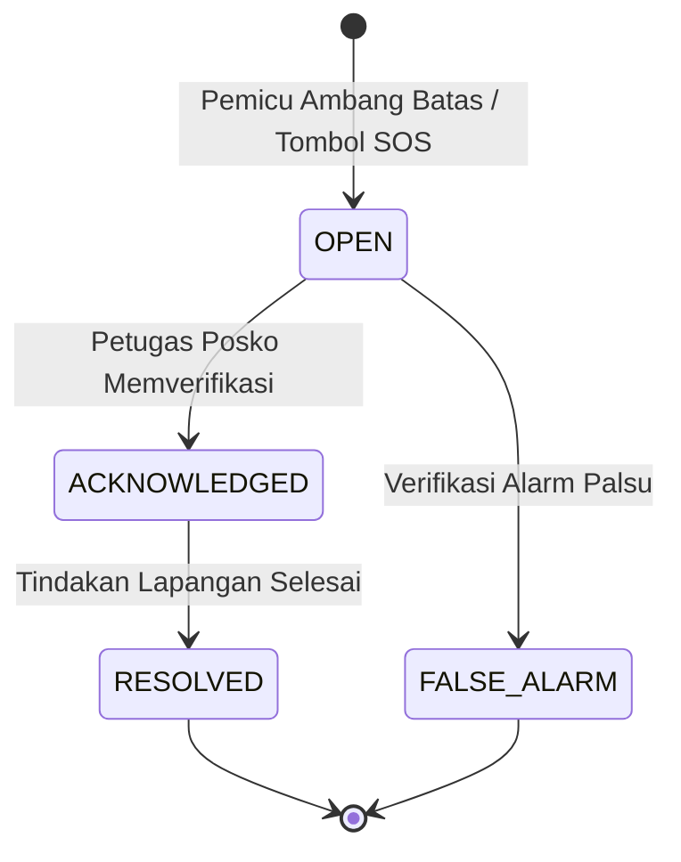

# DOKUMEN ARSITEKTUR BASIS DATA & ENTITY RELATIONSHIP DIAGRAM (ERD)
## Smart-Sanitation eSOS (Emergency Sanitation Operating System) — Sistem Pemantauan Sanitasi Darurat Pasca-Bencana

Status Dokumen: ARSITEKTUR BASIS DATA TERKENDALI (CONTROLLED BASELINE)  
Database Engine: PostgreSQL 15+ (Dual-Support: SQLite WAL Mode untuk Edge Server)  
Standar Kepatuhan: ACID (Atomicity, Consistency, Isolation, Durability)  
Strategi Kunci Utama: **Universally Unique Identifier Versi 7 (UUIDv7 Time-Ordered / RFC 9562)**  
Author: Daffa Hardhan (Manajer Proyek & Penanggung Jawab Backend/Pipeline Data)  
Institusi: Departemen Teknik Elektro, Fakultas Teknik Universitas Indonesia (DTE FTUI)  

---

## 1. Glosarium Singkatan & Istilah Lengkap Basis Data (Database Glossary)

Berikut adalah daftar kepanjangan resmi dan definisi istilah teknis basis data yang digunakan dalam sistem eSOS:

| Singkatan | Kepanjangan Lengkap (Full Term) | Penjelasan Sederhana & Fungsi dalam Sistem eSOS |
|:---|:---|:---|
| **UUID** | *Universally Unique Identifier (RFC 4122)* | Kode identitas acak unik global 128-bit berstandar internasional yang menjamin tidak akan pernah terjadi tabrakan ID (*ID collision*) saat data dari puluhan posko bencana digabungkan ke server pusat. |
| **PK** | *Primary Key* (Kunci Utama) | Kolom unik yang menjadi tanda pengenal identitas tunggal dari setiap baris rekaman pada tabel. |
| **FK** | *Foreign Key* (Kunci Asing / Relasi) | Kolom yang menghubungkan rekaman pada tabel anak ke kolom kunci utama (*Primary Key*) pada tabel induk. |
| **ERD** | *Entity Relationship Diagram* (Diagram Relasi Entitas) | Diagram visual pemetaan struktur tabel, kolom, tipe data, dan hubungan relasi antar-entitas dalam basis data. |
| **DDL** | *Data Definition Language* | Sekumpulan perintah SQL (`CREATE`, `ALTER`, `DROP`, `INDEX`) untuk mendefinisikan kerangka struktur basis data. |
| **SQL** | *Structured Query Language* | Bahasa standar internasional untuk berkomunikasi, memanipulasi, dan meminta data dari sistem basis data relasional. |
| **ACID** | *Atomicity, Consistency, Isolation, Durability* | Empat prinsip keandalan mutlak transaksi basis data agar data dijamin utuh, konsisten, tidak tumpang tindih, dan tidak hilang saat listrik padam. |
| **WAL** | *Write-Ahead Logging* | Mekanisme pencatatan transaksi ke dalam log penyimpanan permanen terlebih dahulu sebelum ditulis ke berkas database utama guna menjamin ketahanan saat daya padam (*crash-recovery*). |
| **MVCC** | *Multi-Version Concurrency Control* | Arsitektur konkurensi PostgreSQL yang memungkinkan pembacaan data oleh dashboard tidak terhalang atau terkunci oleh proses penulisan paket data sensor yang masuk bersamaan. |
| **DSN** | *Data Source Name* | String koneksi yang memuat parameter lokasi berkas database, port, hak akses, dan opsi pragma optimasi. |
| **HMAC** | *Hash-based Message Authentication Code* | Kode verifikasi keaslian paket data sensor yang dihitung menggunakan fungsi hash kriptografi bersama kunci rahasia. |
| **SHA-256** | *Secure Hash Algorithm 256-bit* | Algoritma matematika satu arah berstandar industri keamanan militer untuk memastikan paket telemetri tidak dimanipulasi. |
| **GPS** | *Global Positioning System* | Sistem satelit navigasi global untuk menentukan titik koordinat garis lintang (*latitude*) dan garis bujur (*longitude*) bilik sanitasi di peta bumi. |
| **GIS** | *Geographic Information System* | Sistem komputasi untuk menyimpan, memetakan, dan menganalisis data spasial koordinat geografis posko bencana. |
| **IoT** | *Internet of Things* (Internet untuk Segala) | Jaringan perangkat keras fisik (sensor, mikrokontroler, aktuator) yang saling terhubung dan bertukar data melalui jaringan nirkabel. |
| **eSOS** | *Emergency Sanitation Operating System* | Nama sistem perangkat lunak dan arsitektur pemantauan fasilitas sanitasi darurat terpadu kelompok 4 Despro. |

---

## 2. Rationale Strategi Kunci Utama: Mengapa Wajib Menggunakan UUID?

Dalam arsitektur sistem IoT terdistribusi di wilayah posko pasca-bencana, pemilihan tipe *Primary Key* sangat krusial:

### Mengapa Auto-Increment Integer (`BIGSERIAL` 1, 2, 3...) Berbahaya untuk Wilayah Bencana?
1. **Risiko Tabrakan Data Saat Sinkronisasi (*ID Collision*):** Posko A (dalam kondisi *blank spot* tanpa internet) mencatat alarm dengan ID `1`, `2`, `3`. Posko B di bukit sebelah juga mencatat alarm dengan ID `1`, `2`, `3`. Ketika jaringan internet darurat pulih dan kedua posko menyinkronkan data ke server pusat BNPB / BPBD, **terjadi tabrakan data (*Primary Key Conflict*)** yang merusak integritas database.
2. **Ketergantungan Terpusat:** Auto-increment mewajibkan klien selalu bertanya ke database pusat untuk mendapatkan ID berikutnya, yang mustahil dilakukan saat jaringan terputus.

### Keunggulan Menggunakan `UUIDv4` (`gen_random_uuid()`):
1. **Kemandirian Penuh (*Decentralized ID Generation*):** Setiap node sensor, mesin ETL Go, dan server posko dapat membangkitkan ID unik secara lokal di memori secara mandiri dengan probabilitas tabrakan mendekati nol ($1 \text{ banding } 2^{122}$).
2. **Sinkronisasi Tanpa Konflik (*Seamless Uplink Replication*):** Ketika koneksi satelit/seluler pulih, jutaan data dari seluruh posko pengungsian di Indonesia dapat langsung digabungkan ke basis data pusat tanpa perlu re-mapping ID.
3. **Keamanan Data (*Anti-Enumeration Attack*):** Mencegah pihak luar menebak volume atau jumlah insiden posko secara sekuensial.

---

## 3. Entity Relationship Diagram (ERD) — Skema Berbasis UUID

```mermaid
erDiagram
    SANITATION_NODES ||--|| NODE_THRESHOLD_CONFIGS : "memiliki konfigurasi ambang"
    SANITATION_NODES ||--o{ TELEMETRY_RECORDS : "mengirimkan deret waktu"
    SANITATION_NODES ||--o{ INCIDENT_ALERTS : "membangkitkan peringatan"
    SANITATION_NODES ||--o{ ACTUATION_COMMANDS : "menerima perintah kontrol"

    SANITATION_NODES {
        uuid node_id PK "Kunci Utama Unik Global (UUIDv4)"
        string node_code UK "Kode Unit Posko (e.g. NODE_SANITATION_01)"
        string node_name "Nama Stasiun Sanitasi"
        string zone_area "Zona Wilayah Evakuasi"
        decimal latitude "Koordinat Lintang GPS (-90 s.d. 90)"
        decimal longitude "Koordinat Bujur GPS (-180 s.d. 180)"
        string firmware_version "Versi Firmware ESP32"
        string hardware_revision "Revisi Perakitan Hardware"
        bigint lora_frequency_hz "Frekuensi RF (433000000 Hz)"
        enum status "ACTIVE | INACTIVE | MAINTENANCE | ALERT_EMERGENCY"
        timestamptz installed_at "Waktu Instalasi Fisik"
        timestamptz last_ping_at "Waktu Terakhir Node Aktif"
        timestamptz created_at "Waktu Pembuatan Rekaman"
        timestamptz updated_at "Waktu Pembaruan Terakhir"
    }

    NODE_THRESHOLD_CONFIGS {
        uuid config_id PK "Kunci Utama Konfigurasi (UUIDv4)"
        uuid node_id FK "Relasi ke SANITATION_NODES (UNIQUE)"
        decimal water_tank_height_cm "Tinggi Fisik Tangki Air (cm)"
        decimal water_critical_low_cm "Batas Kritis Air Kosong (cm)"
        decimal water_warning_low_cm "Batas Peringatan Air Rendah (cm)"
        decimal ammonia_warning_ppm "Batas Peringatan Gas NH3 (ppm)"
        decimal ammonia_danger_ppm "Batas Bahaya Gas NH3 (ppm)"
        decimal h2s_warning_ppm "Batas Peringatan Gas H2S (ppm)"
        decimal h2s_danger_ppm "Batas Bahaya Gas H2S (ppm)"
        decimal battery_critical_volt "Tegangan Kritis Cutoff Baterai (V)"
        decimal battery_warning_volt "Tegangan Peringatan Baterai Rendah (V)"
        timestamptz updated_at "Waktu Modifikasi Parameter"
    }

    TELEMETRY_RECORDS {
        uuid record_id PK "Kunci Utama Rekaman (UUIDv4)"
        timestamptz received_at PK "Waktu Penerimaan Server (Partition Key)"
        uuid node_id FK "Relasi ke SANITATION_NODES"
        string node_code "Kode Posko untuk Query Cepat"
        bigint sequence_no "Nomor Urut Paket Transmisi"
        decimal water_level_cm "Jarak Level Air Tangki (cm)"
        decimal water_volume_percentage "Kapasitas Volume Air (%)"
        decimal ammonia_ppm "Konsentrasi Gas Amonia (ppm)"
        decimal h2s_ppm "Konsentrasi Gas H2S Toksik (ppm)"
        enum air_quality_index "GOOD | MODERATE | UNHEALTHY | HAZARDOUS"
        decimal battery_voltage "Tegangan Baterai 1S4P (V)"
        decimal battery_percentage "Persentase Daya Baterai (%)"
        boolean solar_charging_active "Indikator Pengisian Panel Surya"
        boolean valve_servo_open "Status Bukaan Katup Sanitasi"
        boolean sos_button_triggered "Status Tombol Darurat SOS"
        boolean anomaly_detected "Indikator Anomali Sinyal"
        int rssi_dbm "Kekuatan Sinyal Nirkabel LoRa (dBm)"
        decimal snr_db "Rasio Signal-to-Noise LoRa (dB)"
    }

    INCIDENT_ALERTS {
        uuid alert_id PK "Kunci Utama Insiden (UUIDv4)"
        uuid node_id FK "Relasi ke SANITATION_NODES"
        string node_code "Kode Posko Pelapor"
        string alert_code "Kode Kejadian Darurat"
        enum severity "INFO | WARNING | CRITICAL | EMERGENCY"
        text description "Deskripsi Rinci Insiden"
        decimal trigger_value "Nilai Parameter Sensor Pemicu"
        enum status "OPEN | ACKNOWLEDGED | RESOLVED | FALSE_ALARM"
        boolean is_resolved "Status Selesai (Generated Column)"
        timestamptz acknowledged_at "Waktu Verifikasi Petugas"
        string acknowledged_by "Nama Petugas yang Memverifikasi"
        timestamptz resolved_at "Waktu Insiden Diselesaikan"
        string resolved_by "Nama Petugas Penyelesai"
        text resolution_notes "Catatan Tindakan Korektif"
        timestamptz created_at "Waktu Alarm Dibangkitkan"
    }

    ACTUATION_COMMANDS {
        uuid command_id PK "Kunci Utama Perintah (UUIDv4)"
        uuid node_id FK "Relasi ke SANITATION_NODES"
        string node_code "Kode Posko Pelaksana"
        string command_type "Tipe Perintah (OPEN_VALVE | CLOSE_VALVE)"
        int target_angle_deg "Target Sudut Servo (0 s.d. 180 Derajat)"
        string triggered_by "Pemicu (SENSOR_AUTO | OPERATOR_DASHBOARD)"
        string operator_id "ID Petugas Pengendali"
        enum status "PENDING | TRANSMITTED | EXECUTED_SUCCESS | EXECUTION_FAILED"
        int execution_latency_ms "Latensi Eksekusi Jaringan (ms)"
        timestamptz executed_at "Waktu Perintah Selesai Dieksekusi"
        timestamptz created_at "Waktu Perintah Diterbitkan"
    }

    SYSTEM_AUDIT_LOGS {
        uuid log_id PK "Kunci Utama Log Audit (UUIDv4)"
        string action_type "Tipe Aksi Sistem / Konfigurasi"
        string actor_id "ID Aktor / Pengguna"
        string ip_address "Alamat IP Klien / Perangkat"
        jsonb details "Payload Rinci Perubahan (JSONB)"
        timestamptz created_at "Waktu Kejadian"
    }
```

---

## 4. Rincian Tabel & Struktur Kolom (Data Dictionary)

### 4.1 Tabel Master: `sanitation_nodes`
Tabel master yang meregistrasikan seluruh unit bilik sanitasi eSOS yang tersebar di wilayah posko pengungsian.
- **`node_id` (UUID, Primary Key, DEFAULT `gen_random_uuid()`):** Kunci unik global 128-bit.
- **`node_code` (VARCHAR(32), UNIQUE, NOT NULL):** Nama kode yang mudah dibaca manusia (contoh: `'NODE_SANITATION_01'`).
- **`node_name` (VARCHAR(128), NOT NULL):** Nama deskriptif fasilitas sanitasi.
- **`zone_area` (VARCHAR(64), NOT NULL):** Lokasi spesifik penempatan (contoh: `'Shelter Posko A - Zona Evakuasi 1'`).
- **`latitude` & `longitude` (DECIMAL(10,7) & DECIMAL(11,7), NOT NULL):** Koordinat lintang dan bujur GPS yang divalidasi dengan constraint rentang bumi valid.
- **`status` (node_status_enum, NOT NULL):** Status operasional (`ACTIVE`, `INACTIVE`, `MAINTENANCE`, `ALERT_EMERGENCY`).
- **`last_ping_at` (TIMESTAMPTZ):** Diperbarui otomatis oleh database trigger saat menerima paket telemetri baru.

### 4.2 Tabel Konfigurasi: `node_threshold_configs`
Menyimpan batas ambang alarm yang dapat disesuaikan per masing-masing stasiun sanitasi.
- **`config_id` (UUID, Primary Key, DEFAULT `gen_random_uuid()`):** Kunci unik konfigurasi.
- **`node_id` (UUID, Foreign Key, UNIQUE):** Terhubung 1-to-1 dengan `sanitation_nodes(node_id)`.
- **`water_critical_low_cm` (DECIMAL(5,2)):** Batas ketinggian air terendah sebelum memicu peringatan darurat tangki kosong (default: $15.00\text{ cm}$).
- **`ammonia_warning_ppm` & `ammonia_danger_ppm` (DECIMAL(6,2)):** Batas konsentrasi gas amonia $NH_3$ aman vs bahaya ($25\text{ ppm}$ dan $50\text{ ppm}$).
- **`h2s_warning_ppm` & `h2s_danger_ppm` (DECIMAL(6,2)):** Batas konsentrasi gas hidrogen sulfida $H_2S$ toksik ($10\text{ ppm}$ dan $20\text{ ppm}$).
- **`battery_critical_volt` (DECIMAL(3,2)):** Batas tegangan cutoff baterai Li-ion ($3.00\text{ V}$).

### 4.3 Tabel Deret Waktu: `telemetry_records` (Partitioned Table)
Tabel time-series berkinerja tinggi yang menyimpan aliran data sensor secara berkala.
- **Primary Key:** Komposit `(record_id UUID, received_at TIMESTAMPTZ)` untuk kompatibilitas partisi rentang waktu.
- **Partisi Bulanan:** Menggunakan strategi `PARTITION BY RANGE (received_at)` untuk memisahkan tabel per bulan kalender.
- **`water_level_cm` & `water_volume_percentage`:** Pembacaan ketinggian air dan kalkulasi persentase kapasitas tangki.
- **`ammonia_ppm` & `h2s_ppm`:** Konsentrasi gas terkalibrasi dari sensor MQ-137 dan MQ-136.
- **`air_quality_index` (aqi_category_enum):** Klasifikasi mutu udara otomatis (`GOOD`, `MODERATE`, `UNHEALTHY`, `HAZARDOUS`).
- **`battery_voltage` & `solar_charging_active`:** Parameter kelistrikan baterai 1S4P dan status suplai panel surya 10Wp.
- **`sos_button_triggered` (BOOLEAN):** Flag darurat tombol SOS fisik yang ditekan oleh pengungsi.
- **`rssi_dbm` & `snr_db`:** Metrik kualitas tautan nirkabel LoRa 433 MHz untuk memantau integritas transmisi radio.

### 4.4 Tabel Peringatan Insiden: `incident_alerts`
Menyimpan seluruh kejadian darurat (SOS button, kebocoran gas beracun, air habis, tegangan drop) dengan siklus penanganan tertutup (*Incident Lifecycle*):

### 4.5 Tabel Perintah Aktuasi: `actuation_commands`
Catatan jejak audit (*audit trail*) setiap perintah kendali pembukaan/penutupan katup motor servo MG996R, baik yang dipicu secara otomatis oleh sistem (*sensor auto-trigger*) maupun manual oleh operator posko.

---

## 5. Ekstensi PostgreSQL yang Digunakan & Rationale Teknis

| Nama Ekstensi | Tujuan dan Alasan Penggunaan pada Proyek eSOS |
|:---|:---|
| **`uuid-ossp`** | Menghasilkan pengenal unik global (*Universally Unique Identifier*) berstandar RFC 4122 versi 4 (`uuid_generate_v4()`) untuk kebutuhan token otentikasi API, ID audit log, dan session tracking operator posko tanpa risiko tabrakan ID lintas sistem. |
| **`pgcrypto`** | Menyediakan fungsi `gen_random_uuid()`, `crypt()`, `gen_salt()`, dan `hmac()`. Digunakan untuk mengenkripsi kata sandi operator posko dan memvalidasi *checksum HMAC-SHA256* pada paket data sensor guna mencegah manipulasi data di udara. |
| **`timescaledb`** *(Opsional Scale-up)* | Mengubah tabel `telemetry_records` menjadi *Hypertable* teroptimasi IoT, menyediakan fitur kompresi data time-series hingga 90%, dan *continuous aggregate view* untuk efisiensi penyimpanan jangka panjang. |
| **`postgis`** *(Opsional Scale-up)* | Menyediakan tipe data spasial geografis (`GEOMETRY(Point, 4326)`), memungkinkan query geospasial seperti mencari posko sanitasi terdekat dari titik lokasi evakuasi atau menghitung radius sebaran gas toksik. |

---

## 6. Penegakan Kepatuhan ACID (ACID Enforcement)

1. **Atomicity (Keutuhan Transaksi):**
   - Transaksi *Batch Load* dari server Go diikat dalam blok `BEGIN ... COMMIT`. Seluruh rekaman dalam satu batch berhasil masuk secara utuh atau dibatalkan sepenuhnya jika terjadi kesalahan fatal, menjamin tidak ada data setengah jalan.
2. **Consistency (Konsistensi Aturan Data):**
   - Penegakan integritas struktural menggunakan `CHECK CONSTRAINTS` di level basis data untuk memastikan tidak ada angka sensor yang tidak masuk akal (misal: tegangan baterai negatif atau ketinggian air melebihi kapasitas fisik).
   - Penggunaan tipe data `ENUM` memastikan hanya status valid yang dapat tersimpan di tabel.
3. **Isolation (Isolasi Antar-Sesi Konkuren):**
   - Menggunakan arsitektur MVCC (*Multi-Version Concurrency Control*) PostgreSQL. Pembacaan grafik dashboard live tidak pernah mengunci (*lock*) proses penulisan paket telemetri LoRa yang masuk bersamaan.
4. **Durability (Ketahanan Terhadap Crash Daya):**
   - Seluruh perubahan data dicatat terlebih dahulu ke dalam *Write-Ahead Log* (WAL) disk non-volatile sebelum status transaksi dikembalikan ke aplikasi. Hal ini menjamin integritas data tetap $100\%$ utuh meskipun suplai listrik posko bencana terputus tiba-tiba.

---

## 7. Strategi Pengindeksan & Kinerja Query (Indexing Strategy)

Untuk memastikan waktu respon API dashboard tetap berada di bawah $5\text{ ms}$:
1. **`idx_telemetry_node_received` (Composite Index B-Tree on `node_code, received_at DESC`):**  
   Mengoptimalkan query grafik dashboard time-series yang selalu mengambil data terkini berdasarkan kode posko.
2. **`idx_telemetry_sos` (Partial Index on `sos_button_triggered = TRUE`):**  
   Pengindeksan parsial khusus untuk baris yang memiliki status SOS darurat aktif, mempercepat query deteksi insiden tanpa membebani ukuran indeks keseluruhan.
3. **`idx_alerts_unresolved` (Partial Index on `status IN ('OPEN', 'ACKNOWLEDGED')`):**  
   Menjamin query daftar alarm aktif posko langsung menemukan data tanpa melakukan *Full Table Scan*.
