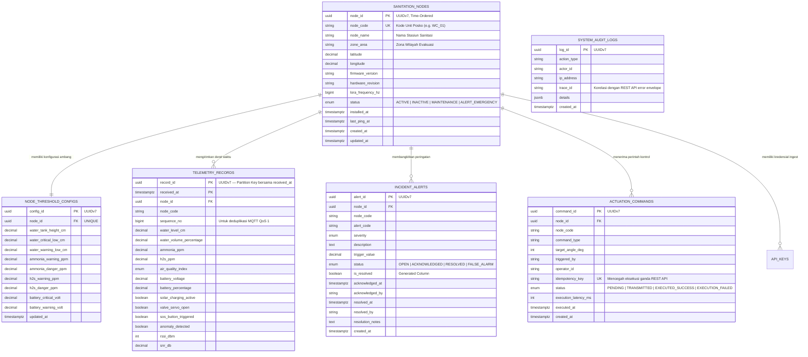

# DOKUMEN ARSITEKTUR BASIS DATA & ENTITY RELATIONSHIP DIAGRAM (ERD)
## Smart-Sanitation eSOS — Sistem Pemantauan Sanitasi Darurat Pasca-Bencana

Status Dokumen: **ARSITEKTUR BASIS DATA TERKENDALI (CONTROLLED BASELINE) — v2.0 MATURED**
Mengacu pada: `00_ARCHITECTURE_DECISION_RECORD.md` (ADR-06, ADR-07)
Database Engine: PostgreSQL 15+ dengan Ekstensi **TimescaleDB**
Standar Kepatuhan: ACID
Strategi Kunci Utama: **UUIDv7 (RFC 9562, Time-Ordered)** — konsisten di seluruh tabel
Author: Daffa Hardhan

---

## 1. Glosarium

*(Istilah utama: UUID, PK, FK, ERD, DDL, SQL, ACID, WAL, MVCC, DSN, HMAC, SHA-256, GPS, GIS, IoT.)*

| Singkatan | Kepanjangan Lengkap | Penjelasan |
|:---|:---|:---|
| **LISTEN/NOTIFY** | *PostgreSQL Asynchronous Notification* | Mekanisme *native* PostgreSQL untuk memberi tahu proses lain (Go Server) secara *real-time* saat baris tabel tertentu berubah, tanpa perlu *polling*. |
| **UUIDv7** | *Universally Unique Identifier Version 7 (RFC 9562)* | Varian UUID terbaru yang menggabungkan komponen *timestamp* (48-bit millisecond precision) dengan komponen acak, sehingga **terurut secara alami** (*monotonically increasing*) namun tetap terdesentralisasi. |

---

## 2. Rationale Strategi Kunci Utama: Mengapa UUIDv7, Bukan Auto-Increment atau UUIDv4?

### 2.1 Mengapa Auto-Increment Integer (`BIGSERIAL`) Berbahaya?
*(Tidak berubah)* Risiko *ID Collision* saat sinkronisasi multi-posko dan ketergantungan terpusat pada database untuk `nextval()` yang mustahil dilakukan di jaringan *blank spot*.

### 2.2 Mengapa Bukan UUIDv4 Murni (`gen_random_uuid()`)?
UUIDv4 sepenuhnya acak (122-bit random), yang memberi keunggulan desentralisasi dan anti-*enumeration* — namun punya **kelemahan performa** untuk kasus penggunaan eSOS:
1. **B-Tree Index Fragmentation:** Karena UUIDv4 tidak terurut, setiap `INSERT` baru berpotensi jatuh di halaman *index* acak manapun, menyebabkan *page split* berlebihan dan indeks yang tidak efisien saat volume telemetri mencapai jutaan baris.
2. **Cache Locality Buruk:** Baris data yang secara logis "baru saja masuk" (kandidat paling sering di-*query* untuk dashboard *real-time*) tersebar acak di seluruh *tablespace*, bukan mengelompok di halaman terbaru.

### 2.3 Keunggulan UUIDv7 (Keputusan Final — ADR-06)
UUIDv7 menggabungkan **kedua dunia**:

| Properti | UUIDv4 | UUIDv7 |
|:---|:---:|:---:|
| Desentralisasi generasi ID (tanpa koordinasi pusat) | ✅ | ✅ |
| Anti-*collision* lintas-posko | ✅ | ✅ |
| Anti-*enumeration attack* (tidak bisa ditebak sekuensial) | ✅ | ✅ (128-bit space tetap besar) |
| Terurut secara waktu (*time-ordered*) | ❌ | ✅ |
| Performa indeks B-Tree (menghindari *page split*) | ❌ Buruk | ✅ Optimal |
| Bisa diekstrak *timestamp* pembuatan tanpa kolom terpisah | ❌ | ✅ (berguna untuk *debugging* forensik insiden) |

**Kesimpulan:** UUIDv7 dipakai secara **konsisten** di seluruh Primary Key tabel (`sanitation_nodes`, `node_threshold_configs`, `telemetry_records`, `incident_alerts`, `actuation_commands`, `system_audit_logs`).

### 2.4 Implementasi Generasi UUIDv7 di PostgreSQL
PostgreSQL native `gen_random_uuid()` (ekstensi `pgcrypto`) hanya menghasilkan **UUIDv4**. Karena PostgreSQL 15/16 belum punya fungsi bawaan UUIDv7, sistem eSOS menggunakan salah satu dari dua pendekatan berikut (dipilih saat implementasi):

**Opsi A — Ekstensi Komunitas:**
```sql
CREATE EXTENSION IF NOT EXISTS pg_uuidv7; -- https://github.com/fboulnois/pg_uuidv7
-- Pemakaian: DEFAULT uuid_generate_v7()
```

**Opsi B — Fungsi SQL Kustom (Tanpa Dependensi Eksternal):**
```sql
CREATE OR REPLACE FUNCTION uuid_generate_v7() RETURNS UUID AS $$
DECLARE
    unix_ts_ms BYTEA;
    uuid_bytes BYTEA;
BEGIN
    unix_ts_ms := substring(int8send(floor(extract(epoch FROM clock_timestamp()) * 1000)::bigint) FROM 3);
    uuid_bytes := unix_ts_ms || gen_random_bytes(10);
    uuid_bytes := set_byte(uuid_bytes, 6, (b'0111' || get_byte(uuid_bytes, 6)::bit(4))::bit(8)::int);
    uuid_bytes := set_byte(uuid_bytes, 8, (b'10' || get_byte(uuid_bytes, 8)::bit(6))::bit(8)::int);
    RETURN encode(uuid_bytes, 'hex')::UUID;
END;
$$ LANGUAGE plpgsql VOLATILE;
```

> Di lapisan Go (ETL Server), pembangkitan tetap memakai `uuid.Must(uuid.NewV7())` dari `github.com/google/uuid` — **konsisten** dengan strategi database.

---

## 3. Arsitektur Pemrosesan Big Data (Lambda Architecture & TimescaleDB)

*(Tidak berubah secara prinsip Lambda Architecture, namun jalur masuk data kini eksplisit via MQTT sesuai `05_LORA_MQTT_TELEMETRY_PIPELINE.md`, bukan HTTP POST langsung.)*

- **Jalur Stream:** MQTT Subscriber (Goroutine Worker Pool) → Threshold Checking (via *in-memory cache*, §6) → WebSocket Push.
- **Jalur Batch:** TimescaleDB Hypertable + Continuous Aggregates (tidak berubah).

---

## 4. Entity Relationship Diagram (ERD) — Skema UUIDv7 Konsisten



Tabel `API_KEYS` mendukung autentikasi per node (ADR-05), kolom `sequence_no` menjamin deduplikasi MQTT, kolom `idempotency_key` pada `ACTUATION_COMMANDS` menangani retry yang aman, dan `trace_id` pada `SYSTEM_AUDIT_LOGS` mendukung korelasi error envelope REST API.

---

## 5. Mekanisme Cache Invalidation Ambang Batas (ADR-07) via LISTEN/NOTIFY

Untuk menjamin perubahan `node_threshold_configs` dari Dashboard (`PUT /api/v1/nodes/{id}/config`) **langsung** mempengaruhi logika alarm di ETL Server tanpa restart:

```sql
CREATE OR REPLACE FUNCTION notify_threshold_change() RETURNS TRIGGER AS $$
BEGIN
    PERFORM pg_notify('threshold_config_updated', NEW.node_id::text);
    RETURN NEW;
END;
$$ LANGUAGE plpgsql;

CREATE OR REPLACE TRIGGER trg_notify_threshold_change
AFTER INSERT OR UPDATE ON node_threshold_configs
FOR EACH ROW EXECUTE FUNCTION notify_threshold_change();
```

Go Server menjalankan *goroutine* terpisah yang melakukan `LISTEN threshold_config_updated` sepanjang siklus hidup proses. Saat notifikasi masuk, *in-memory cache* threshold (map `node_id → ThresholdConfig`, dilindungi `sync.RWMutex`) di-*refresh* untuk `node_id` terkait — detail implementasi ada di `02_BACKEND_ETL_AND_API_ARCHITECTURE.md` §4.4.

---

## 6. Ekstensi PostgreSQL yang Digunakan

| Ekstensi | Tujuan |
|:---|:---|
| **`pgcrypto`** | `gen_random_bytes()` (dipakai fungsi `uuid_generate_v7()` kustom), HMAC-SHA256 validasi integritas payload. |
| **`pg_uuidv7`** *(opsional, direkomendasikan)* | Alternatif native performant untuk generasi UUIDv7 dibanding fungsi PL/pgSQL kustom. |
| **`timescaledb`** | Hypertable `telemetry_records`, Continuous Aggregates, kompresi time-series. |
| **`postgis`** *(opsional scale-up)* | Query geospasial multi-posko. |

---

## 7. Penegakan ACID & Strategi Indeks

Indeks tambahan untuk menunjang performa:

```sql
CREATE UNIQUE INDEX idx_actuation_idempotency ON actuation_commands (idempotency_key);
CREATE INDEX idx_telemetry_dedup ON telemetry_records (node_code, sequence_no);
```

Indeks `idx_telemetry_dedup` mendukung pengecekan cepat duplikasi `sequence_no` per node sebelum `INSERT` (lihat ADR §4 "Setiap pesan MQTT wajib memiliki `sequence_no`").
