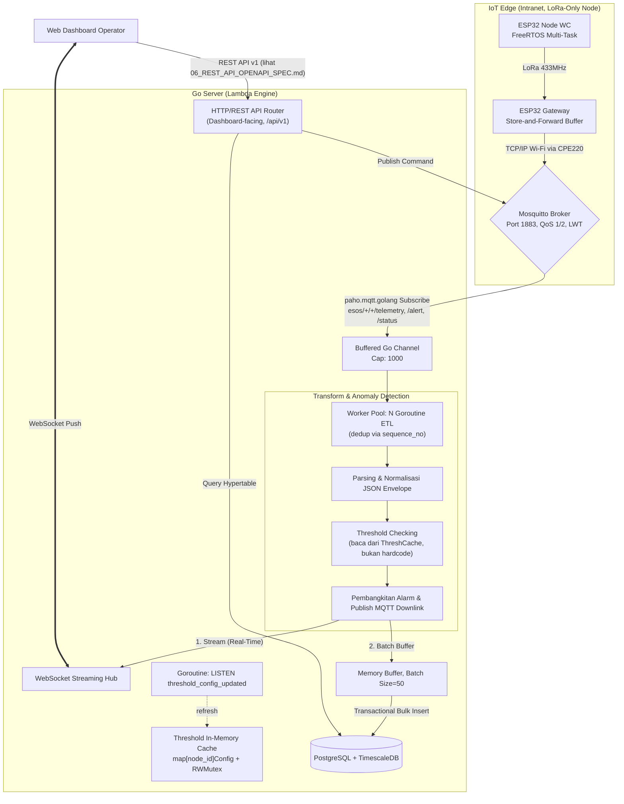
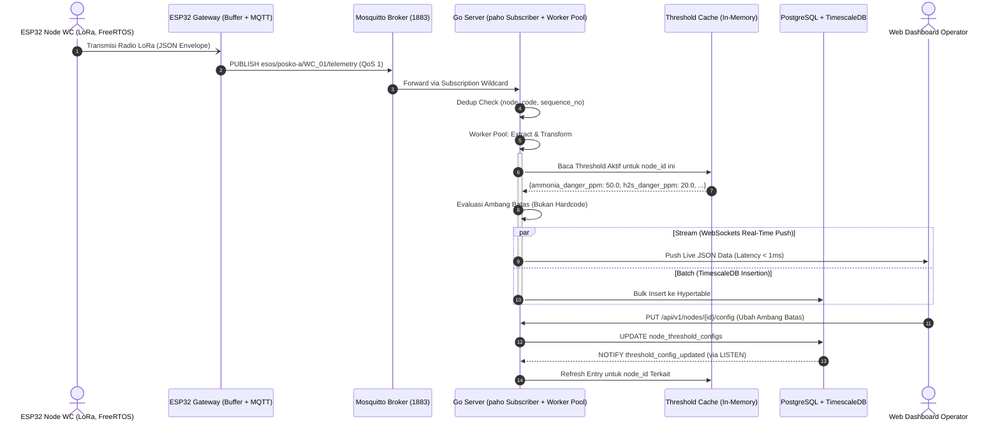

# DOKUMEN ARSITEKTUR BACKEND, MESIN ETL & SPESIFIKASI API
## Smart-Sanitation eSOS — Server Edge Berkinerja Tinggi Berbasis Go (Golang)

Status Dokumen: **ARSITEKTUR BACKEND TERKENDALI (CONTROLLED BASELINE) — v2.0 MATURED**
Mengacu pada: `00_ARCHITECTURE_DECISION_RECORD.md` (ADR-01, ADR-06, ADR-07)
Arsitektur Sistem: Lambda Architecture (**MQTT Subscriber Ingestion** + TimescaleDB Batch + WebSockets)
Author: Daffa Hardhan

---

## 1. Glosarium

Tambahan istilah baru:

| Singkatan | Kepanjangan Lengkap | Penjelasan |
|:---|:---|:---|
| **paho.mqtt.golang** | *Eclipse Paho MQTT Golang Client* | Pustaka klien MQTT resmi Eclipse Foundation untuk Go, mendukung *persistent session*, *auto-reconnect*, dan QoS 0/1/2 penuh. |
| **Worker Pool** | *Goroutine Worker Pool Pattern* | Pola konkurensi di mana sejumlah tetap Goroutine mengonsumsi pekerjaan dari satu *channel* bersama, mencegah *unbounded goroutine spawning* saat lonjakan pesan MQTT. |
| **LISTEN/NOTIFY** | *PostgreSQL Async Notification* | Dipakai Server Go untuk menerima notifikasi perubahan `node_threshold_configs` secara real-time (lihat `01_DATABASE_ARCHITECTURE_AND_ERD.md` §5). |

---

## 2. Arsitektur Internal Server Go (High-Level Architecture)



---

## 3. Diagram Alur Transmisi & Pemrosesan Data (Sequence Diagram)



---

## 4. Rincian Alur Kerja Mesin ETL

### 4.1 Tahap Ekstraksi (*Extract Stage*) — MQTT Subscriber, Bukan HTTP Handler

- Server Go terhubung sebagai **satu klien MQTT persisten** (`clean_session=false`) ke Mosquitto Broker menggunakan `github.com/eclipse/paho.mqtt.golang`.
- **Keamanan Kredensial:** Go Server dilarang melakukan hardcode kredensial Mosquitto. Username dan Password untuk koneksi `paho.mqtt.golang` WAJIB dibaca dari environment variables (`MQTT_USER`, `MQTT_PASS`) pada file `.env` lokal posko saat proses bootstrap.
- Callback `OnMessage` dari `paho` **tidak pernah memproses data secara langsung** (mencegah *blocking* pada thread MQTT client) — ia hanya mem-*push* pesan mentah ke *buffered Go Channel* (`chan MQTTMessage`, kapasitas 1000).
- **Worker Pool** berisi N Goroutine (dikonfigurasi via `ETL_WORKER_COUNT`, default 8) yang mengonsumsi channel tersebut secara paralel.
- **Deduplikasi:** Sebelum diproses, setiap pesan dicek terhadap *LRU cache* `(node_code → last_sequence_no)` di memori. Pesan dengan `sequence_no` ≤ nilai terakhir yang tercatat (indikasi *retry* duplikat dari QoS 1) dibuang tanpa diproses ulang.

```go
type MQTTMessage struct {
    Topic   string
    Payload []byte
}

func (p *Pipeline) startMQTTSubscriber(client mqtt.Client) {
    client.Subscribe("esos/+/+/telemetry", 1, func(c mqtt.Client, msg mqtt.Message) {
        select {
        case p.inStream <- MQTTMessage{Topic: msg.Topic(), Payload: msg.Payload()}:
        default:
            log.Printf("[WARN] Ingest buffer penuh! Pesan dari topik %s dibuang.", msg.Topic())
        }
    })
}
```

### 4.2 Tahap Transformasi (*Transform Stage*) — Threshold dari Cache, Bukan Hardcode

Sistem **tidak menggunakan angka ambang batas yang di-hardcode** (misal `ammonia_ppm > 25.0` langsung di kode Go). Sebagai gantinya:

```go
type ThresholdCache struct {
    mu     sync.RWMutex
    byNode map[string]models.ThresholdConfig // key: node_id
}

func (tc *ThresholdCache) Get(nodeID string) models.ThresholdConfig {
    tc.mu.RLock()
    defer tc.mu.RUnlock()
    return tc.byNode[nodeID] // fallback ke default jika belum di-load
}

func (tc *ThresholdCache) Refresh(nodeID string, db *database.DB) {
    cfg, _ := db.GetThresholdConfig(nodeID)
    tc.mu.Lock()
    tc.byNode[nodeID] = cfg
    tc.mu.Unlock()
}
```

Kalkulasi nilai lainnya (volume air, persentase baterai, AQI) dieksekusi secara independen per Goroutine.

### 4.3 Tahap Pemuatan Data (*Load Stage*) — Tidak Berubah
Sistem menggunakan micro-batch optimization (kapasitas 50 rekaman / *flush timer* 3 detik). Bootstrap & Live Refresh (ADR-07)

```go
func (p *Pipeline) startThresholdListener(pgConn *pgx.Conn) {
    // 1. Bootstrap: load seluruh threshold config saat startup
    p.cache.LoadAll(p.db)

    // 2. Live refresh via PostgreSQL LISTEN/NOTIFY
    pgConn.Exec(context.Background(), "LISTEN threshold_config_updated")
    for {
        notification, err := pgConn.WaitForNotification(context.Background())
        if err != nil {
            log.Printf("[LISTEN ERROR] %v — retry in 3s", err)
            time.Sleep(3 * time.Second)
            continue
        }
        nodeID := notification.Payload
        p.cache.Refresh(nodeID, p.db)
        log.Printf("[THRESHOLD CACHE] Refreshed untuk node_id=%s", nodeID)
    }
}
```

### 4.5 Publikasi Perintah Aktuator (Downlink)

Saat `POST /api/v1/actuator/commands` diterima Router REST API:
1. Simpan `ActuationCommand` baru ke database dengan status `PENDING`.
2. Publish payload ke topik `esos/{zone}/{node_code}/command` (QoS 2) via klien MQTT yang sama.
3. Update status jadi `TRANSMITTED`.
4. Saat `esos/{zone}/{node_code}/command/ack` diterima kembali dari Node, update status jadi `EXECUTED_SUCCESS`/`EXECUTION_FAILED` dan broadcast event `ACTUATOR_STATUS` ke WebSocket Hub.

---

## 5. WebSocket Real-Time Streaming Hub

*(Tidak berubah secara mekanisme *fan-out* `sync.Mutex`, namun kini juga menyiarkan event tambahan `GATEWAY_STATUS` (dari LWT MQTT) dan `ACTUATOR_STATUS` (dari `command/ack`) — lihat `06_REST_API_OPENAPI_SPEC.md` §4.7.)*

---

## 6. Kontrak REST API

**Kontrak REST API lengkap (endpoint, autentikasi, pagination, error envelope, idempotency) didefinisikan secara otoritatif di `06_REST_API_OPENAPI_SPEC.md`.** Dokumen ini mendelegasikan spesifikasi tersebut untuk menjaga prinsip single source of truth.

Ringkasan tanggung jawab lapisan:
- **`02` (dokumen ini):** Bagaimana data *masuk* ke sistem (MQTT ingestion, ETL, threshold cache) dan *tersimpan*.
- **`06`:** Bagaimana Dashboard/operator *berinteraksi* dengan data tersebut (kontrak REST, autentikasi, format request/response).

