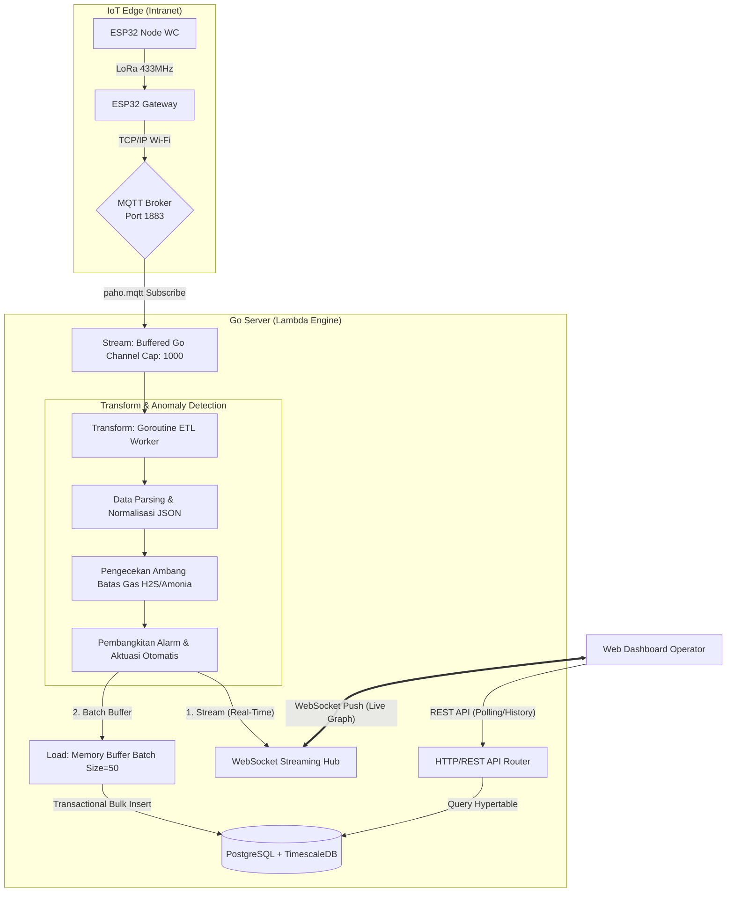
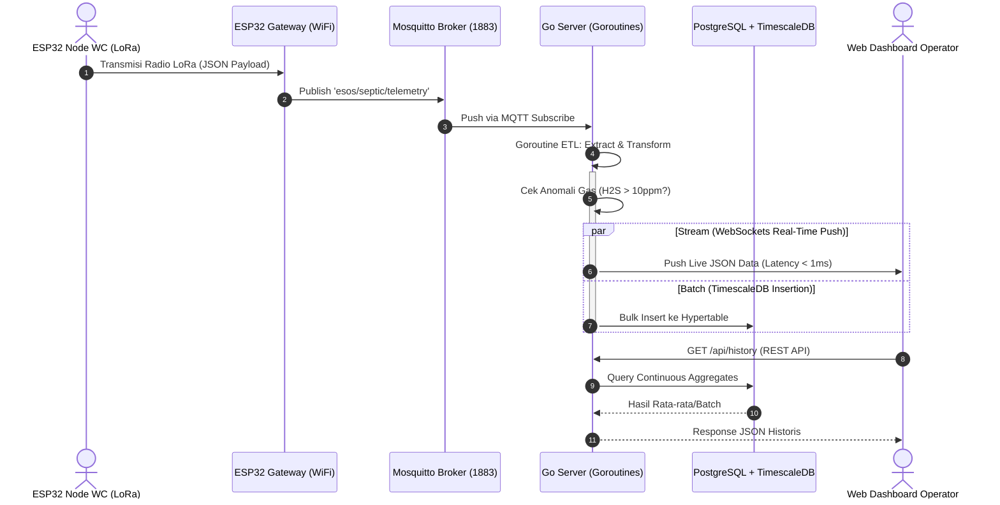

# DOKUMEN ARSITEKTUR BACKEND, MESIN ETL & SPESIFIKASI API
## Smart-Sanitation eSOS (Emergency Sanitation Operating System) — Server Edge Berkinerja Tinggi Berbasis Go (Golang)

Status Dokumen: ARSITEKTUR BACKEND TERKENDALI (CONTROLLED BASELINE)  
Bahasa Pemrograman: Go (Golang 1.25+)  
Arsitektur Sistem: Lambda Architecture (MQTT Stream Ingestion + TimescaleDB Batch + WebSockets)  
Author: Daffa Hardhan (Manajer Proyek & Penanggung Jawab Backend/Pipeline Data)  
Institusi: Departemen Teknik Elektro, Fakultas Teknik Universitas Indonesia (DTE FTUI)  

---

## 1. Glosarium Singkatan & Istilah Lengkap Backend & ETL (Backend Glossary)

Berikut adalah daftar kepanjangan resmi dan definisi istilah teknis rekayasa perangkat lunak backend dan pipeline data pada sistem eSOS:

| Singkatan | Kepanjangan Lengkap (Full Term) | Penjelasan Sederhana & Fungsi dalam Sistem eSOS |
|:---|:---|:---|
| **ETL** | *Extract, Transform, Load* (Ekstraksi, Transformasi, Pemuatan) | Alur pipa pemrosesan data tiga tahap: mengekstrak paket mentah dari sensor, mentransformasikan rumus kalibrasi dan alarm, lalu memuatnya ke basis data. |
| **API** | *Application Programming Interface* (Antarmuka Pemrograman Aplikasi) | Jalur perantara komunikasi standar antara perangkat keras sensor mikrokontroler ESP32 dan server backend Go. |
| **REST** | *Representational State Transfer* | Standar arsitektur layanan web berbasis protokol HTTP yang bersifat *stateless* dan menggunakan format data JSON. |
| **HTTP** | *Hypertext Transfer Protocol* | Protokol komunikasi dasar jaringan komputer untuk mengirimkan data permintaan (*request*) dan tanggapan (*response*). |
| **WS / WebSocket** | *WebSocket Protocol (RFC 6455)* | Jalur komunikasi dua arah berlatensi sangat rendah ($< 1\text{ ms}$) untuk menyiarkan aliran data sensor langsung ke layar dashboard secara kontinu. |
| **RAM** | *Random Access Memory* (Memori Akses Acak) | Memori utama berkecepatan tinggi pada komputer server posko untuk menyimpan antrean *buffered channel* dan *batch buffer*. |
| **CPU** | *Central Processing Unit* (Unit Pemroses Sentral) | Prosesor komputer yang mengeksekusi logika algoritma dan konkurensi goroutine. |
| **I/O** | *Input / Output* (Masukan / Keluaran) | Operasi pembacaan dan penulisan berkas pada media penyimpanan disk atau lalu lintas data pada kartu jaringan. |
| **WAL** | *Write-Ahead Logging* | Mekanisme penulisan log transaksi SQLite/PostgreSQL untuk mencegah korupsi data saat terjadi pemadaman listrik posko secara mendadak. |
| **MVCC** | *Multi-Version Concurrency Control* | Manajemen konkurensi basis data agar operasi pembacaan dashboard tidak pernah saling mengunci (*lock*) dengan operasi penulisan paket data sensor. |
| **PPM** | *Parts Per Million* (Bagian per Sejuta) | Satuan konsentrasi gas amonia ($NH_3$) dan hidrogen sulfida ($H_2S$) terlarut di udara. |
| **AQI** | *Air Quality Index* (Indeks Mutu Udara) | Kategori visual tingkat keamanan udara di dalam bilik sanitasi (*GOOD*, *MODERATE*, atau *HAZARDOUS*). |
| **ACID** | *Atomicity, Consistency, Isolation, Durability* | Standar integritas transaksi data agar setiap kumpulan paket telemetri tersimpan secara utuh dan aman. |
| **JSON** | *JavaScript Object Notation* | Format teks standar untuk pengiriman payload telemetri nirkabel. |
| **Goroutine** | *Go Lightweight Thread* (Utas Ringan Go) | Unit eksekusi independen berdaya sangat ringan ($\approx 2\text{ KB}$ per utas) yang memungkinkan ribuan tugas paralel dijalankan secara bersamaan. |
| **Channel** | *Go Synchronization Channel* (Saluran Sinkronisasi Go) | Pipa transmisi data internal Go yang aman digunakan antar-goroutine (*thread-safe*) tanpa membutuhkan penguncian manual yang rumit. |

| **MQTT** | *Message Queuing Telemetry Transport* | Protokol ringan berbasis *publish-subscribe* berstandar industri IoT untuk penerimaan jutaan paket data dari ESP32 Gateway. |
| **Mosquitto** | *Eclipse Mosquitto MQTT Broker* | *Service background* penengah yang berlari di RAM PC Server untuk meneruskan lalu lintas MQTT ke Server Go secara seketika (*zero-delay*). |
| **Lambda Architecture** | *Big Data Lambda Architecture* | Pola desain sistem terdistribusi yang menangani data massal melalui dua jalur simultan: *Streaming* (real-time) dan *Batch* (historis). |
| **TimescaleDB** | *Time-Series PostgreSQL Extension* | *Database Engine* berkinerja tinggi penyimpan *Hypertable* yang melakukan *Continuous Aggregates* secara transparan. |
---

## 2. Arsitektur Internal Server Go (High-Level Architecture)

Server backend eSOS dirancang secara modular dengan mengadopsi prinsip *Clean Architecture* dan *Event-Driven Concurrency* menggunakan fitur bawaan Go (*Goroutines* dan *Channels*):



---

## 3. Diagram Alur Transmisi & Pemrosesan Data (Sequence Diagram)



---

## 4. Rincian Alur Kerja Mesin ETL (Extract, Transform, Load)

### 4.1 Tahap Ekstraksi (*Extract Stage*)
- Menerima struktur data `RawTelemetryPacket` melalui pemanggilan fungsi `pipeline.Ingest(raw)`.
- Menggunakan *buffered Go Channel* berkapasitas 1000 antrean. Jika terjadi lonjakan paket data masuk yang sangat tinggi, data akan diantrekan secara aman di memori tanpa memblokir siklus eksekusi HTTP handler (*non-blocking I/O*).

### 4.2 Tahap Transformasi (*Transform Stage*)
Setiap paket mentah yang diambil dari antrean channel diproses melalui algoritma transformasi deterministik:
1. **Perhitungan Volume Air Tangki:**
   $$\text{WaterVolumePercentage} = \max\left(0.0, \min\left(100.0, \frac{\text{WaterLevelCm}}{\text{TankHeightCm}} \times 100\right)\right)$$
2. **Kalkulasi Kapasitas Baterai 1S4P (3.0V s.d. 4.2V):**
   $$\text{BatteryPercentage} = \max\left(0.0, \min\left(100.0, \frac{\text{BatteryVoltage} - 3.0\text{V}}{1.2\text{V}} \times 100\right)\right)$$
3. **Kategorisasi Indeks Kualitas Udara (AQI):**
   - Jika $\text{H}_2\text{S} > 10.0\text{ ppm}$ atau $\text{NH}_3 > 25.0\text{ ppm} \rightarrow$ **`HAZARDOUS`**.
   - Jika $\text{H}_2\text{S} > 5.0\text{ ppm}$ atau $\text{NH}_3 > 15.0\text{ ppm} \rightarrow$ **`MODERATE`**.
   - Jika parameter di bawah ambang batas $\rightarrow$ **`GOOD`**.
4. **Deteksi Anomali & Pembangkitan Alarm Otomatis:**
   - Memeriksa flag `SosButtonTriggered`. Jika `true`, sistem secara otomatis membuat rekaman *Incident Alert* bertipe `SOS_BUTTON` dengan tingkat keparahan `EMERGENCY`.
   - Memeriksa pelanggaran ambang batas gas dan level air kritis ($< 15\text{ cm}$).

### 4.3 Tahap Pemuatan Data (*Load Stage — Micro-Batch Optimization*)
Untuk menghindari fenomena *disk I/O contention* dan *database lock* akibat penulisan baris per baris secara terus-menerus:
- Data hasil transformasi disimpan di dalam *memory slice* `batchBuffer`.
- Penulisan massal (*bulk insert*) ke SQLite/PostgreSQL dipicu oleh salah satu dari dua kondisi:
  1. **Threshold Kapasitas:** Jumlah data di memori mencapai **20 rekaman**.
  2. **Threshold Waktu:** Timer flush internal berdetak setiap **3.0 detik**.
- Penulisan dilakukan di dalam *Goroutine* terpisah dengan transaksi tunggal (`BEGIN TRANSACTION ... COMMIT`), memastikan latensi baca pada dashboard tetap konsisten di bawah $5\text{ ms}$.

---

## 5. WebSocket Real-Time Streaming Hub (`package api/websocket.go`)

- Menggunakan protokol WebSocket standar RFC 6455 melalui pustaka `github.com/gorilla/websocket`.
- **Mekanisme Broadcast:** Menggunakan *fan-out pattern* thread-safe dengan `sync.Mutex` untuk mengelola *pool* koneksi peramban aktif.
- Begitu data selesai ditransformasikan di tahap ETL, objek `WebSocketEvent` bertipe `TELEMETRY_STREAM` langsung disiarkan ke seluruh klien peramban yang terhubung secara instan ($< 1\text{ ms}$) tanpa perlu menunggu data tersimpan ke disk.
- Dilengkapi mekanisme *Auto-Reconnect* di sisi JavaScript peramban jika terjadi pemutusan koneksi jaringan nirkabel.

---

## 6. Spesifikasi Lengkap Antarmuka REST API (API Reference)

### 6.1 Ingest Telemetri Sensor
Menerima paket telemetri yang dikirimkan oleh Node ESP32 melalui Router TP-Link CPE220 atau LoRa Gateway Bridge.

- **Endpoint:** `POST /api/telemetry`
- **Content-Type:** `application/json`
- **Request Payload Schema:**
  ```json
  {
    "node_id": "NODE_SANITATION_01",
    "sequence_no": 105,
    "water_level_cm": 65.4,
    "ammonia_ppm": 8.2,
    "h2s_ppm": 3.1,
    "battery_voltage": 3.95,
    "sos_button_triggered": false,
    "valve_servo_open": false,
    "rssi_dbm": -72,
    "snr_db": 9.0
  }
  ```
- **Response Success (201 Created):**
  ```json
  {
    "status": "ACCEPTED",
    "node_id": "NODE_SANITATION_01",
    "sequence_no": 105,
    "ingested_at": "2026-09-03T06:25:00.123456+07:00"
  }
  ```

---

### 6.2 Mengambil Telemetri Terkini (*Latest Snapshot*)
Mengambil status telemetri paling baru untuk pembaruan awal kartu metrik pada dashboard.

- **Endpoint:** `GET /api/telemetry/latest`
- **Query Parameter (Opsional):** `?node_id=NODE_SANITATION_01`
- **Response Success (200 OK):**
  ```json
  [
    {
      "record_id": 1420,
      "node_id": "NODE_SANITATION_01",
      "sequence_no": 105,
      "water_level_cm": 65.4,
      "water_volume_percentage": 65.4,
      "ammonia_ppm": 8.2,
      "h2s_ppm": 3.1,
      "battery_voltage": 3.95,
      "battery_percentage": 79.2,
      "solar_charging_active": true,
      "valve_servo_open": false,
      "sos_button_triggered": false,
      "air_quality_index": "GOOD",
      "anomaly_detected": false,
      "rssi_dbm": -72,
      "snr_db": 9.0,
      "received_at": "2026-09-03T06:25:00Z"
    }
  ]
  ```

---

### 6.3 Mengambil Riwayat Deret Waktu (*Time-Series History*)
Mengambil kumpulan data riwayat untuk rendering grafik Chart.js di dashboard.

- **Endpoint:** `GET /api/telemetry/history`
- **Query Parameters:**
  - `node_id` (string, opsional): Filter ID posko sanitasi.
  - `limit` (integer, default: 50, max: 500): Batas jumlah data yang diambil.
- **Response Success (200 OK):**
  ```json
  [
    {
      "record_id": 1420,
      "node_id": "NODE_SANITATION_01",
      "water_level_cm": 65.4,
      "ammonia_ppm": 8.2,
      "h2s_ppm": 3.1,
      "battery_voltage": 3.95,
      "received_at": "2026-09-03T06:25:00Z"
    },
    {
      "record_id": 1419,
      "node_id": "NODE_SANITATION_01",
      "water_level_cm": 65.5,
      "ammonia_ppm": 8.1,
      "h2s_ppm": 3.0,
      "battery_voltage": 3.96,
      "received_at": "2026-09-03T06:24:50Z"
    }
  ]
  ```

---

### 6.4 Mengambil Daftar Peringatan Insiden Aktif (*Active Alerts*)
Mengambil seluruh insiden darurat yang belum ditangani oleh petugas posko.

- **Endpoint:** `GET /api/alerts/active`
- **Response Success (200 OK):**
  ```json
  [
    {
      "alert_id": 12,
      "node_id": "NODE_SANITATION_01",
      "alert_type": "SOS_BUTTON",
      "severity": "EMERGENCY",
      "description": "Peringatan Darurat: Tombol SOS bilik sanitasi ditekan oleh pengungsi!",
      "is_resolved": false,
      "created_at": "2026-09-03T06:24:12Z"
    }
  ]
  ```

---

### 6.5 Menyelesaikan Status Insiden (*Resolve Alert*)
Digunakan oleh petugas posko untuk menandai bahwa insiden darurat telah diverifikasi dan ditangani di lapangan.

- **Endpoint:** `POST /api/alerts/resolve?alert_id=12&resolved_by=Petugas_Posko_A`
- **Response Success (200 OK):**
  ```json
  {
    "status": "RESOLVED",
    "alert_id": 12,
    "resolved_by": "Petugas_Posko_A"
  }
  ```

---

### 6.6 Endpoint WebSocket Streaming
- **Endpoint:** `GET /ws` (Protokol Upgrade: `HTTP/1.1 101 Switching Protocols`)
- **Event Frame Stream:**
  ```json
  {
    "type": "TELEMETRY_STREAM",
    "payload": {
      "node_id": "NODE_SANITATION_01",
      "water_level_cm": 65.4,
      "ammonia_ppm": 8.2,
      "h2s_ppm": 3.1,
      "battery_voltage": 3.95,
      "sos_button_triggered": false
    },
    "timestamp": "2026-09-03T06:25:00.123456+07:00"
  }
  ```
