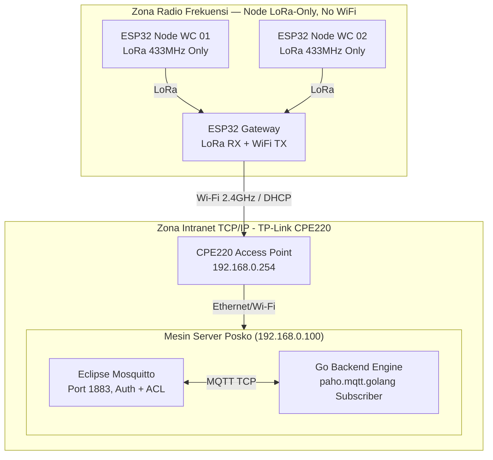
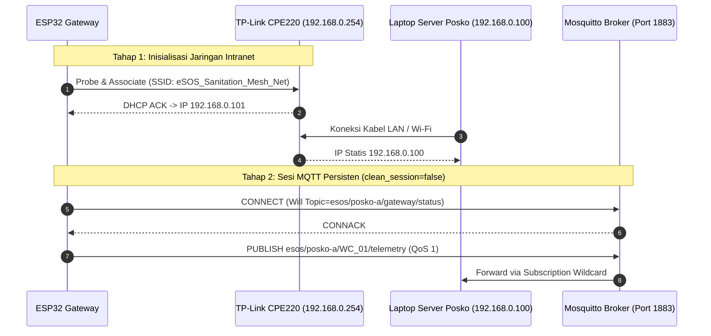
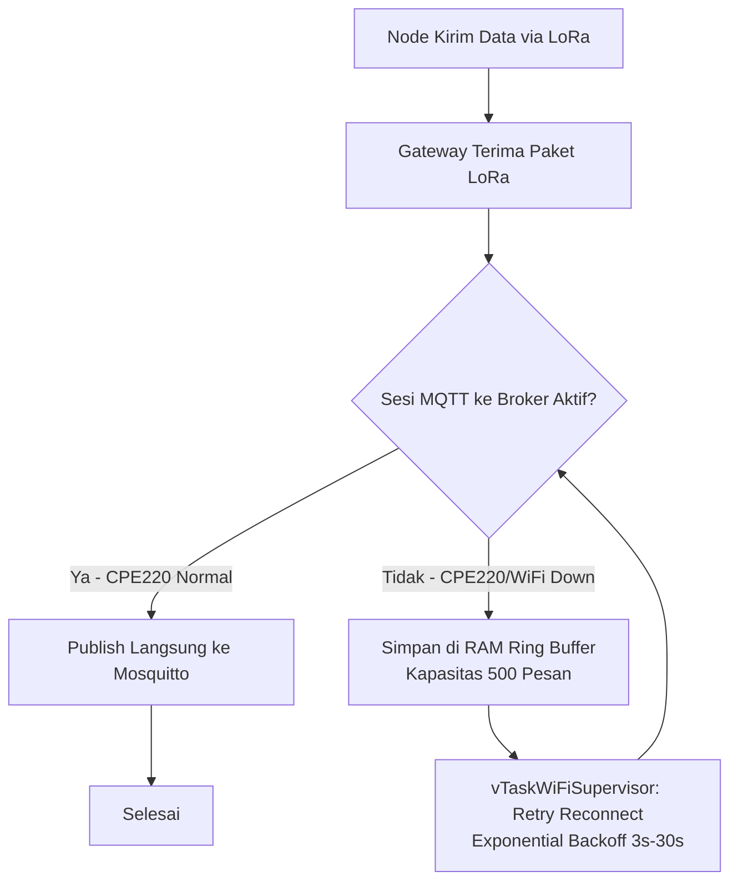

# DOKUMEN PIPELINE JARINGAN GATEWAY, ROUTER & ALUR DATA SENSOR
## Smart-Sanitation eSOS — Komunikasi Nirkabel Wilayah Blank Spot Pasca-Bencana

Status Dokumen: **SPESIFIKASI JARINGAN TERKENDALI (CONTROLLED BASELINE) — v2.0 MATURED**
Mengacu pada: `00_ARCHITECTURE_DECISION_RECORD.md` (ADR-02, ADR-03)
Perangkat Jaringan: TP-Link CPE220 Outdoor Access Point (2.4GHz High-Power 23 dBm)
Protokol Transmisi: Intranet TCP/IP (Wi-Fi AP) untuk **Gateway ke MQTT Broker** (bukan lagi Node ke Server)
Author: Daffa Hardhan

---

## 1. Glosarium

---

## 2. Arsitektur Jaringan Intranet (TCP/IP Topology)

Sesuai ADR-02, Node ESP32 WC **tidak pernah terhubung ke Wi-Fi CPE220 secara langsung**. Hanya **ESP32 Gateway** yang memiliki radio Wi-Fi.



---

## 3. Diagram Alokasi Jaringan Intranet (Sequence Diagram)



---

## 4. Konfigurasi Standar Router TP-Link CPE220 (`config/network_cpe220.conf`)

```ini
[DEVICE_INFO]
Model = TP-Link CPE220 V3
Operating_Mode = Access Point (AP)
Antenna = Built-in 12dBi Dual-polarized Directional (Beamwidth: 60° Horizontal)
Transmit_Power = 23 dBm (200 mW)

[WIRELESS_SETTINGS]
SSID = eSOS_Sanitation_Mesh_Net
Security_Mode = WPA2-PSK (AES)
Channel_Frequency = 2.412 GHz (Channel 1)
Channel_Width = 20 MHz
Distance_Setting = 1.5 km
Isolation = Disabled

[IP_SETTINGS]
IP_Assignment = Static
Management_IP = 192.168.0.254
Gateway_Server_IP = 192.168.0.100
Subnet_Mask = 255.255.255.0
DHCP_Server = Enabled
DHCP_Range_Start = 192.168.0.101
DHCP_Range_End = 192.168.0.200
Lease_Time = 7200

[IP_RESERVATION_TABLE]
192.168.0.100 = Server_Posko_Monitoring (Laptop / Mini PC — Mosquitto + Go Server)
192.168.0.101 = ESP32_Gateway_Bridge (Satu-satunya Node dengan radio Wi-Fi)
192.168.0.254 = Gateway_AP_CPE220 (Access Point)
```

> **Catatan Jaringan:** Reservasi IP hanya berlaku untuk perangkat di zona TCP/IP. Node WC murni berada di luar jaringan IP dan hanya dikenali via `node_code` di dalam payload MQTT yang diteruskan Gateway.

---

## 5. Mekanisme Resiliensi Jaringan

Node beroperasi sebagai *LoRa-only* (tanpa radio Wi-Fi sama sekali).

Resiliensi jaringan kini **sepenuhnya berada di level Gateway**, didetailkan penuh di `05_LORA_MQTT_TELEMETRY_PIPELINE.md` §5. Ringkasan untuk konteks jaringan:



Dengan model ini:
- **Node tidak pernah tahu** apakah jaringan Wi-Fi/CPE220 sedang bermasalah — ia terus memancarkan LoRa seperti biasa, sepenuhnya *stateless* terhadap kondisi jaringan.
- **Gateway** menjadi satu-satunya titik yang perlu menangani kompleksitas *reconnect* dan buffering, menyederhanakan firmware Node secara signifikan.

---

## 6. Prosedur Verifikasi Jaringan di Laboratorium / Lapangan

```powershell
# 1. Verifikasi Konektivitas ke Router Access Point
ping 192.168.0.254

# 2. Verifikasi Konektivitas ke Server Backend Posko
ping 192.168.0.100

# 3. Uji Publish Manual ke Mosquitto Broker (menggantikan curl POST /api/telemetry)
mosquitto_pub -h 192.168.0.100 -p 1883 `
  -u gateway_posko_a -P "<password>" `
  -t "esos/posko-a/WC_01/telemetry" -q 1 `
  -m '{"schema_version":"1.0","node_code":"WC_01","sequence_no":1,"sent_at":"2026-09-06T10:30:00+07:00","payload_type":"TELEMETRY","data":{"water_level_cm":65.0,"ammonia_ppm":8.0,"h2s_ppm":3.0,"battery_voltage":3.95,"sos_button_triggered":false,"rssi_dbm":-70,"snr_db":9.0}}'

# 4. Verifikasi Server Go Menerima & Memproses (Subscribe sebagai observer eksternal)
mosquitto_sub -h 192.168.0.100 -p 1883 -u go_server_subscriber -P "<password>" -t "esos/#" -v

# 5. Verifikasi Endpoint REST API v1 (Query, bukan Ingest)
curl http://192.168.0.100:8000/api/v1/nodes/{node_id}/telemetry/latest `
```

> **Catatan:** Jalur ingest resmi adalah eksklusif via MQTT (ADR-01). Endpoint `POST /api/v1/telemetry/ingest` berstatus *fallback-only* untuk kebutuhan simulasi pengembangan.

