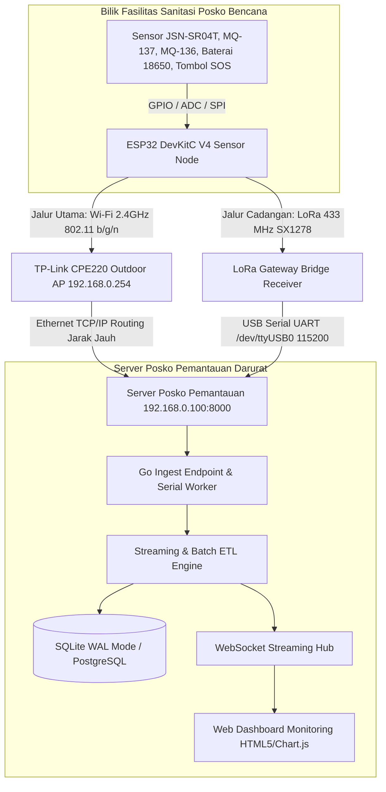
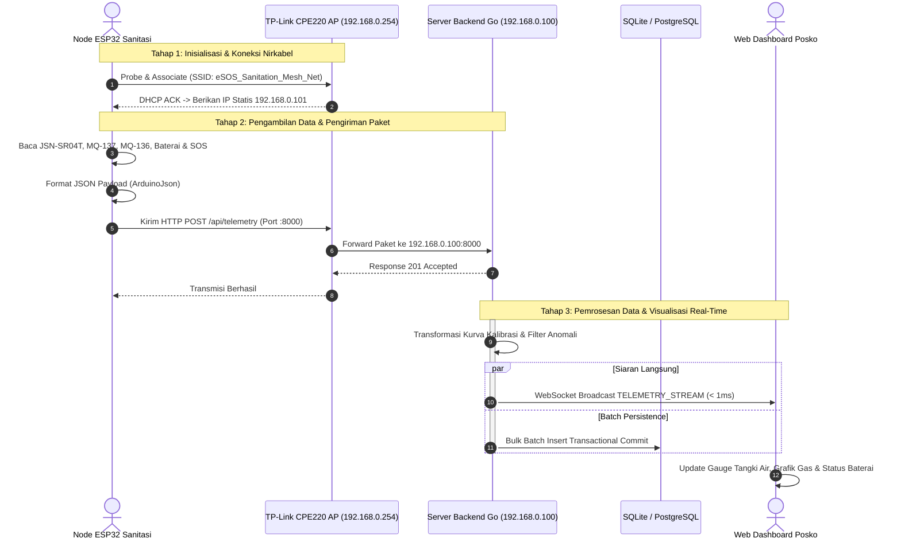
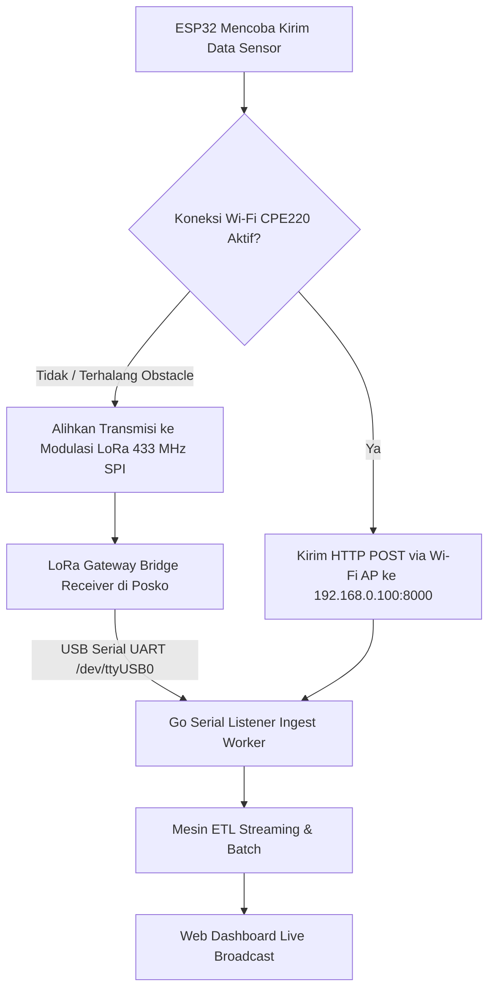

# DOKUMEN PIPELINE JARINGAN GATEWAY, ROUTER & ALUR DATA SENSOR
## Smart-Sanitation eSOS (Emergency Sanitation Operating System) — Komunikasi Nirkabel Wilayah Blank Spot Pasca-Bencana

Status Dokumen: SPESIFIKASI JARINGAN TERKENDALI (CONTROLLED BASELINE)  
Perangkat Jaringan: TP-Link CPE220 Outdoor Access Point (2.4GHz High-Power 23 dBm)  
Protokol Transmisi: Dual-Path Hybrid (TCP/IP HTTP/WebSocket over Wi-Fi AP + LoRa RA-02 433 MHz Fallback)  
Author: Daffa Hardhan (Manajer Proyek & Penanggung Jawab Backend/Pipeline Data)  
Institusi: Departemen Teknik Elektro, Fakultas Teknik Universitas Indonesia (DTE FTUI)  

---

## 1. Glosarium Singkatan & Istilah Lengkap Jaringan & Komunikasi Radio (Network Glossary)

Berikut adalah daftar kepanjangan resmi dan definisi istilah teknis jaringan nirkabel dan telekomunikasi pada sistem eSOS:

| Singkatan | Kepanjangan Lengkap (Full Term) | Penjelasan Sederhana & Fungsi dalam Sistem eSOS |
|:---|:---|:---|
| **CPE** | *Customer Premises Equipment* | Perangkat pemancar nirkabel luar ruangan (*outdoor wireless router access point*) model TP-Link CPE220 yang dipasang di posko pemantauan. |
| **AP** | *Access Point* (Titik Akses Nirkabel) | Titik pemancar sinyal Wi-Fi lokal tempat mikrokontroler ESP32 di bilik sanitasi terhubung untuk mengirimkan data. |
| **SSID** | *Service Set Identifier* | Nama identitas jaringan nirkabel Wi-Fi yang dipancarkan oleh router (contoh: `eSOS_Sanitation_Mesh_Net`). |
| **WPA2-PSK** | *Wi-Fi Protected Access 2 - Pre-Shared Key* | Standar enkripsi keamanan nirkabel yang mengamankan komunikasi data antara ESP32 dan router menggunakan kata sandi rahasia bersama. |
| **AES** | *Advanced Encryption Standard* | Algoritma penyandian simetris berstandar global untuk mengamankan paket data di udara agar tidak dapat disadap. |
| **DHCP** | *Dynamic Host Configuration Protocol* | Protokol jaringan yang secara otomatis mengalokasikan alamat IP dan konfigurasi jaringan ke mikrokontroler ESP32 saat pertama kali menyala. |
| **IP Address** | *Internet Protocol Address* | Alamat numerik unik perangkat di dalam jaringan lokal posko (contoh: `192.168.0.100` untuk Server, `192.168.0.101` untuk ESP32). |
| **MAC Address** | *Media Access Control Address* | Alamat identitas fisik unik perangkat keras jaringan yang tertanam permanen pada kartu jaringan Wi-Fi ESP32. |
| **TCP/IP** | *Transmission Control Protocol / Internet Protocol* | Kumpulan protokol standar komunikasi komputer yang menjamin paket data terkirim secara andal, berurutan, dan tanpa galat. |
| **LoRa** | *Long Range Radio* | Teknologi modulasi radio nirkabel berdaya rendah (*low-power*) jarak jauh yang mampu menembus rintangan reruntuhan bangunan pasca-bencana hingga $2-3\text{ km}$. |
| **RF** | *Radio Frequency* (Frekuensi Radio) | Gelombang elektromagnetik nirkabel yang digunakan untuk mentransmisikan data di udara (433 MHz untuk LoRa, 2.4 GHz untuk Wi-Fi). |
| **SPI** | *Serial Peripheral Interface* | Protokol komunikasi sinkron antar-komponen terintegrasi pada board (digunakan ESP32 untuk berkomunikasi dengan chip LoRa SX1278). |
| **UART** | *Universal Asynchronous Receiver-Transmitter* | Antarmuka komunikasi serial asinkron (digunakan LoRa Gateway receiver untuk mengirim data ke port USB server). |
| **RSSI** | *Received Signal Strength Indicator* | Indikator kekuatan daya sinyal radio yang diterima, dinyatakan dalam satuan desibel miliwatt (dBm). |
| **SNR** | *Signal-to-Noise Ratio* | Rasio perbandingan antara kekuatan sinyal informasi terhadap derau (*noise*) interferensi lingkungan nirkabel, dinyatakan dalam desibel (dB). |
| **dBm** | *Decibel-milliwatts* | Satuan daya sinyal nirkabel terukur terhadap referensi 1 miliwatt (contoh: 23 dBm setara dengan 200 miliwatt daya pancar). |
| **QoS** | *Quality of Service* | Manajemen prioritas alokasi lebar pita (*bandwidth*) jaringan agar paket darurat SOS selalu diutamakan dibanding data lainnya. |
| **ACK** | *Acknowledgement* (Pemberitahuan Terima) | Sinyal konfirmasi bahwa paket data sensor telah diterima dengan sukses oleh server posko. |

---

## 2. Arsitektur Jaringan End-to-End (Network Topology)

Sistem Smart-Sanitation eSOS mengadopsi **Arsitektur Jaringan Hibrida Jalur Ganda (*Dual-Path Redundant Network*)** untuk menjamin tidak ada data sensor yang hilang (*zero data loss*) pada kondisi ekstrem pasca-bencana:



---

## 3. Diagram Alur Transmisi Step-by-Step (Sequence Diagram)



---

## 4. Konfigurasi Standar Router TP-Link CPE220 (`config/network_cpe220.conf`)

Untuk memastikan kestabilan koneksi di lingkungan terbuka pasca-bencana, router outdoor dikonfigurasi dengan parameter optimal:

```ini
[DEVICE_INFO]
Model = TP-Link CPE220 V3
Operating_Mode = Access Point (AP)
Antenna = Built-in 12dBi Dual-polarized Directional (Beamwidth: 60° Horizontal)
Transmit_Power = 23 dBm (200 mW)

[WIRELESS_SETTINGS]
SSID = eSOS_Sanitation_Mesh_Net
Security_Mode = WPA2-PSK (AES)
Channel_Frequency = 2.412 GHz (Channel 1)
Channel_Width = 20 MHz (Lebih tahan terhadap interferensi lingkungan)
Distance_Setting = 1.5 km (Optimasi timing ACK nirkabel jarak jauh)
Isolation = Disabled (Mengizinkan komunikasi antar-perangkat lokal)

[IP_SETTINGS]
IP_Assignment = Static
Management_IP = 192.168.0.254
Gateway_Server_IP = 192.168.0.100
Subnet_Mask = 255.255.255.0
DHCP_Server = Enabled
DHCP_Range_Start = 192.168.0.101
DHCP_Range_End = 192.168.0.200
Lease_Time = 7200

[IP_RESERVATION_TABLE]
# Pemetaan Alamat IP Perangkat Keras eSOS
192.168.0.100 = Server_Posko_Monitoring (Laptop / Mini PC)
192.168.0.101 = ESP32_Node_Sanitasi_01 (Shelter A)
192.168.0.102 = ESP32_Node_Sanitasi_02 (Shelter B)
192.168.0.254 = Gateway_AP_CPE220 (Access Point)
```

---

## 5. Mekanisme Jalur Cadangan (LoRa 433 MHz Fallback Redundancy)



---

## 6. Prosedur Verifikasi Jaringan di Laboratorium / Lapangan

Petugas atau pengembang dapat memvalidasi keterhubungan pipa data menggunakan perintah terminal:

```powershell
# 1. Verifikasi Konektivitas ke Router Access Point
ping 192.168.0.254

# 2. Verifikasi Konektivitas ke Server Backend Posko
ping 192.168.0.100

# 3. Uji Injeksi Paket Telemetri via HTTP cURL
curl -X POST http://192.168.0.100:8000/api/telemetry `
  -H "Content-Type: application/json" `
  -d '{"node_id":"NODE_SANITATION_01","sequence_no":1,"water_level_cm":65.0,"ammonia_ppm":8.0,"h2s_ppm":3.0,"battery_voltage":3.95,"sos_button_triggered":false,"rssi_dbm":-70,"snr_db":9.0}'

# 4. Verifikasi Pembacaan Data Terkini dari Server
curl http://192.168.0.100:8000/api/telemetry/latest
```
