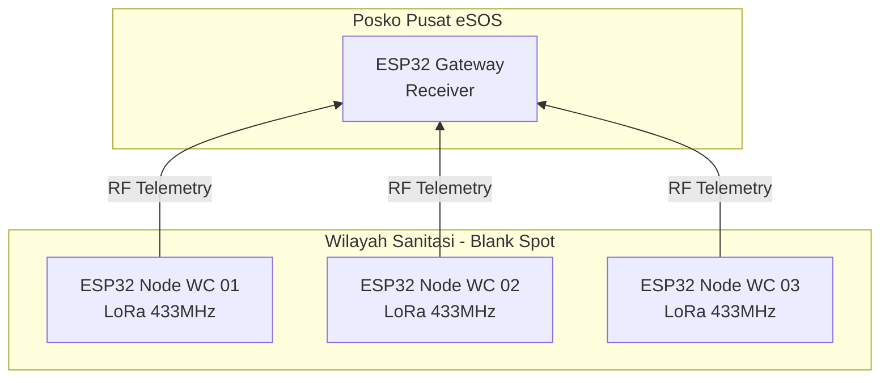
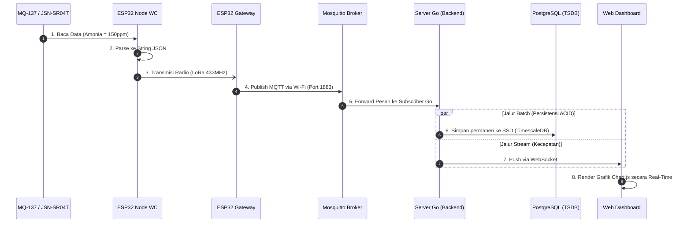

# DOKUMEN ARSITEKTUR TELEMETRI LORA & MQTT (STAR TOPOLOGY)
## Smart-Sanitation eSOS - Jaringan Terisolasi (Intranet Blank Spot)

Dokumen ini mendefinisikan secara resmi arsitektur komunikasi data antara perangkat *Hardware* di lapangan (Septic Tank) hingga ke Layar Pemantauan (*Dashboard*) di Posko Pusat. 

Sistem ini beroperasi **100% Offline (Intranet)** menggunakan *Router* TP-Link CPE220 dan protokol ringan MQTT, tanpa memerlukan koneksi internet (WWW).

---

## 1. Topologi Jaringan: "Star" (Point-to-Multipoint)
Sistem ini secara tegas **TIDAK menggunakan topologi Mesh**. Untuk memastikan keandalan tingkat tinggi (*high reliability*) dan kemudahan pemrograman, sistem menggunakan topologi **Star**.

*   **Mengapa Bintang (Star)?** Jangkauan frekuensi LoRa 433MHz sangat jauh (ratusan meter hingga kilometer) dan mampu menembus tembok/beton *septic tank*. Oleh karena itu, Node WC di lapangan tidak perlu saling menitip pesan (*hopping/mesh*). Semua Node langsung memancarkan data (*broadcast*) lurus ke satu titik pusat (Menara Posko).

*   **Kelebihan:** Menghemat baterai Node (karena tidak perlu terus menyala untuk mem-*forward* pesan orang lain) dan membebaskan mikrokontroler dari algoritma *routing* yang rawan *error*.

---

## 2. Mental Model & Aktor Jaringan (The 3 Actors)

Sistem ini dibangun oleh 3 entitas (aktor) utama yang bekerja secara terpisah namun terintegrasi:

### 3.1 Alur Telemetri Sensor (Uplink Pipeline)

### 3.1 Alur Telemetri Sensor (Uplink Pipeline)

Berikut adalah perjalanan satu paket data telemetri dari kotoran limbah hingga menjadi grafik di layar:

### Aktor 1: Sang Wartawan Lapangan (ESP32 Node WC)
*   **Perangkat:** ESP32 + Sensor Gas + Sensor Ultrasonik + Antena LoRa RA-02.
*   **Koneksi:** **Hanya Radio LoRa** (Wi-Fi ESP32 dimatikan total untuk menghemat baterai panel surya).
*   **Tugas:** Membaca sensor, menyusun **C-Struct Biner berukuran kecil (< 50 bytes)** (BUKAN JSON, demi efisiensi airtime LoRa), dan memancarkannya ke udara lewat frekuensi 433MHz.

### Aktor 2: Sang Jembatan Posko (ESP32 Gateway)
*   **Perangkat:** ESP32 + Antena LoRa RA-02. (Diletakkan di dalam Posko, dicolok ke sumber listrik PLN/Genset stabil).
*   **Koneksi:** Memiliki 2 jalur. Mendengarkan LoRa 433MHz di udara, DAN terhubung ke Wi-Fi Router TP-Link CPE220.
*   **Tugas:** Begitu antena LoRa menangkap paket biner dari Aktor 1, ESP32 Gateway bertugas **men-deserialize struct biner tersebut dan mengubahnya menjadi String JSON Envelope lengkap** sebelum me-publish-nya ke protokol TCP/IP (MQTT) via Wi-Fi.

### Aktor 3: Sang Kantor Pos & Redaksi (Mosquitto & Server Go)
*   **Perangkat:** Laptop/PC Server milik Daffa yang terhubung ke Wi-Fi CPE220. Memiliki IP Statis (misal: `192.168.0.100`).
*   **Mosquitto (Sang Kantor Pos):** Aplikasi MQTT Broker yang berjalan di *background*. Ia bertugas menjaga **Port TCP 1883** tetap terbuka. Menerima JSON dari Aktor 2 dan langsung memindahkannya dari RAM ke Aktor 3.
*   **Server Go (Sang Redaksi):** Berlangganan (*Subscribe*) ke Mosquitto. Saat data masuk, Server Go menaruhnya secara permanen di Brankas (Database PostgreSQL).

---

## 3. Alur Komunikasi Penuh (End-to-End Pipeline)

### 3.1 Alur Telemetri Sensor (Uplink Pipeline)

Berikut adalah perjalanan satu paket data telemetri dari kotoran limbah hingga menjadi grafik di layar:

**Penjelasan Sekuensial:**
1. **[Fisik]** Sensor Gas membaca konsentrasi.
2. **[C++]** ESP32 Node WC membungkusnya jadi teks JSON.
3. **[Radio]** Ditembakkan ke udara via LoRa 433MHz.
4. **[Wi-Fi]** ESP32 Gateway meneruskannya ke Protokol MQTT.
5. **[RAM]** Mosquitto mem-forward-nya ke Server Go.
6. **[Storage]** Disimpan permanen ke Hardisk/SSD (PostgreSQL).
7. **[Network]** Server Go menembak WebSocket ke layar.
8. **[Visualisasi]** Grafik di layar bergerak naik seketika.

### 3.2 Alur Perintah Aktuator Jarak Jauh (Downlink Pipeline)

Selain mengirim data sensor ke atas, arsitektur MQTT eSOS mendukung instruksi ke bawah (Downlink) untuk memicu putaran Servo MG996R pembuka katup tangki.

`mermaid
sequenceDiagram
    autonumber
    participant UI as Web Dashboard
    participant Go as Server Go (API)
    participant Broker as Mosquitto Broker
    participant GW as ESP32 Gateway
    participant Node as ESP32 Node WC
    participant Servo as Servo MG996R

    UI->>Go: 1. POST /api/v1/actuator/commands (Idempotency Key)
    Go->>Go: 2. Validasi & Simpan ke DB (Status: PENDING)
    Go-->>UI: 3. HTTP 202 Accepted
    Go->>Broker: 4. Publish ke esos/posko-a/WC_01/command
    Broker->>GW: 5. Forward ke Gateway (MQTT Subscriber)
    GW-)Node: 6. Transmisi Radio (LoRa Downlink)
    Node->>Servo: 7. vTaskActuator ubah sudut (Buka Katup)
    Node-)GW: 8. LoRa ACK (Aktuator Bergerak)
    GW->>Broker: 9. Publish ke esos/posko-a/WC_01/command/ack
    Broker->>Go: 10. Update DB (Status: EXECUTED_SUCCESS)
    Go->>UI: 11. WebSocket Push: ACTUATOR_STATUS
`

**Penjelasan Sekuensial Aktuator:**
1. **[Interaksi]** Petugas menekan tombol buka katup di layar.
2. **[Persistensi]** Server merekam jejak audit perintah ke database.
3. **[Asinkron]** Karena komunikasi LoRa lambat, server Go tidak menahan respons API, melainkan langsung menjawab 202 Accepted.
4-7. **[Eksekusi]** Perintah dirutekan turun dari MQTT hingga secara fisik memutar Motor Servo.
8-11. **[Konfirmasi]** Status keberhasilan naik kembali lewat LoRa hingga memicu centang hijau (sukses) di layar Dashboard petugas.

---

## 4. Alokasi Sumber Daya (*Resource Allocation*)

Untuk menepis kesalahpahaman, protokol MQTT adalah "kurir" tanpa bentuk fisik. Sumber daya komputasi yang bekerja adalah:
*   **SRAM ESP32 (Internal):** Hanya memakan $\approx 1\text{ KB}$ RAM untuk menampung *buffer string* JSON sebelum ditransmisikan.
*   **RAM Laptop Server (Mosquitto):** Hanya memakan $\approx 5 - 15\text{ MB}$ RAM untuk melakukan *In-Memory Routing* (Luar biasa ringan dan cepat, tidak menyebabkan laptop lemot).
*   **SSD Laptop Server (PostgreSQL):** Penyimpanan permanen. Data histori tidak akan pernah hilang meskipun sistem dimatikan atau listrik posko padam.

---

## 5. Mekanisme Resiliensi Jaringan (Store-and-Forward Ring Buffer)

Berdasarkan ADR-03, resiliensi jaringan ditangani secara eksklusif di level Gateway. Node WC LoRa-only bersifat *stateless* dan tidak menyadari jika jaringan Wi-Fi posko sedang terputus.

Jika koneksi TCP/IP Wi-Fi dari ESP32 Gateway ke CPE220 atau Mosquitto Broker terputus:
1. **Penyimpanan Lokal:** Gateway tidak akan membuang paket LoRa yang masuk. Paket tersebut ditampung ke dalam **Fixed-Size Binary Circular Buffer** dalam 1 file .dat (misal: uffer.dat) pada media LittleFS (kapasitas maksimal 500 pesan). Dilarang menggunakan mekanisme *append file* teks biasa untuk mencegah kerusakan *Flash Memory Wear-Out*. Untuk mencegah hilangnya pointer antrean saat Gateway mati listrik, indeks head, 	ail, dan count WAJIB disimpan secara persisten ke dalam memori Flash (misal pada file meta.dat atau di byte awal uffer.dat) dan di-update setiap kali ada pergeseran buffer. Hal ini menjamin prinsip **Durability (Ketahanan)**: jika Gateway mengalami putus daya (mati listrik) saat Wi-Fi sedang terputus, antrean data sensor tidak akan hilang dari memori volatil dan akan otomatis dikirimkan begitu Gateway menyala dan terhubung kembali.
2. **Exponential Backoff:** Task TaskWiFiSupervisor pada FreeRTOS Gateway akan mencoba menyambung ulang (*reconnect*) secara berkala dengan jeda eksponensial (3s, 6s, 12s, max 30s) untuk mencegah banjir *request*.
3. **Flushing (Store-and-Forward):** Begitu koneksi ke Mosquitto kembali terjalin (CONNACK diterima), Gateway akan melakukan *flush* (mengirimkan secara berurutan) seluruh pesan yang tertahan di dalam *buffer* menggunakan QoS 1.

Mekanisme LWT (Last Will and Testament):
Saat Gateway berhasil *connect*, ia juga menitipkan pesan wasiat (*Last Will*) ke Mosquitto:
*   **Topik:** esos/posko-a/gateway/status
*   **Payload:** {"status": "OFFLINE", "reason": "UNEXPECTED_DISCONNECT"}
Jika Gateway mati listrik mendadak, Mosquitto akan otomatis mem-*publish* pesan wasiat ini ke Dashboard sehingga operator tahu bahwa *Gateway* mati.

---

## 6. Pemenuhan Prinsip ACID pada Telemetri MQTT
Walaupun MQTT adalah protokol transmisi, arsitektur ini dirancang untuk mendukung prinsip ACID (Atomicity, Consistency, Isolation, Durability) saat data mendarat di database:

1. **Atomicity (Keutuhan):** Penggunaan *MQTT QoS 1 (At least once)* pada *library* PubSubClient menjamin bahwa paket tidak akan setengah terkirim. Pesan JSON masuk secara utuh (Atomik) ke Server Go, atau gagal seluruhnya.
2. **Consistency (Konsistensi):** Format JSON yang dikirimkan node (seperti mmonia_ppm) divalidasi ketat oleh tipe data struct Golang sebelum INSERT ke database.
3. **Isolation (Isolasi):** Setiap *Goroutine* di Go memproses paket LoRa dari WC 1 dan WC 2 secara independen tanpa saling menimpa memori (*Thread-Safe*).
4. **Durability (Ketahanan):** Dengan integrasi langsung ke PostgreSQL *Write-Ahead Logging* (WAL), setelah data menyentuh siklus ke-6 pada diagram di atas, data dijamin tidak akan hilang walau posko mati listrik mendadak.

---

## 7. Konfigurasi Mosquitto Broker & ACL (Access Control List)

Sesuai ADR-01, Mosquitto wajib dikonfigurasi menolak koneksi anonim dan membatasi hak akses per perangkat.

**src/config/mosquitto.conf (Ringkasan):**
`ini
listener 1883 0.0.0.0
allow_anonymous false
password_file /mosquitto/config/mosquitto_passwd
acl_file /mosquitto/config/mosquitto_acl
persistence true
persistence_location /mosquitto/data/
`

**src/config/mosquitto_acl (Ringkasan):**
`	ext
# Gateway hanya boleh publish ke topik telemetri/status posko-nya
user gateway_posko_a
topic write esos/posko-a/+/telemetry
topic write esos/posko-a/gateway/status

# Server Go butuh akses baca semua dan tulis ke command
user go_server_subscriber
topic read esos/#
topic write esos/+/+/command
`

