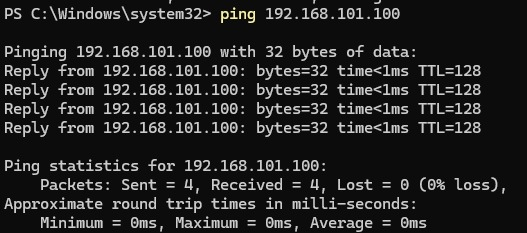
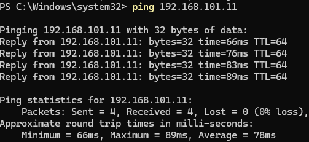
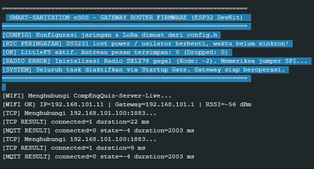

# 03 MASTER WBS SEMESTER & SISTEM MONITORING
## Operational Work Breakdown Structure — Smart-Sanitation eSOS

Status Dokumen: MASTER WBS SEMESTER TERKENDALI (CONTROLLED BASELINE) — **v2.0 Selaras ADR**
Mengacu pada: `docs/architecture/00_ARCHITECTURE_DECISION_RECORD.md`
Proyek: Smart-Sanitation eSOS
Mata Kuliah: Desain Proyek 2 (Gasal 2026/2027)
Acuan Resmi: Bab 5.5 Jadwal dan Perancangan Proposal Desain Proyek 1 DTE FTUI
Total Alokasi Waktu: 205 Jam Kerja Semester (Tidak Berubah — Realokasi Internal per Domain)

> **Catatan Revisi:** Keputusan arsitektur (MQTT-native, FreeRTOS multi-task, REST v1 enterprise) **tidak menambah total 205 jam**, melainkan **merealokasi cakupan kerja** yang sudah teralokasi di paket W2-PM (Daffa) dan W2-SW/W3-4 (Siti) agar sesuai kontrak arsitektur final di `docs/architecture/`.

---

## 1. Tautan Lembar Kerja Live Spreadsheet & Sistem Monitoring Harian

> **[BARU]** Google Sheets Live Tracker perlu ditambah kolom referensi ADR pada `Daily_Logbook_Tracking` agar setiap entri log yang menyentuh domain MQTT/FreeRTOS/REST v1 dapat ditelusuri ke ADR terkait (ADR-01 s.d. ADR-08).

Untuk memfasilitasi kolaborasi dinamis 5 anggota tim secara *real-time* tanpa risiko bentrok versi (*Git merge conflict*), seluruh pencatatan logbook harian, status tugas per pekan, dan pelacakan anggaran dihubungkan secara langsung ke **Google Sheets Live Master WBS Tracker**:

> **Tautan Master Tracking Spreadsheet:**
> [Live Master WBS & BoM Tracker — Smart-Sanitation eSOS (Google Sheets)](https://docs.google.com/spreadsheets/d/1zRfozwUUJNMKAodWKQSK0rwU4v89uHyB7RLKbxfwlRk/edit?usp=sharing)

### Arsitektur Struktur Tab Google Sheets:
1. **Tab 1: `Master_WBS_Gantt`** — Daftar lengkap paket kerja Pekan 1 s.d. Pekan 14, dependensi jalur kritis, durasi hari, diagram Gantt interaktif otomatis.
2. **Tab 2: `Daily_Logbook_Tracking`** — Jam kerja aktual, uraian aktivitas, luaran, ID bukti dengan rumus kalkulasi otomatis:
   $$\text{Total Jam Individu} = \text{SUMIFS}(\text{Jam}, \text{Nama}, \text{"Nama Anggota"}, \text{Pekan}, \text{Nomor Pekan})$$
3. **Tab 3: `BoM_Procurement_Tracker`** — Tabel pelacak 15 komponen, vendor, nomor resi kurir, status kedatangan:
   $$\text{Budget Sisa} = \text{Rp2.000.000} - \text{SUM}(\text{Total\_Harga\_Beli})$$
4. **Tab 4: `Phase_Gate_KPI_Dashboard`** — Dashboard visual persentase progres berbobot per subsistem dan indikator kelulusan Gerbang 1 sampai 4.

---

## 2. Alur Struktur Hierarki WBS Semester Penuh

```text
Smart-Sanitation eSOS (Total Scope Semester: 205 Jam)
│
├── 1.0 INITIATION & RE-PLANNING (Pekan 1 — 20h Daffa, 18h Raka, 22h Siti, 26h Ilman, 20h Darrel)
│     ├── 1.1 Evaluasi Proposal, Target Kinerja, dan Batasan Sistem (W1-PM, W1-SA)
│     ├── 1.2 Master Schedule 14 Pekan, RACI, dan Repositori Governance (W1-PM, W1-SW, W1-HW, W1-MQ)
│     └── 1.3 Architecture Decision Record (ADR): kunci 8 keputusan arsitektur final (W1-PM: Daffa)
│
├── 2.0 PROCUREMENT & IMPLEMENTATION READINESS (Pekan 2 — Jendela Pengadaan 31 Agt – 05 Sep)
│     ├── 2.1 Eksekusi BoM 15 Komponen & Verifikasi Fisik Kedatangan (W2-PROC: Raka)
│     ├── 2.2 Penyiapan Toolchain Firmware & Baseline Code ESP32 [REVISI: baseline FreeRTOS task skeleton] (W2-SW: Siti)
│     ├── 2.3 Validasi Kelistrikan Daya Surya 10Wp & Topologi 1S4P (W2-HW: Ilman)
│     ├── 2.4 Finalisasi Model 3D CAD Casing IoT & Gambar Teknik 2D (W2-MECH: Darrel)
│     └── 2.5 Setup Repositori Git, Task Tracker, Server Lokal & Mosquitto MQTT Broker (W2-PM: Daffa)
│
├── 3.0 SUBSYSTEM FABRICATION & HARDWARE PREPARATION (Pekan 3 – Pekan 4)
│     ├── 3.1 Fabrikasi 3D Printing Casing PETG & Sealing Gasket RTV IP54 (Darrel)
│     ├── 3.2 Perakitan Modul Daya & Perfboard Wiring Harness Terisolasi (Ilman — No Custom PCB)
│     ├── 3.3 Kalibrasi Sensor Gas Analog MQ-137/136 & Sensor Jarak JSN-SR04T (Ilman, Siti)
│     └── 3.4 Pengembangan Task FreeRTOS Modular (vTaskUltrasonic, vTaskGasSensors, vTaskSOSButton) & Migrasi Library LoRa ke RadioLib (Siti)
│
├── 4.0 WIRELESS TELEMETRY & SYSTEM INTEGRATION (Pekan 5 – Pekan 6)
│     ├── 4.1 Implementasi Stack MQTT Publisher/Subscriber (vTaskMqttPublisher Gateway) & Mekanisme Servo (Siti, Darrel)
│     ├── 4.2 Integrasi Casing 3D IoT + Hardware + Firmware ESP32 Dual-Varian (Node & Gateway) (Darrel, Ilman, Siti)
│     └── 4.3 Setup MQTT Subscriber Worker Pool Go & Integrasi TP-Link CPE220 (Daffa)
│
├── 5.0 MID-TERM EVALUATION & PHASE GATE 3 (Pekan 7 — Evaluasi Tengah Semester / UTS)
│     ├── 5.1 Verifikasi Konektivitas Jaringan Lokal Subnet 192.168.101.0/24 (Ping PC, Broker, Gateway) (Daffa)
│     ├── 5.2 Pengujian Transport Layer Soket TCP & Handshake MQTT Gateway→Broker (Daffa)
│     └── 5.3 Demonstrasi Prototipe Terintegrasi & Evaluasi Kesiapan Midterm (Seluruh Tim)
│
├── 6.0 FIELD TESTING & DURABILITY VALIDATION (Pekan 8 – Pekan 10)
│     ├── 6.1 Uji Ketahanan Cuaca IP54 & Siklus Daya Surya 24 Jam Pasca-Bencana (Darrel, Ilman)
│     ├── 6.2 Uji Transmisi Nirkabel LoRa Jarak Jauh pada Wilayah Blank Spot & Resiliensi MQTT Store-and-Forward (Siti, Daffa)
│     └── 6.3 Eksekusi Penuh Skenario Pengujian Mutu TC-01 s.d. TC-06 (Darrel + Seluruh PIC)
│
└── 7.0 FINAL OPTIMIZATION, REPORTING & DEMO (Pekan 11 – Pekan 14 / UAS)
      ├── 7.1 Freeze Versi Rilis Casing 3D, Firmware FreeRTOS, Server MQTT, dan REST API v1 (Seluruh Tim)
      ├── 7.2 Penyusunan Laporan Akhir Capstone Komprehensif (Seluruh Tim — Lead: Daffa)
      ├── 7.3 Pembuatan Media Presentasi, Banner & Video Demonstrasi Sistem (All)
      └── 7.4 Sidang Akhir Capstone Desain Proyek 2 & Demonstrasi Live (All)
```

---

## 3. Rincian Paket Kerja Semester (Bab 5.5 Proposal DP1: Pekan 1 s.d. Pekan 14)

### Fase 1: Perencanaan Ulang dan Penetapan Baseline (Pekan 1)
- **Target Periode:** 26 Agustus 2026 – 01 September 2026
- **Aktivitas Utama:**
  - `W1-PM-01` s.d. `W1-PM-10` (Daffa): Master WBS, jadwal semester, alokasi RACI fixed 205 jam, struktur repositori, **penyusunan Architecture Decision Record (ADR)**.
  - `W1-SA-01` s.d. `W1-SA-08` (Raka): Analisis kebutuhan, verifikasi silang BoM, pelacak pengadaan.
  - `W1-SW-01` s.d. `W1-SW-08` (Siti): Pemetaan modul firmware, pinout ESP32, **rancangan pembagian task FreeRTOS awal**.
  - `W1-HW-01` s.d. `W1-HW-09` (Ilman): Power budget daya surya 10Wp, skematik daya, pre-heating sensor gas.
  - `W1-MQ-01` s.d. `W1-MQ-08` (Darrel): Batasan mekanik fasilitas sanitasi, konsep 3D enclosure, Master Test Plan.
- **Milestone:** **Phase Gate 1 Review — PASS**.

### Fase 2: Kesiapan Implementasi dan Pengadaan (Pekan 2)
- **Target Periode:** 02 September 2026 – 08 September 2026 (Jendela Pengadaan: 31 Agt – 05 Sep)
- **Aktivitas Utama:**
  - `W2-PROC-01` s.d. `W2-PROC-11` (Raka): Eksekusi pembelian 15 item BoM, verifikasi fisik barang tiba, buku aset.
  - `W2-SW-01` s.d. `W2-SW-10` (Siti): Setup PlatformIO (dua target build: Node & Gateway), kompilasi baseline firmware **dengan skeleton task FreeRTOS**, uji GPIO/ADC/PWM.
  - `W2-HW-01` s.d. `W2-HW-10` (Ilman): Verifikasi spesifikasi fisik, penguncian topologi baterai 1S4P, rencana wiring harness.
  - `W2-MECH-01` s.d. `W2-MECH-08` (Darrel): Gambar teknik 2D, pemodelan 3D CAD casing IoT, persiapan cetak PETG.
  - `W2-PM-01` s.d. `W2-PM-09` (Daffa): **[REVISI]** Pembangunan Web Dashboard pemantauan real-time (`index.html`), **instalasi & konfigurasi Mosquitto MQTT Broker (`mosquitto.conf`, ACL)**, skeleton MQTT Subscriber Go, konfigurasi jaringan outdoor TP-Link CPE220 (`network_cpe220.conf`), repositori modular, dan live Google Sheets tracker.
- **Milestone:** **Phase Gate 2 Review (Kesiapan $\ge 80\%$ Komponen) — PASS**.

### Fase 3: Fabrikasi Casing 3D dan Perakitan Elektrikal (Pekan 3 – Pekan 4)
- **Target Periode:** 09 September 2026 – 22 September 2026
- **Aktivitas Utama:**
  - **Darrel:** Pencetakan 3D casing IoT berbahan PETG, aplikasi sealing gasket silikon RTV, dan pembuatan bracket tiang.
  - **Ilman:** Perakitan rangkaian catu daya solar 10Wp, modul TP4056 BMS, baterai 18650, dan wiring harness modular (No Custom PCB).
  - **Siti:** **[REVISI]** Implementasi task `vTaskUltrasonic`, `vTaskGasSensors`, `vTaskBatteryMonitor`, `vTaskSOSButton` (ISR-driven) sesuai tabel prioritas di `docs/hardware_references/01_SENSOR_AND_ACTUATOR_REFERENCES.md`; migrasi library LoRa dari `sandeepmistry/LoRa` ke **RadioLib** untuk mendukung operasi non-blocking.
  - **Daffa:** Pengembangan backend database server lokal (PostgreSQL/TimescaleDB, UUIDv7) dan skeleton **MQTT Subscriber Worker Pool**.
  - **Raka:** Audit anggaran pengeluaran riil dan evaluasi kepatuhan komponen terhadap standar sanitasi.

### Fase 4: Integrasi Nirkabel LoRa/MQTT dan Mekanisme Aktuator (Pekan 5 – Pekan 6)
- **Target Periode:** 23 September 2026 – 06 Oktober 2026
- **Aktivitas Utama:**
  - **Siti & Ilman:** Implementasi firmware **ESP32 Gateway** terpisah (`vTaskLoRaListener`, `vTaskMqttPublisher`, `vTaskWiFiSupervisor` dengan *store-and-forward ring buffer*), pengujian *Packet Error Rate* LoRa Node→Gateway.
  - **Raka & Darrel:** **[IMPLEMENTASI AKTUATOR]** Pengadaan dan perakitan perangkat keras aktuator (Servo MG996R / Solenoid Door Lock), modul driver/relay daya penggerak, pengujian mekanika penguncian pintu bilik sanitasi, dan verifikasi waktu respons aktuasi.
  - **Darrel & Ilman:** Pemasangan terpadu seluruh modul elektrikal ke dalam casing 3D IoT (fit check 100% pas) — dua varian casing: Node WC dan Gateway.
  - **Daffa:** **[INTEGRATOR SENSOR & AKTUATOR]** Mengintegrasikan subsistem sensor (Siti & Ilman) dengan subsistem aktuator (Raka & Darrel) ke dalam arsitektur FreeRTOS (jendela dengar Class A RX), pengujian koneksi MQTT Gateway→Broker via TP-Link CPE220, implementasi Threshold Cache (LISTEN/NOTIFY), dan kendali tombol aktuator dari Dashboard web.
  - **Raka:** Penyusunan dokumen keterlacakan verifikasi komponen terhadap matriks RTM dan audit realisasi biaya aktuator.

### Fase 5: Evaluasi Tengah Semester / UTS (Pekan 7)
- **Target Periode:** 07 Oktober 2026 – 13 Oktober 2026
- **Aktivitas Utama:**
  - **Daffa Hardhan:** Verifikasi konektivitas jaringan end-to-end (ICMP Ping satu per satu antara PC Client, Broker Laptop, dan Node Gateway ESP32), pengujian transport layer TCP socket ke broker port 1883, standardisasi IP statis pada `config.h`, dan isolasi timeout MQTT serta diagnostik SPI LoRa.
  - **Seluruh Anggota:** Demonstrasi fungsional prototipe berjalan (termasuk jalur MQTT end-to-end dan kontrol aktuator dari Dashboard) di hadapan Dosen Pembimbing.
  - **Daffa:** Kompilasi Laporan Tengah Semester dan evaluasi kelulusan **Phase Gate 3 (Mid-term Prototype Review)**.
- **Milestone & Gerbang Mutu:** **Phase Gate 3 Review — PROGRES SIGNIFIKAN / NETWORK LAYER VERIFIED**.

> **Status Capaian Midterm (Pekan 7):** Lapisan jaringan lokal (*Network & TCP Transport Layer*) terverifikasi 100% (Uji ICMP Ping satu per satu 0% loss dan pembukaan soket TCP port 1883 sukses `connected=1`). Transmisi nirkabel LoRa-to-LoRa dari Node WC ke Gateway tertahan sementara akibat kendala fisik inisialisasi modul radio SX1278 pada Gateway (`Kode: -2` / `CHIP_NOT_FOUND`) dan dijadwalkan diselesaikan melalui penataan ulang kabel jumper/catu daya fisik pada awal Pekan 8.

#### Matriks Artefak Bukti Capaian Teknis Pekan 7 (WBS Deliverables):
| ID Bukti | Deskripsi Bukti Teknis | Target Simpul / Alamat IP | Hasil Verifikasi | Lokasi Berkas Bukti |
|:---|:---|:---|:---|:---|
| **EV-W7-PM-001** | Uji ICMP Ping PC Laptop ke Broker Mosquitto | `192.168.101.100` | 4/4 Paket (0% loss), Latensi $<1\text{ ms}$ | `reports/media/Ping_Broker_Laptop_W7.png` |
| **EV-W7-PM-002** | Uji ICMP Ping PC Laptop ke ESP32 Node Gateway | `192.168.101.11` | 4/4 Paket (0% loss), Rata-rata $78\text{ ms}$ | `reports/media/Ping_Gateway_ESP32_W7.png` |
| **EV-W7-PM-003** | Log Serial Monitor Wi-Fi STA & TCP Socket Connect (Rekaman Galat LoRa Kode: -2) | `192.168.101.100:1883` | `connected=1`, Durasi $9-22\text{ ms}$, RSSI $-56\text{ dBm}$ (Log Radio LoRa Error -2) | `reports/media/Serial_Monitor_Gateway_TCP_W7.png` |

#### Dokumentasi Visual Bukti Teknis Pekan 7 (WBS Evidence Artifacts):

##### 1. Bukti EV-W7-PM-001: Uji Ping PC Laptop ke Mosquitto Broker (`192.168.101.100`)
*Verifikasi keterhubungan jaringan lokal ke Mosquitto MQTT Broker yang berjalan di PC laptop:*


##### 2. Bukti EV-W7-PM-002: Uji Ping PC Laptop ke Node Gateway ESP32 (`192.168.101.11`)
*Verifikasi keterhubungan nirkabel PC Client ke ESP32 Node Gateway via Access Point `CompEngQuiz-Server-Live`:*


##### 3. Bukti EV-W7-PM-003: Log Serial Monitor ESP32 Gateway — Koneksi Wi-Fi STA & Soket TCP Port 1883 (beserta Log Galat LoRa Kode: -2)
*Verifikasi pembentukan soket transport layer TCP dari ESP32 Gateway ke Broker Mosquitto Port 1883 (`connected=1`) sekaligus rekaman kegagalan inisialisasi radio LoRa SX1278 (`Kode: -2`) yang menjadi alasan transmisi LoRa-to-LoRa belum bisa dilakukan:*


### Fase 6: Pengujian Lapangan, Keandalan Kontinu & Validasi QA (Pekan 8 – Pekan 10)
- **Target Periode:** 14 Oktober 2026 – 03 November 2026
- **Aktivitas Utama:**
  - **Darrel & Ilman:** Eksekusi pengujian ketahanan semprotan air IP54 (TC-06) dan uji operasional kontinu daya surya 24 jam (TC-05).
  - **Siti & Daffa:** **[REVISI]** Pengujian jangkauan transmisi LoRa jarak jauh pada simulasi *blank spot* (TC-03) **plus pengujian resiliensi MQTT store-and-forward saat CPE220 disimulasikan mati (TC-07 baru)**.
  - **Siti & Ilman:** Pengujian akurasi level cairan tangki (TC-01) dan sensitivitas gas amonia/$H_2S$ (TC-02).
  - **Darrel:** Eksekusi uji siklus gerak katup mekanis 500 kali (TC-04) dan pengarsipan bukti pada `05_EVIDENCE_REGISTER.md`.

### Fase 7: Optimasi Akhir, Finalisasi Dokumen & Sidang Capstone (Pekan 11 – Pekan 14)
- **Target Periode:** 04 November 2026 – 01 Desember 2026
- **Aktivitas Utama:**
  - **Pekan 11 (Seluruh Tim):** Pembekuan (*freeze*) versi rilis casing 3D fisik, firmware FreeRTOS v2.0 (Node + Gateway), dan server MQTT-native.
  - **Pekan 12 (Lead Daffa + All):** Penyusunan draf Laporan Akhir Capstone Desain Proyek 2 lengkap sesuai format FTUI.
  - **Pekan 13 (All):** Geladi bersih demonstrasi alat, pembuatan video demo profesional, dan materi presentasi sidang.
  - **Pekan 14 (All):** **Phase Gate 4 (Ujian Akhir Semester / Sidang Capstone DP2 & Live Exhibition)**.

---

## 4. Distribusi Alokasi Jam Kerja Semester (Total: 205 Jam — Tidak Berubah)

| Nama Anggota | Peran Proposal | Alokasi Proposal | W1 – W2 (Persiapan) | W3 – W6 (Implementasi) | W7 – W10 (Uji & QA) | W11 – W14 (Final & Demo) | Total Akumulasi |
|:---|:---|:---:|:---:|:---:|:---:|:---:|:---:|
| **Daffa Hardhan** | PM dan Pengembang | **40 Jam** | 20 Jam | 8 Jam | 6 Jam | 6 Jam | **40 Jam (100%)** |
| **Raka Arrayan M.** | Analis Solusi & BoM | **35 Jam** | 18 Jam | 7 Jam | 5 Jam | 5 Jam | **35 Jam (100%)** |
| **Siti Amalia N.** | Software & LoRa | **45 Jam** | 22 Jam | 11 Jam | 6 Jam | 6 Jam | **45 Jam (100%)** |
| **Muhammad Ilman Z.**| Hardware & Power | **45 Jam** | 26 Jam | 9 Jam | 5 Jam | 5 Jam | **45 Jam (100%)** |
| **Darrel Alfath** | 3D Casing IoT & QA | **40 Jam** | 20 Jam | 8 Jam | 6 Jam | 6 Jam | **40 Jam (100%)** |
| **TOTAL TIM** | | **205 Jam** | **106 Jam** | **43 Jam** | **28 Jam** | **28 Jam** | **205 Jam (100%)** |

> **Catatan Realokasi:** Pekerjaan tambahan (setup Mosquitto, migrasi RadioLib, implementasi task FreeRTOS granular, Threshold Cache LISTEN/NOTIFY) diserap **di dalam** alokasi jam yang sudah ada di W2-PM dan W3-W6 milik Daffa/Siti — bukan penambahan jam baru. Jika realisasi lapangan menunjukkan pekerjaan ini melebihi kapasitas jam tersedia, PM (Daffa) wajib mengeskalasi melalui **Prosedur Pengendalian Perubahan** (`04_PHASE_GATE_AND_TRACEABILITY.md` §5) sebelum Pekan 5.

---

## 5. Prosedur Sinkronisasi Mingguan (*SOP Google Sheets to Git Markdown*)

1. **Setiap Hari Kerja (Senin–Jumat):** Anggota mengisi log aktivitas dan jam kerja aktual pada Google Sheets Live Tracker.
2. **Setiap Jumat Sore:** Formula Google Sheets menghitung persentase ketercapaian target pekanan dan status inventaris.
3. **Setiap Sabtu Pagi:** Manajer Proyek (Daffa) mengonsolidasikan ringkasan capaian ke dalam berkas Markdown laporan mingguan (`reports/group/` dan `reports/individual/`), memperbarui `05_EVIDENCE_REGISTER.md`, dan melakukan *Git Commit* sebagai arsip resmi.

