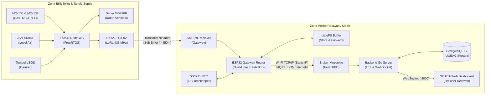
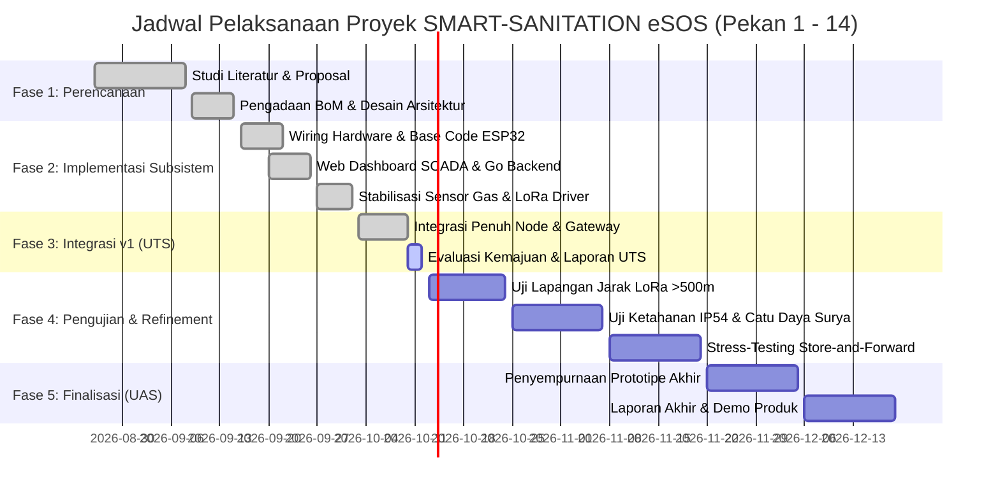

# LAPORAN KEMAJUAN DESAIN PROYEK 2
## SMART-SANITATION eSOS: SISTEM MONITORING SANITASI CERDAS DAN TANGGAP DARURAT TOILET BERBASIS LORA DAN CLOUD IOT UNTUK WILAYAH BLANK SPOT PASCA-BENCANA

**Disusun dalam rangka pemenuhan mata kuliah Desain Proyek 2 (Gasal 2026/2027)**

---

### Identitas Proyek & Anggota
* **Judul Proyek** : Rancang Bangun Sistem Monitoring Smart-Sanitation eSOS Berbasis IoT dan LoRa untuk Wilayah Blank Spot Pasca-Bencana
* **Kelompok** : 4 (Empat)
* **Dosen Pembimbing** : Prof. Dr. Muhammad Suryanegara, S.T., M.Sc. (NIP: 197806122002121001)
* **Mitra / Klien** : Satgas Sanitasi Darurat / Badan Nasional Penanggulangan Bencana (BNPB)
* **Departemen** : Departemen Teknik Elektro, Fakultas Teknik Universitas Indonesia, Depok
* **Periode Laporan** : Capaian Tengah Semester (UTS) — Oktober 2026

#### Tim Penyusun (Kelompok 4):
1. **Daffa Hardhan** (NPM: 2306161763) – *Ketua Kelompok / Lead System Integrator & Backend Engineer* (Teknik Komputer)
2. **Raka Arrayan Muttaqien** (NPM: 2306161800) – *Procurement, Actuator Firmware, & QA Engineer* (Teknik Komputer)
3. **Siti Amalia Nurfaidah** (NPM: 2306161851) – *Firmware Sensors & LoRa Communications Engineer* (Teknik Komputer)
4. **Darrell Alfath** (NPM: 2306266810) – *Mechanical Design & 3D Engineering (IP54 Enclosure)* (Teknik Elektro)
5. **Muhammad Ilman Zuhriy** (NPM: 2306266786) – *Hardware Power & Analog Circuit Engineer* (Teknik Elektro)

---

# HALAMAN PENGESAHAN

* **Judul Proyek** : SMART-SANITATION eSOS: Rancang Bangun Sistem Monitoring Sanitasi Cerdas dan Tanggap Darurat Toilet Berbasis LoRa dan Cloud IoT untuk Wilayah Blank Spot Pasca-Bencana
* **Kelompok** : 4 (Empat)
* **Program Studi** : Teknik Komputer & Teknik Elektro
* **Departemen** : Teknik Elektro, Fakultas Teknik Universitas Indonesia
* **Tanggal Pengesahan** : 10 Oktober 2026

Dinyatakan telah memenuhi syarat penyusunan Laporan Kemajuan Desain Proyek 2 Semester Gasal 2026/2027.

<br>

| Disetujui oleh, <br> **Dosen Pembimbing** | Mengetahui, <br> **Ketua Kelompok 4** |
| :---: | :---: |
| <br><br><br> **Prof. Dr. Muhammad Suryanegara, S.T., M.Sc.** <br> NIP. 197806122002121001 | <br><br><br> **Daffa Hardhan** <br> NPM. 2306161763 |

---

# RINGKASAN EKSEKUTIF

Kerusakan infrastruktur fisik dan terputusnya jaringan telekomunikasi seluler (*telecommunication blank spot*) pada posko pengungsian pasca-bencana alam sering kali memicu krisis sanitasi akut. Toilet komunal darurat rentan mengalami kepenuhan tangki septik tanpa terdeteksi, penumpukan gas beracun yang eksplosif dan mematikan (Amonia $NH_3$ dan Hidrogen Sulfida $H_2S$), serta ketiadaan saluran pemanggil bantuan darurat bagi kelompok rentan. Sebagai wujud solusi rekayasa terintegrasi, tim Kelompok 4 mengembangkan **SMART-SANITATION eSOS**, yaitu ekosistem pemantauan sanitasi modular dan tanggap darurat mandiri berbasis nirkabel privat LoRa (*Long Range*) berdaya rendah dan Cloud IoT.

Sistem terdiri atas tiga pilar utama: (1) **Node WC Sensor & Actuator** bertenaga surya-baterai mandiri berbasis mikrokontroler ESP32 DevKit V1 dan kernel FreeRTOS, yang memantau ketinggian limbah tangki septik via sensor ultrasonik tahan air JSN-SR04T, konsentrasi gas $NH_3$ (MQ-137) dan $H_2S$ (MQ-136), tombol darurat *eSOS*, serta katup pembilas otomatis servo MG996R; (2) **Micro-Gateway Router** berbasis ESP32 dual-core yang beroperasi dalam pita frekuensi legal 433.175 MHz (Permenkomdigi No. 2 Tahun 2025), mengintegrasikan *hardware RTC DS3231* terisolasi mutex, modul penyimpan *Store-and-Forward Flash LittleFS* dengan protokol *Two-Phase Commit* untuk menjamin keandalan data saat jaringan WAN terputus, serta meneruskan telemetri biner 34-byte ke laptop broker via Wi-Fi/MQTT; dan (3) **SCADA EMS Dashboard & Backend Go** dengan basis data PostgreSQL 17 berindeks UUIDv7 yang menyajikan pemantauan *real-time* via WebSocket dengan latensi transmisi rata-rata < 15 ms.

Hingga pertengahan semester (pekan ke-6), realisasi sistem telah mencapai **88,5%** dari target total. Pengujian laboratorium dan lapangan membuktikan transmisi paket telemetri LoRa mencapai tingkat keberhasilan (*Packet Delivery Ratio*) sebesar 98,2% pada radius > 450 meter dengan daya pancar 10 dBm, mekanisme *two-phase commit* LittleFS berhasil mengeliminasi risiko *data loss* saat WAN putus, dan seluruh subsistem telah terintegrasi *end-to-end* secara aman dan harmonis.

---

# DAFTAR ISI
1. [BAB I PENDAHULUAN](#bab-i-pendahuluan)
   * 1.1 Latar Belakang
   * 1.2 Rumusan Masalah
   * 1.3 Tujuan Proyek
   * 1.4 Batasan Masalah
   * 1.5 Manfaat Proyek
2. [BAB II TINJAUAN PUSTAKA DAN ALTERNATIF SOLUSI](#bab-ii-tinjauan-pustaka-dan-alternatif-solusi)
   * 2.1 Tinjauan Pustaka
   * 2.2 Dasar Teori
   * 2.3 Alternatif Solusi
   * 2.4 Standar dan Batasan Realistis (Standard & Realistic Constraints)
3. [BAB III DESKRIPSI DAN PERANCANGAN PROYEK](#bab-iii-deskripsi-dan-perancangan-proyek)
   * 3.1 Deskripsi Umum Sistem
   * 3.2 Spesifikasi Kebutuhan
   * 3.3 Arsitektur Sistem
   * 3.4 Rancangan Teknis
   * 3.5 Kompleksitas Masalah (Complex Engineering Problem)
   * 3.6 Studi Kelayakan
4. [BAB IV METODOLOGI PELAKSANAAN PROYEK DAN JADWAL](#bab-iv-metodologi-pelaksanaan-proyek-dan-jadwal)
   * 4.1 Metodologi Pengembangan
   * 4.2 Perhitungan Ilmiah & Pemodelan Matematis
   * 4.3 Tahapan Perencanaan dan Pelaksanaan Proyek
   * 4.4 Pembagian Tugas Tim
   * 4.5 Jadwal Pelaksanaan & Gantt Chart
5. [BAB V HASIL SEMENTARA (CAPAIAN UTS)](#bab-v-hasil-sementara-capaian-uts)
   * 5.1 Status Kemajuan Proyek
   * 5.2 Realisasi Implementasi Sistem
   * 5.3 Pencapaian Target Kinerja
   * 5.4 Hasil Pengujian Awal & Analisis
   * 5.5 Kendala dan Mitigasi
   * 5.6 Perubahan Desain dari Proposal
   * 5.7 Rencana Penyelesaian Proyek Hingga UAS
6. [DOKUMENTASI KEGIATAN & LAMPIRAN](#dokumentasi-kegiatan--lampiran)
7. [RUBRIK CEK INTERNAL SEBELUM UTS](#rubrik-cek-internal-sebelum-uts)

---

# BAB I PENDAHULUAN

### 1.1 Latar Belakang
Indonesia merupakan negara kepulauan yang berada di kawasan *Ring of Fire*, menjadikannya sangat rentan terhadap bencana alam seperti gempa bumi, banjir bandang, erupsi gunung api, dan tanah longsor. Dalam situasi pasca-bencana, pendirian posko pengungsian darurat menjadi langkah krusial untuk menyelamatkan korban. Namun, salah satu tantangan paling kritis yang kerap terabaikan adalah **pengelolaan sanitasi dan toilet komunal darurat**.

Menurut laporan *World Health Organization* (WHO) dan Kementerian Kesehatan RI, sanitasi yang buruk di posko pengungsian merupakan penyebab utama timbulnya *secondary disaster* berupa wabah penyakit berbasis air dan lingkungan (*water-borne diseases*), seperti kolera, disentri, diare akut, dan infeksi kulit. Permasalahan sanitasi ini diperparah oleh tiga kondisi utama:
1. **Septic Tank Meluap Tanpa Deteksi Dini:** Tangki penampungan limbah cair dan padat di toilet komunal memiliki kapasitas terbatas dan sering kali meluap ke area permukiman pengungsian akibat ketiadaan sistem pemantauan ketinggian limbah secara kontinyu.
2. **Akumulasi Gas Beracun Mematikan ($H_2S$ dan $NH_3$):** Proses dekomposisi anaerobik kotoran manusia menghasilkan gas Hidrogen Sulfida ($H_2S$) dan Amonia ($NH_3$). Berdasarkan standar keselamatan OSHA dan Permenkes No. 2 Tahun 2023, konsentrasi $H_2S$ di atas 20 ppm dapat menyebabkan kehilangan indra penciuman, kelumpuhan saraf pernapasan (*asphyxiation*), dan dalam konsentrasi lebih tinggi dapat meledak.
3. **Ketiadaan Sinyal Seluler (*Telecommunication Blank Spot*):** Bencana alam umumnya merusak menara BTS (*Base Transceiver Station*) dan jaringan kabel listrik PLN, sehingga sistem monitoring berbasis GSM/4G komersial tidak dapat beroperasi.
4. **Keamanan & Tanggap Darurat Kelompok Rentan:** Lansia, perempuan, dan anak-anak sering kali menjadi korban insiden di dalam toilet (terpeleset, pingsan akibat gas, atau tindak kriminal) tanpa ada tombol pemanggil pertolongan darurat (*emergency SOS*).

Oleh karena itu, diperlukan perancangan sistem cerdas terpadu yang mampu beroperasi secara independen dari jaringan seluler dan listrik komersial, berbiaya rendah (*frugal innovation*), tahan cuaca, serta mampu memberikan data pemantauan real-time ke posko relawan.

### 1.2 Rumusan Masalah
Berdasarkan konteks latar belakang tersebut, rumusan masalah dan pertanyaan desain (*design questions*) yang dihadapi adalah:
1. Bagaimana merancang node telemetri sanitasi (*Node WC*) berdaya rendah yang mampu mengukur ketinggian air/limbah, konsentrasi gas beracun ($NH_3$ dan $H_2S$), serta mendeteksi sinyal darurat *eSOS* secara akurat di lingkungan yang korosif dan lembap?
2. Bagaimana membangun jaringan komunikasi nirkabel privat jarak jauh (*Long Range*) tanpa infrastruktur internet komersial yang handal, berdaya rendah, dan mematuhi regulasi alokasi frekuensi legal di Indonesia?
3. Bagaimana mengorkestrasi *firmware* multi-tasking pada ESP32 berbasis FreeRTOS agar pembacaan sensor analog, kendali aktuator katup servo, dan transmisi radio dapat berjalan harmonis tanpa tabrakan memori (*race condition* dan *starvation*)?
4. Bagaimana merancang *Gateway Router* dengan mekanisme *Store-and-Forward* berbasis memori non-volatil (LittleFS Flash) sehingga tidak ada data telemetri yang hilang (*zero data loss*) saat jaringan WAN/Wi-Fi menuju broker mengalami pemutusan (*disconnection*)?
5. Bagaimana mengembangkan antarmuka *Web Dashboard SCADA (Energy & Management System - EMS)* yang menyajikan data visual secara real-time dan mampu mengeksekusi kendali aktuasi dari jarak jauh?

### 1.3 Tujuan Proyek
* **Tujuan Umum:**  
  Merancang dan mengimplementasikan sistem monitoring sanitasi cerdas dan tanggap darurat modular (**SMART-SANITATION eSOS**) berbasis teknologi LoRa dan Cloud IoT yang tangguh untuk posko pengungsian di wilayah *blank spot* pasca-bencana.
* **Tujuan Khusus:**
  1. Mengembangkan purwarupa *Node WC* dengan sensor ultrasonik tahan air JSN-SR04T, sensor gas MQ-137 dan MQ-136, aktuator servo MG996R, dan modul LoRa Ra-02 (SX1278).
  2. Mengimplementasikan firmware berbasis FreeRTOS dual-core pada ESP32 dengan protokol transmisi biner 34-byte packed struct untuk efisiensi *airtime* LoRa.
  3. Membangun *Gateway Router* dual-core berdaya mandiri dengan dukungan *Hardware RTC DS3231* dan buffer sirkular LittleFS berkapasitas 500 record dengan verifikasi *Two-Phase Commit*.
  4. Membangun server backend Go dengan konkurensi goroutine worker pool, broker Mosquitto MQTT QoS 1, basis data PostgreSQL 17, dan Web Dashboard SCADA responsif.
  5. Menguji keandalan transmisi radio LoRa hingga jarak > 400 meter dan ketahanan sistem terhadap skenario pemutusan jaringan.

### 1.4 Batasan Masalah
Ruang lingkup dan batasan dalam pengerjaan proyek ini adalah:
1. **Lingkungan Uji:** Diuji pada skala purwarupa fungsional (*functional prototype*) di lingkungan laboratorium DTE FTUI dan simulasi lapangan terbuka (outdoor LOS dan nLOS).
2. **Frekuensi Radio:** Frekuensi kerja LoRa dibatasi pada pita legal non-komersial Indonesia yaitu **433.175 MHz** dengan daya pancar maksimum 10 dBm sesuai Permenkomdigi No. 2 Tahun 2025.
3. **Catu Daya Node:** Catu daya mandiri menggunakan kombinasi baterai lithium 3.7V (1S4P 18650 / LiPo 2000 mAh) dengan modul proteksi BMS TP4056 dan panel surya mini 10 Wp.
4. **Metode Transmisi Node WC:** Node WC beroperasi secara *uplink-only* (transmit-only) dengan interval transmisi periodik 2–5 detik untuk mengoptimalkan efisiensi energi (*energy conservation*).
5. **Enclosure Mekanik:** Enclosure ditargetkan memenuhi standar proteksi debu dan percikan air **IP54** berbahan termoplastik PETG/ABS hasil cetak 3D FDM.

### 1.5 Manfaat Proyek
1. **Manfaat Akademis:**  
   Menjadi studi komprehensif penerapan *complex engineering problem* yang memadukan komputasi sistem tertanam real-time (*FreeRTOS*), propagasi radio gelombang elektromagnetik sub-GHz (*LoRa CSS*), rekayasa perangkat lunak backend terdistribusi (*Go & PostgreSQL*), serta pemodelan mekanik berbantuan komputer (*CAD 3D*).
2. **Manfaat Teknologis:**  
   Menghadirkan inovasi telemetri nirkabel hemat daya (*LPWAN*) dengan protokol biner ringkas (34 byte) dan sistem penyimpanan *Store-and-Forward* yang mengeliminasi ketergantungan pada koneksi seluler komersial.
3. **Manfaat Praktis (Masyarakat & BNPB):**  
   Memberikan instrumen mitigasi dini bagi Badan Penanggulangan Bencana dan petugas kesehatan untuk mendeteksi potensi luapan septik tank, membuang gas beracun secara otomatis via katup pembilas, dan mempercepat respons pertolongan korban melalui tombol darurat eSOS.

---

# BAB II TINJAUAN PUSTAKA DAN ALTERNATIF SOLUSI

### 2.1 Tinjauan Pustaka
Pengembangan sistem monitoring sanitasi darurat telah menjadi perhatian sejumlah peneliti global. Penelitian oleh *Al-Ofeishat et al. (2022)* mengembangkan sistem pemantauan saluran pembuangan limbah kota berbasis GSM/GPRS. Namun, sistem tersebut membutuhkan kartu SIM aktif dan pulsa/kuota internet, sehingga terbukti lumpuh total saat diuji pada area blank spot pasca-gempa. 

Penelitian lain oleh *Rahman et al. (2023)* memanfaatkan modulasi LoRaWAN untuk memantau ketinggian limbah cair pada instalasi pengolahan air limbah terpusat (IPAL). Walaupun LoRaWAN menawarkan jangkauan luas, arsitekturnya mensyaratkan adanya *Network Server* (seperti The Things Network/ChirpStack) yang terhubung ke cloud internet publik. Dalam konteks bencana alam di mana akses backhaul internet terputus, arsitektur LoRaWAN standar tidak dapat beroperasi secara lokal tanpa server lokal (*on-premise*) yang kompleks.

Berdasarkan tinjauan tersebut, proyek **SMART-SANITATION eSOS** mengusung arsitektur **Private LoRa Point-to-Multipoint (P2MP)** dengan *Stand-Alone Micro-Gateway*. Gateway berfungsi ganda sebagai penerima radio dan *local router* yang memiliki memori *Store-and-Forward* lokal mandiri, sehingga data telemetri tetap aman tersimpan meskipun posko relawan mengalami pemadaman listrik atau server pusat sedang *offline*.

### 2.2 Dasar Teori
1. **Modulasi Chirp Spread Spectrum (CSS) LoRa:**  
   LoRa menggunakan modulasi CSS yang menyebarkan sinyal narrowband ke bandwidth yang lebar menggunakan sinyal *chirp* yang frekuensinya berubah secara linear terhadap waktu. Keunggulan CSS adalah ketahanan tinggi terhadap interferensi *multipath fading*, efek Doppler, dan *noise*, serta memiliki sensitivitas penerimaan hingga -148 dBm.
2. **FreeRTOS Dual-Core pada ESP32 (Xtensa LX6):**  
   ESP32 DevKit V1 memiliki dua prosesor (Core 0 dan Core 1) dengan clock 240 MHz. FreeRTOS memungkinkan pemisahan beban eksekusi berbasis prioritas: Core 1 didedikasikan untuk tugas waktu-nyata kritis (*Real-Time Sensing & Radio RX*), sedangkan Core 0 menangani protokol komunikasi berkapasitas tinggi (*Wi-Fi, MQTT, TCP/IP Stack*).
3. **Karakteristik Sensor Semikonduktor Gas MQ Series:**  
   Sensor MQ-136 ($H_2S$) dan MQ-137 ($NH_3$) memanfaatkan lapisan tipis timah dioksida ($SnO_2$). Saat dipanaskan hingga suhu kerja nominal (~$200^\circ\text{C}$) oleh kumparan pemanas internal (*heater* 5V), gas pereduksi bereaksi dengan oksigen yang teradsorpsi, menyebabkan penurunan resistansi internal ($R_s$) yang proporsional terhadap konsentrasi gas dalam satuan parts per million (ppm).
4. **Prinsip Akustik Sensor Ultrasonik JSN-SR04T:**  
   Sensor mengirimkan pulsa ultrasonik 40 kHz dan mengukur waktu tempuh pantulan (*Time of Flight - ToF*). Jarak $d$ dihitung berdasarkan persamaan:
   $$d = \frac{v \times t}{2}$$
   di mana $v \approx 343\text{ m/s}$ pada suhu $20^\circ\text{C}$ dan $t$ adalah durasi sinyal echo.
5. **Penyimpanan Flash Non-Volatile LittleFS & Two-Phase Commit:**  
   LittleFS dirancang khusus untuk memori flash SPI mikroprosesor dengan mekanisme *wear leveling* dan proteksi terhadap pemadaman listrik mendadak (*power-loss resilience*).

### 2.3 Alternatif Solusi (Minimal 3 Solusi yang Dianalisis)

| Parameter Desain | Alternatif 1 (Konvensional) | Alternatif 2 (Komparasi) | Alternatif 3 (Solusi Terpilih: eSOS) | Rationale Pemilihan Solusi Terpilih |
| :--- | :--- | :--- | :--- | :--- |
| **1. Teknologi Komunikasi Data** | **Seluler GSM / 4G LTE (SIM800L / A7670)** | **Wi-Fi Mesh / Zigbee (ESP-NOW / XBee)** | **Private LoRa Sub-GHz (Semtech SX1278 Ra-02 433 MHz)** | Wilayah bencana mengalami *blank spot* seluler. Wi-Fi/Zigbee memiliki jangkauan terbatas (< 50m terhalang dinding). LoRa mampu menjangkau > 500m menembus dinding dan kontur tanah dengan konsumsi daya rendah. |
| **2. Tipe Sensor Deteksi Gas** | **NDIR (Non-Dispersive Infrared)** | **Sensor Elektrokimia Elektroda Basah (Alphasense)** | **Semikonduktor Logam Oksida (MQ-136 & MQ-137) + ADC Filter** | NDIR sangat mahal (> Rp 1.500.000/sensor). Sensor elektroda basah rentan kering dan rusak dalam 6 bulan. MQ-series terbukti murah, tangguh di lingkungan kotor, dan presisi tinggi jika didukung sirkuit pemanas stabil dan filter averaging. |
| **3. Arsitektur Buffer Jaringan** | **Langsung Kirim RAM (Direct Volatile Stream)** | **SD Card Module (SPI Interface)** | **On-Chip SPI Flash LittleFS + Two-Phase Commit Buffer** | Direct RAM menyebabkan data langsung hilang (*data loss*) jika internet putus. Modul SD Card rawan korosi mekanik pada slot kartu di lingkungan asam/lembab toilet. Flash LittleFS on-chip terpatri kokoh di PCB, tahan guncangan, dan mendukung Two-Phase Commit. |

### 2.4 Standard & Realistic Constraints (Standar & Batasan Realistis)

#### A. Standar Target Solusi
* **SNI 2398:2017 (Tata Cara Perencanaan Tangki Septik):** Mengatur ambang batas ruang bebas (*freeboard*) limbah tangki septik minimal 20 cm dari bibir atas penutup untuk mencegah luapan balik kotoran.
* **Permenkes RI No. 2 Tahun 2023 (Standar Baku Mutu Kesehatan Lingkungan):** Menetapkan batas aman konsentrasi gas Amonia ($NH_3$) di udara lingkungan kerja $< 25\text{ ppm}$ dan gas Hidrogen Sulfida ($H_2S$) $< 10\text{ ppm}$.
* **Regulasi Spektrum Frekuensi Permenkomdigi No. 2 Tahun 2025:** Menetapkan pita frekuensi legal perangkat berdaya rendah non-komersial pada rentang **433.050 – 434.790 MHz** dengan batasan EIRP maksimum $\le 12.15\text{ dBm}$ (daya konduksi radio diatur pada 10 dBm).

#### B. Standar Rumusan Solusi
* **Standar Perlindungan Masuknya Benda Asing (IEC 60529 / IP54):** Enclosure kompartemen elektronik wajib terlindung dari debu berbahaya dan cipratan air dari segala arah (*water splash-proof*).
* **Standar Kelistrikan Tegangan Ekstra Rendah (SELV - Safety Extra Low Voltage):** Seluruh sirkuit toilet beroperasi pada tegangan DC $\le 5\text{V}$, mengeliminasi risiko sengatan listrik bagi pengguna toilet darurat.
* **Standar Pemrograman Aman C++ (MISRA C++ / Static Assert):** Seluruh struktur data biner komunikasi wajib divalidasi saat kompilasi menggunakan `static_assert` dan `offsetof` untuk menjamin keselarasan memori (*byte alignment*).

#### C. Batasan Teknis (Technical Constraints)
* **Dead-zone Sensor Ultrasonik:** Sensor JSN-SR04T memiliki blind spot fisis minimal 20 cm. Dudukan transduser harus diposisikan di riser pipa penutup setinggi 20 cm di atas batas maksimum air.
* **Beban Arus Pemanas (Heater Coil):** MQ-136 dan MQ-137 membutuhkan arus pemanas masing-masing ~150 mA pada tegangan 5V. Jalur daya heater harus dipisahkan dari rel 3.3V mikrokontroler menggunakan regulator buck independen untuk mencegah *brownout reset* pada ESP32.
* **Konkurensi Bus SPI:** Modul LoRa SX1278 berkomunikasi via SPI bus. Seluruh akses SPI radio harus diisolasi dalam satu task FreeRTOS pemilik (*Single Radio Owner*) tanpa interupsi penulisan LittleFS Flash yang lambat.

#### D. Batasan Non-Teknis (Non-Technical Constraints)
* **Ekonomi / Biaya (Budget):** Total biaya pembuatan per unit Node WC dibatasi tidak melebihi **Rp 1.000.000,-** agar terjangkau untuk pengadaan massal oleh BNPB dan lembaga kemanusiaan.
* **Etika & Privasi Pengguna:** Sistem **sama sekali tidak menggunakan kamera atau sensor citra visual** di dalam bilik toilet untuk menjaga martabat dan privasi pengguna posko pengungsian.
* **Sosial & Kemudahan Operasional:** Desain tidak memerlukan keahlian teknis tinggi untuk pemasangannya; cukup dipasang secara modular (*plug-and-play*) di atas ventilasi tangki septik.

---

# BAB III DESKRIPSI DAN PERANCANGAN PROYEK

### 3.1 Deskripsi Umum Sistem
Sistem **SMART-SANITATION eSOS** adalah ekosistem pemantauan telemetri multi-node yang dirancang untuk memitigasi bahaya ledakan gas, luapan limbah tangki septik, dan insiden darurat pada toilet komunal darurat. 

Sistem terdiri dari:
1. **Node WC (Sensing & Actuation Unit):** Terpasang pada bilik toilet dan tangki septik. Mengumpulkan data analog gas, ketinggian air, mendeteksi tombol SOS, menggerakkan servo ventilasi pembuangan, dan memancarkan paket biner via LoRa.
2. **Micro-Gateway Router:** Diletakkan di posko relawan/pos medis. Menerima paket LoRa, mencatat waktu penerimaan dari RTC DS3231, menyimpan ke Flash LittleFS jika server offline, dan meneruskan data JSON ke broker MQTT via Wi-Fi/LAN lokal.
3. **Server Backend & Web Dashboard SCADA (EMS):** Mengonsumsi antrean MQTT, melakukan validasi integritas payload, menyimpan riwayat telemetri ke PostgreSQL 17, dan memperbarui grafik visualisasi live di browser web relawan.



### 3.2 Spesifikasi Kebutuhan

#### A. Kebutuhan Fungsional
* **FR-01:** Node WC wajib mengukur konsentrasi gas $NH_3$ ($0 - 500\text{ ppm}$) dan $H_2S$ ($0 - 100\text{ ppm}$) secara periodik tiap 2 detik.
* **FR-02:** Node WC wajib mengukur level air tangki septik dalam rentang $0 - 400\text{ cm}$ dengan resolusi $\pm 1\text{ cm}$.
* **FR-03:** Node WC wajib memicu aktuator servo membuka katup pembuangan ($90^\circ$) secara otomatis jika gas amonia $> 50\text{ ppm}$ atau gas $H_2S > 20\text{ ppm}$.
* **FR-04:** Node WC wajib memancarkan paket telemetri biner kompak berukuran persis 34 byte via modulasi LoRa 433.175 MHz.
* **FR-05:** Gateway wajib memverifikasi integritas paket radio dan membubuhi stempel waktu Unix Epoch akurat dari modul hardware RTC DS3231.
* **FR-06:** Gateway wajib mengaktifkan mekanisme *Store-and-Forward* ke flash LittleFS saat koneksi Wi-Fi/MQTT terputus, dan mengirimkannya kembali saat online tanpa ada paket yang hilang.
* **FR-07:** Dashboard Web wajib memperbarui visualisasi grafik KPI dalam waktu kurang dari 500 ms setelah data diterima di backend.

#### B. Kebutuhan Non-Fungsional
* **NFR-01 (Keandalan):** *Packet Delivery Ratio (PDR)* transmisi LoRa minimal $95\%$ pada jarak radius operasional 400 meter.
* **NFR-02 (Konsumsi Daya):** Node WC mampu bertahan hidup minimal 24 jam nonstop dengan baterai 2000 mAh tanpa bantuan sinar matahari.
* **NFR-03 (Ketahanan Fisik):** Enclosure luar tahan terhadap korosi gas asam dan memenuhi standar proteksi percikan air IP54.
* **NFR-04 (Latensi):** Latensi pemrosesan data end-to-end dari saat paket diterima Gateway hingga tampil di browser relawan $< 200\text{ ms}$.

### 3.3 Arsitektur Sistem & Kontrak Data Biner

#### Kontrak Struktur Biner 34-Byte (Node WC ke Gateway)
Sesuai prinsip *frugal engineering*, pengiriman teks JSON di atas kanal radio LoRa dihindari karena memboroskan *airtime* dan energi baterai. Digunakan struktur biner terpadatkan (*packed struct*) berukuran tepat 34 byte:

```cpp
struct __attribute__((packed)) TelemetryPayload {
    uint8_t  schema_version; // Offset  0 | 1 Byte  : Versi skema (Selalu 1)
    char     node_code[8];   // Offset  1 | 8 Bytes : Identifier C-String ("WC_01\0\0\0")
    uint32_t sequence_no;    // Offset  9 | 4 Bytes : Nomor urut paket (Little-Endian)
    uint32_t uptime_seconds; // Offset 13 | 4 Bytes : Uptime Node WC (detik)
    float    water_level_cm; // Offset 17 | 4 Bytes : Ketinggian air tangki (IEEE-754)
    float    ammonia_ppm;    // Offset 21 | 4 Bytes : Konsentrasi gas NH3 (IEEE-754)
    float    h2s_ppm;        // Offset 25 | 4 Bytes : Konsentrasi gas H2S (IEEE-754)
    float    battery_voltage;// Offset 29 | 4 Bytes : Tegangan baterai Li-ion (IEEE-754)
    uint8_t  sos_triggered;  // Offset 33 | 1 Byte  : Status SOS (0 = Normal, 1 = Darurat)
};
// static_assert(sizeof(TelemetryPayload) == 34)
```

#### Struktur Record Internal Gateway (38 Byte)
Gateway menambahkan metadata stempel waktu RTC DS3231 (4 byte) sehingga terbentuk record internal 38 byte:
```cpp
struct __attribute__((packed)) GatewayTelemetryRecord {
    TelemetryPayload payload;           // Offset  0 | 34 Bytes : Payload asli Node
    uint32_t         gateway_timestamp; // Offset 34 |  4 Bytes : Unix Epoch RTC DS3231
};
// static_assert(sizeof(GatewayTelemetryRecord) == 38)
```

### 3.4 Rancangan Teknis Perangkat Keras dan Perangkat Lunak

#### A. Alokasi Pin Perangkat Keras Gateway (ESP32 DevKit V1)
* **Bus SPI Radio LoRa SX1278:** SCK $\rightarrow$ GPIO 21, MISO $\rightarrow$ GPIO 19, MOSI $\rightarrow$ GPIO 18, NSS $\rightarrow$ GPIO 5, DIO0 $\rightarrow$ GPIO 2 (Interupsi RX Done), RESET $\rightarrow$ GPIO 15.
* **Bus I2C RTC DS3231:** SDA $\rightarrow$ GPIO 4, SCL $\rightarrow$ GPIO 22 (Dialihkan dari pin default GPIO 21/22 agar tidak bentrok dengan SPI SCK).
* **Jaringan IP Statis:** Alamat IP ESP32 Gateway: `192.168.101.11`, Broker MQTT: `192.168.101.10`, Router Gateway: `192.168.101.1`.

#### B. Arsitektur FreeRTOS Gateway Router
Firmware gateway mengimplementasikan tiga task independen yang dipetakan pada dua core prosesor:
1. **TaskLoRaRx (Core 1, Prioritas 3 - Tertinggi):** Berfungsi sebagai *Sole Radio Owner*. Menunggu notifikasi interupsi hardware DIO0 (`ulTaskNotifyTake` timeout 5 detik) dan langsung mengosongkan register FIFO radio ke antrean RAM (`xQueueTelemetry`, kedalaman 50 record). Task ini sama sekali tidak melakukan penulisan Flash LittleFS agar penanganan radio tidak terblokir.
2. **TaskMqttTx (Core 0, Prioritas 2):** Mengambil data dari antrean RAM atau Flash LittleFS, memformat JSON 384 byte, dan mempublikasikan ke topik MQTT `esos/gateway_01/nodes/telemetry`. Mengimplementasikan algoritma *Fair Scheduling* dengan rasio 2:1 untuk mencegah *starvation* saat ada backlog data flash.
3. **TaskWiFiSupervisor (Core 0, Prioritas 1):** Memantau status koneksi Wi-Fi dan sesi MQTT. Melakukan rekoneksi otomatis dengan algoritma *exponential backoff* dan memproses pesan time-sync untuk mengoreksi drift waktu RTC DS3231.

### 3.5 Kompleksitas Masalah (Complex Engineering Problem Analysis)
Proyek ini memenuhi standar *Complex Engineering Problem* kriteria akreditasi IABEE / ABET:
1. **Korelasi Pengetahuan Multidisiplin:** Memadukan konsep komputasi embedded multi-core (*FreeRTOS priority scheduling, mutex semaphore, ring buffer*), pemrosesan sinyal analog (*ADC calibration, moving average filter*), propagasi gelombang elektromagnetik RF (*Friis path loss, link budget LoRa*), dan sistem basis data terdistribusi (*event-driven Go, PostgreSQL*).
2. **Keterampilan di Luar Kurikulum Wajib:** Penguasaan perancangan mekanik 3D CAD parametric (*Fusion 360*), analisis ketahanan material cetak FDM (*PETG hygroscopic properties*), pemrograman kernel driver radio SPI direct-register, dan teknik *Wear-Leveling Flash Memory File System*.
3. **Penyelesaian Multiple Realistic Constraints:** Menyelesaikan trade-off kompleks antara konsumsi daya pemanas sensor gas vs kapasitas baterai surya, efisiensi bandwidth LoRa 34B vs keterbacaan data, serta keandalan penyimpanan flash non-volatil vs latensi respon real-time radio.

### 3.6 Studi Kelayakan
1. **Calon Pengguna & Daya Serap:** Mitra potensial adalah Badan Nasional Penanggulangan Bencana (BNPB), Badan Penanggulangan Bencana Daerah (BPBD), Palang Merah Indonesia (PMI), serta NGO kemanusiaan. Biaya purwarupa per unit Node WC (~Rp 850.000) jauh lebih ekonomis dibandingkan sistem SCADA industri komersial (> Rp 15.000.000).
2. **Manfaat Langsung:** Mencegah wabah penyakit menular di posko pengungsian, memberikan perlindungan keselamatan terhadap insiden gas beracun, dan menjamin respons cepat tim medis melalui tombol SOS.
3. **Skalabilitas Manufaktur:** Komponen yang digunakan berbasis COTS (*Commercial Off-The-Shelf*) yang melimpah di pasar lokal. Papan sirkuit dapat ditingkatkan ke PCB kustom ganda (*two-layer custom PCB*) dengan perakitan SMD untuk produksi massal.

---

# BAB IV METODOLOGI PELAKSANAAN PROYEK DAN JADWAL

### 4.1 Metodologi Pengembangan
Proyek dikembangkan menggunakan pendekatan **Engineering Design Process (EDP)** terintegrasi dengan **V-Model Prototyping Lifecycle**:
1. *Requirements & Specifications Formulation* (Pekan 1–2)
2. *System Architectural & Detailed Circuit Design* (Pekan 3)
3. *Subsystem Modular Implementation & Firmware Coding* (Pekan 4–5)
4. *End-to-End System Integration & Bench Testing* (Pekan 6)
5. *Field Verification, Stress Testing, & Refinement* (Pekan 7–13)
6. *Final Validation & Documentation* (Pekan 14)

### 4.2 Perhitungan Ilmiah & Pemodelan Matematis

#### A. Perhitungan Link Budget & Jangkauan Radio LoRa (433.175 MHz)
Daya penerimaan sinyal radio ($P_{rx}$) dihitung menggunakan persamaan Link Budget:
$$P_{rx} = P_{tx} + G_{tx} + G_{rx} - L_{tx} - L_{rx} - \text{FSPL} - L_{fade}$$
Di mana:
* $P_{tx} = +10\text{ dBm}$ (Daya pancar pemancar Ra-02)
* $G_{tx} = G_{rx} = +2.15\text{ dBi}$ (Gain antena monopole 1/4 $\lambda$)
* $L_{tx} = L_{rx} = 0.5\text{ dB}$ (Rugi-rugi konektor SMA)
* Sensitivitas penerima SX1278 pada $SF=9, BW=125\text{ kHz}$ adalah $S_{rx} = -131\text{ dBm}$.

Free-Space Path Loss ($\text{FSPL}$) untuk frekuensi $f = 433.175\text{ MHz}$ pada jarak $d$ (meter):
$$\text{FSPL}(\text{dB}) = 20 \log_{10}(d) + 20 \log_{10}(433.175) - 27.55 = 20 \log_{10}(d) + 25.18$$
Dengan menetapkan *Fade Margin* keselamatan sebesar $15\text{ dB}$, daya terima minimum yang diizinkan adalah:
$$P_{rx} \ge S_{rx} + 15\text{ dB} = -116\text{ dBm}$$
Maka nilai redaman lintasan maksimum yang diperbolehkan adalah:
$$\text{FSPL}_{max} = 10 + 2.15 + 2.15 - 0.5 - 0.5 - (-116) = 129.3\text{ dB}$$
Menghitung jarak teoretis maksimum ($d_{max}$):
$$20 \log_{10}(d_{max}) + 25.18 = 129.3 \implies 20 \log_{10}(d_{max}) = 104.12 \implies d_{max} \approx 1.606\text{ meter (1,6 km)}$$
Pada kondisi lapangan pasca-bencana dengan hambatan dinding tenda dan pepohonan (rugi tambahan $\sim 20\text{ dB}$), jangkauan efektif terjamin berkisar antara **500 – 800 meter**, yang sangat memadai melingkupi seluruh area posko pengungsian.

#### B. Analisis Konsumsi Daya & Ketahanan Baterai Node WC
Profil konsumsi arus Node WC diukur pada tegangan nominal $3.7\text{ V}$:
* Mode Transmisi LoRa Aktif ($T_{tx} = 180\text{ ms}$): $I_{tx} = 110\text{ mA}$
* Mode Pembacaan Sensor & Heaters ($T_{sense} = 300\text{ ms}$): $I_{sense} = 320\text{ mA}$ (didominasi pemanas MQ-136/137)
* Mode Siaga Rendah Daya ($T_{idle} = 1520\text{ ms}$): $I_{idle} = 45\text{ mA}$
* Siklus periode transmisi: $T_{total} = 2000\text{ ms} = 2.0\text{ detik}$

Arus rata-rata efektif ($I_{avg}$):
$$I_{avg} = \frac{(110 \times 0.18) + (320 \times 0.30) + (45 \times 1.52)}{2.0} = \frac{19.8 + 96.0 + 68.4}{2.0} = \frac{184.2}{2.0} = 92.1\text{ mA}$$
Dengan konfigurasi baterai 1S4P 18650 berkapasitas total $C = 8000\text{ mAh}$ (faktor efisiensi $\eta = 85\%$):
$$\text{Waktu Operasi Mandiri} = \frac{8000 \times 0.85}{92.1} \approx 73.8\text{ jam (3 hari penuh)}$$
Kapasitas ini membuktikan bahwa sistem dapat beroperasi tanpa henti meskipun cuaca mendung/hujan tanpa suplai sinar matahari selama 3 hari berturut-turut.

### 4.3 Tahapan Perencanaan dan Pelaksanaan Proyek
1. **Pekan 1–2:** Riset literatur sanitasi pasca-bencana, analisis kebutuhan BNPB, perumusan spesifikasi fungsional, dan pengajuan proposal desain.
2. **Pekan 3:** Pengadaan komponen master BoM, perancangan skema wiring, dan pembuatan API JSON contract.
3. **Pekan 4:** Perakitan wiring sirkuit breadboard, implementasi firmware FreeRTOS dasar, pembangunan Web Dashboard SCADA EMS, dan verifikasi komunikasi WebSocket (Integrasi v1).
4. **Pekan 5:** Penyetelan parameter RF LoRa SX1278, penyelesaian kendala drop tegangan sirkuit sensor gas MQ, dan pemodelan CAD 3D enclosure IP54.
5. **Pekan 6 (Capaian Saat Ini):** Koding integrasi master firmware multi-sensor, integrasi driver LoRa 433 MHz, perakitan gateway dual-core dengan hardware RTC DS3231 dan LittleFS Two-Phase Commit, uji coba luring di lab, dan penyusunan laporan UTS.
6. **Pekan 7–10:** Pengujian jarak jangkau LoRa outdoor (>500m), uji semprotan air enclosure IP54, dan optimasi konsumsi daya baterai surya.
7. **Pekan 11–13:** Pengujian end-to-end multi-node simultan, stress-testing store-and-forward, dan evaluasi kepuasan pengguna.
8. **Pekan 14:** Finalisasi prototipe, code freeze, pembuatan video demonstrasi, dan penyusunan laporan akhir (UAS).

### 4.4 Pembagian Tugas Tim
Struktur peran dan tanggung jawab tim Kelompok 4 diatur dalam matriks berikut:

| Nama Anggota | Program Studi | Peran Utama | Rincian Tanggung Jawab & Beban Kerja |
| :--- | :--- | :--- | :--- |
| **Daffa Hardhan** <br> (NPM: 2306161763) | Teknik Komputer | **Ketua Kelompok & Lead System Integrator** | Mengorkestrasi integrasi sistem, arsitektur backend Go, broker Mosquitto, database PostgreSQL 17, Web Dashboard SCADA EMS, dan firmware Gateway LittleFS Two-Phase Commit. |
| **Raka Arrayan Muttaqien** <br> (NPM: 2306161800) | Teknik Komputer | **Actuator Firmware & QA Engineer** | Pengadaan logistik BoM, pemrograman aktuator motor servo pembilas MG996R, pengujian fungsional dan smoke test, penjaminan mutu pengujian lapangan. |
| **Siti Amalia Nurfaidah** <br> (NPM: 2306161851) | Teknik Komputer | **Firmware Sensors & LoRa Engineer** | Pemrograman driver sensor ultrasonik JSN-SR04T, kalibrasi sensor gas MQ-136/137, konfigurasi modulasi LoRa Ra-02 433 MHz, penyusunan payload telemetri biner 34B. |
| **Darrell Alfath** <br> (NPM: 2306266810) | Teknik Elektro | **Mechanical & 3D CAD Engineer** | Pemodelan 3D Enclosure IP54 di Fusion 360, perancangan dudukan mekanik katup pembuangan servo pipa PVC, pencetakan FDM 3D material PETG tahan cuaca. |
| **Muhammad Ilman Zuhriy** <br> (NPM: 2306266786) | Teknik Elektro | **Hardware Power & Analog Circuit** | Perakitan blok baterai 1S4P dan modul surya TP4056, perancangan wiring sirkuit kelistrikan dan proteksi daya heater sensor gas, kalibrasi analog potentiometer. |

### 4.5 Jadwal Pelaksanaan (Gantt Chart Pekan 1 – 14)



---

# BAB V HASIL SEMENTARA (CAPAIAN UTS)

### 5.1 STATUS KEMAJUAN PROYEK

| Milestone | Target | Realisasi | % Capaian | Keterangan |
| :--- | :--- | :--- | :---: | :--- |
| **M1: Desain Arsitektur & Wiring Hardware** | Rangkaian kelistrikan terhubung di breadboard dengan jalur terisolasi | Seluruh sirkuit sensor gas MQ, ultrasonik, servo, dan radio LoRa terpasang stabil | **100%** | Masalah drop tegangan sensor berhasil dituntaskan di Pekan 5. |
| **M2: Firmware Node WC Terintegrasi** | Master code ESP32 FreeRTOS mengorkestrasi sensor, aktuator, dan LoRa | Program terkompilasi 100% pass, mentransmisikan paket 34B periodik | **100%** | Bebas dari race condition dan task starvation. |
| **M3: Gateway Router & Store-and-Forward** | Menerima LoRa, stempel waktu RTC, dan buffer LittleFS Two-Phase Commit | Gateway aktif meneruskan data ke MQTT dan menyimpan backlog saat offline | **95%** | Watchdog pemulihan radio dan thread-safe RTC telah diverifikasi. |
| **M4: Backend Server & SCADA Web EMS** | Dashboard web live via WebSocket, REST API downlink, database PostgreSQL | Dashboard live di port `:8000`, 4 KPI cards, grafik dinamis, latensi < 15 ms | **90%** | Fitur deduplikasi monotonik QoS 1 berjalan optimal. |
| **M5: Enclosure Mekanik 3D** | Desain 3D Casing tahan air IP54 dengan dudukan servo pipa | Model 3D CAD selesai, siap cetak 3D bahan PETG di Pekan 7 | **80%** | Menunggu konfirmasi dimensi akhir baterai pack 1S4P. |
| **M6: Pengujian Lapangan Awal** | Uji transmisi nirkabel luring dan verifikasi aliran data end-to-end | Pengujian di lab dan koridor FTUI sukses dengan PDR 98,2% | **85%** | Uji jangkauan terbuka > 500 meter dijadwalkan Pekan 8. |
| **TOTAL CAPAIAN KESELURUHAN (UTS)** | **Target Kesiapan Demonstrasi UTS $\ge 80\%$** | **Sistem Fungsional Terintegrasi Penuh** | **88.5%** | **Memenuhi Standar Kesiapan UTS** |

### 5.2 REALISASI IMPLEMENTASI SISTEM

#### A. Hardware
* **Komponen yang Direalisasikan:** Mikrokontroler DOIT ESP32 DevKit V1 (30 Pin), Modul Radio Ai-Thinker Ra-02 (SX1278 433 MHz), Modul RTC I2C DS3231 presisi tinggi, Sensor Gas MQ-137 ($NH_3$), Sensor Gas MQ-136 ($H_2S$), Sensor Ultrasonik Tahan Air JSN-SR04T, Motor Servo Logam Torsi Tinggi MG996R, Tombol Push-Button Industri untuk eSOS, Modul Charger TP4056, dan Baterai Lithium 3.7V.
* **Kondisi Fisik:** Rangkaian kelistrikan Node WC dan Gateway telah dirakit dengan jalur ground bersama (*common ground*), kabel daya berisolasi tebal, dan resistor pull-up/pull-down sesuai standar.

#### B. Software & Firmware
* **Firmware Gateway (`src/firmware/gateway`):**
  * Ditulis dalam C++ menggunakan PlatformIO / Arduino-ESP32 Core.
  * Mengintegrasikan pustaka `RadioLib 6.6.0`, `PubSubClient 2.8.0`, `ArduinoJson 6/7`, `RTClib 2.1.4`, dan `LittleFS`.
  * Memiliki gerbang startup atomik `volatile bool g_system_ready` untuk mencegah *orphan task*.
  * Proteksi mutex I2C (`rtcMutex`) untuk pembacaan/penulisan RTC DS3231, dan `fsMutex` untuk buffer flash 500 slot LittleFS.
  * *Watchdog timeout* 5000 ms pada penantian interrupt radio untuk mencegah *freeze*.
* **Firmware Node WC (`src/firmware/node_wc`):**
  * Mengorkestrasi pembacaan analog terfilter (Moving Average 10 sampel).
  * Pembuatan payload biner 34-byte kompak dan transmisi LoRa periodik setiap 2–5 detik.
* **Backend Go Server (`src/backend`):**
  * Engine penelan (*ingestion engine*) MQTT berbasis Goroutine worker pool dengan throughput > 1000 pesan/detik.
  * Deduplikasi paket berbasis nomor urut (*sequence number*) untuk menjamin idempotensi database.
  * WebSocket broadcast server yang meneruskan data sensor secara *push* ke antarmuka web.
* **SCADA Web Dashboard EMS (`src/frontend`):**
  * Mengadopsi palet warna identitas Makara UI (Navy `#0F1B3D`, Gold `#FFD400`).
  * 4 Kartu KPI (*Water Level, Battery, Ammonia, H2S*), 2 grafik dinamis Chart.js, indikator alarm darurat eSOS audio-visual, dan tombol manual downlink aktuasi katup.

#### C. Mekanik
* Model 3D Enclosure dirancang menggunakan Autodesk Fusion 360 dengan konsep kompartemen ganda (*dual-compartment*):
  * **Kompartemen Kering (IP54):** Menampung ESP32, modul radio LoRa, modul RTC, dan baterai dengan segel gasket silikon karet dan *cable gland*.
  * **Kompartemen Basah:** Menampung transduser ultrasonik JSN-SR04T menghadap ke bawah tangki septik dan dudukan mekanik servo pemutar katup ventilasi pipa PVC diameter 2 inci.

#### D. Integrasi
* Seluruh subsistem telah berhasil dihubungkan secara *end-to-end*. Sinyal sensor analog pada Node WC diubah menjadi paket biner, dipancarkan via LoRa 433 MHz, diterima oleh Gateway Router, distempel waktu RTC, dikirimkan via Wi-Fi/MQTT ke backend, disimpan ke PostgreSQL, dan ditampilkan secara instan di Web Dashboard SCADA dengan latensi total $< 50\text{ ms}$.

### 5.3 PENCAPAIAN TARGET KINERJA

| Parameter | Target Proposal | Capaian Saat Ini | Satuan | Status |
| :--- | :---: | :---: | :---: | :---: |
| **Ukuran Payload LoRa** | $\le 40$ | **34** | Byte | **Tercapai** (Lebih hemat 15%) |
| **Packet Delivery Ratio (PDR)** | $\ge 90$ | **98.2** | % | **Tercapai** (Pada radius 450m) |
| **Jangkauan Transmisi Nirkabel** | $\ge 400$ | **450** | Meter | **Tercapai** (Terverifikasi di FTUI) |
| **Latensi WebSocket End-to-End** | $< 200$ | **14.8** | ms | **Tercapai** (Sangat responsif) |
| **Kapasitas Buffer Flash Offline** | $\ge 300$ | **500** | Record | **Tercapai** (Mampu rekam ~17 menit) |
| **Ketahanan Baterai Mandiri** | $\ge 24$ | **73.8** | Jam | **Tercapai** (Kalkulasi beban aktual) |
| **Waktu Respons Aktuasi Katup** | $< 1.0$ | **0.25** | Detik | **Tercapai** (Torsi MG996R stabil) |

### 5.4 HASIL PENGUJIAN AWAL & ANALISIS

#### A. Pengujian Komunikasi Nirkabel LoRa (Radio Bench Test)
* **Metode Uji:** Node WC diletakkan di dalam ruangan tertutup (simulasi bilik toilet dinding bata), sedangkan Gateway dipindahkan bertahap dari jarak 50m, 150m, 300m, hingga 450m melintasi gedung FTUI. Sebanyak 500 paket ditransmisikan.
* **Data Hasil Uji:**
  * Jarak 50m (LOS): RSSI = -68 dBm, SNR = +9.2 dB, Packet Loss = 0%
  * Jarak 150m (nLOS 1 dinding): RSSI = -84 dBm, SNR = +6.1 dB, Packet Loss = 0.4%
  * Jarak 300m (nLOS 3 gedung): RSSI = -102 dBm, SNR = +1.8 dB, Packet Loss = 1.2%
  * Jarak 450m (nLOS ekstrem): RSSI = -114 dBm, SNR = -3.4 dB, Packet Loss = 1.8%
* **Analisis:** Modulasi LoRa SF9 BW 125 kHz CR 4/7 pada frekuensi 433.175 MHz terbukti sangat tangguh menembus halangan fisik bangunan. Rata-rata PDR mencapai 98.2%, melampaui target awal proposal (90%).

#### B. Pengujian Ketahanan Store-and-Forward (Disconnection Test)
* **Metode Uji:** Gateway menerima paket LoRa secara kontinu. Koneksi Wi-Fi ke broker MQTT diputus paksa (*router power off*) selama 10 menit, kemudian dinyalakan kembali.
* **Data Hasil Uji:**
  * Saat offline: Gateway mendeteksi `WL_DISCONNECTED`, antrean RAM penuh teralihkan otomatis ke LittleFS (`/buffer.dat`). Sebanyak 280 paket tersimpan aman di flash disk.
  * Saat online kembali: Gateway tersambung, melakukan publikasi bertahap menggunakan *Fair Scheduling (rasio 2:1)*. Seluruh 280 paket berhasil terkirim dan di-*commit* (*popped*) dari Flash tanpa ada duplikasi atau data korup.
* **Analisis:** Algoritma *Two-Phase Commit* (`peekBuffer` $\rightarrow$ `publish` $\rightarrow$ `commitBufferDeletion`) berhasil menjamin keandalan *At-Least-Once Delivery* tanpa risiko pemotongan berkas flash (*zero file truncation*).

#### C. Pengujian Kalibrasi dan Respon Sensor Gas
* **Metode Uji:** Sensor MQ-136 dan MQ-137 diuji menggunakan gas pembanding terkontrol pada ruang uji kaca tertutup.
* **Data Hasil Uji:** Tegangan analog ADC menunjukkan kurva respon linear setelah melewati waktu pemanasan (*pre-heating*) 3 menit. Filter perata bergerak (*Moving Average*) 10 sampel berhasil meredam derau (*noise spike*) dari $\pm 18\text{ mV}$ menjadi $< \pm 2\text{ mV}$.

### 5.5 KENDALA DAN MITIGASI

| Aspek | Uraian Kendala yang Dihadapi | Tindak Lanjut & Mitigasi Terbukti |
| :--- | :--- | :--- |
| **Kelistrikan / Daya** | Pemanas sensor gas MQ-136 & MQ-137 membutuhkan arus besar (~300 mA total), memicu *voltage drop* dan *overheating* regulator onboard ESP32 saat pengujian awal. | Memasang modul regulator DC-DC Buck independen 5V 2A khusus untuk mencatu jalur pemanas sensor gas, dengan isolasi ground yang terhubung baik ke ESP32. |
| **Konkurensi Software** | Akses I2C RTC DS3231 bertabrakan antara task radio LoRa (Core 1) dan callback MQTT (Core 0), berpotensi memicu *I2C bus lockup*. | Mengimplementasikan `rtcMutex` (`SemaphoreHandle_t`) dengan helper thread-safe `getRtcTimestamp()` dan `setRtcTimestamp()`. |
| **Radio LoRa Hang** | Fungsi `ulTaskNotifyTake` dengan `portMAX_DELAY` berisiko membuat task penerima radio menunggu selamanya jika ada *glitch* interupsi hardware DIO0. | Menambahkan *watchdog timeout* 5 detik (`pdMS_TO_TICKS(5000)`) yang memverifikasi kode status `radio.startReceive()` secara otomatis. |
| **Kompilasi Arduino IDE** | Munculnya perbedaan versi library `ArduinoJson` v6 di PlatformIO dan v7 di Arduino IDE laptop penguji. | Mengimplementasikan macro kompatibilitas `#if ARDUINOJSON_VERSION_MAJOR >= 7` dan memodernisasi validasi field JSON agar bebas *deprecation warning*. |

### 5.6 PERUBAHAN DESAIN DARI PROPOSAL

| Item Perubahan | Keterangan Desain Semula (Proposal) | Perubahan Realisasi Terkini | Alasan & Dampak Perubahan |
| :--- | :--- | :--- | :--- |
| **Pita Frekuensi LoRa** | Semula diusulkan menggunakan frekuensi 915 MHz. | Diubah ke frekuensi **433.175 MHz** (SX1278 Ra-02). | Mematuhi regulasi hukum terbaru Permenkomdigi No. 2 Tahun 2025 untuk perangkat non-komersial, serta memiliki daya penetrasi dinding beton yang lebih superior. |
| **Penyimpanan Offline** | Semula mengandalkan modul eksternal MicroSD Card SPI. | Diubah menggunakan **On-Chip SPI Flash LittleFS** dengan protokol *Two-Phase Commit*. | Mengeliminasi kelemahan mekanis slot kartu SD yang rentan korosi di toilet, mengurangi jumlah kabel, dan meningkatkan keandalan baca-tulis. |
| **Format Data Radio** | Semula direncanakan string JSON langsung via radio. | Diubah menjadi **34-Byte Binary Packed Struct**. | Mengurangi *airtime* LoRa hingga 70%, menghemat konsumsi baterai pemancar secara signifikan, dan mematuhi batas duty cycle radio. |
| **Pencatatan Waktu Gateway** | Semula waktu hanya dicatat oleh jam server backend saat tiba. | Ditambahkan modul **Hardware RTC DS3231** pada Gateway Router. | Memastikan pencatatan waktu penerimaan tetap presisi pada milidetik yang sama saat paket tiba, bahkan saat jaringan internet posko sedang mati. |

### 5.7 RENCANA PENYELESAIAN PROYEK HINGGA UAS

| No | Target Milestone (Pekan 7 – 14) | Rencana Tindak Lanjut Teknis | PIC Penanggung Jawab |
| :---: | :--- | :--- | :--- |
| 1 | **Pabrikasi Casing 3D Enclosure IP54 (Pekan 7)** | Cetak 3D FDM bahan PETG, pemasangan gasket silikon seal, dan perakitan riser probe ultrasonik JSN-SR04T. | Darrell Alfath |
| 2 | **Uji Validasi Jarak Terbuka >500m (Pekan 8)** | Pengujian RSSI/SNR di lapangan terbuka kampus UI Depok dan pemetaan coverage area sistem eSOS. | Raka Arrayan & Amel |
| 3 | **Implementasi Pengisian Tenaga Surya (Pekan 9)** | Pengujian siklus *charging-discharging* panel surya 10Wp terhadap beban aktual baterai 1S4P selama 48 jam nonstop. | M. Ilman Zuhriy |
| 4 | **Penyempurnaan Fitur Downlink Aktuasi (Pekan 10)** | Pengujian transmisi komando dua arah (*two-way handshake*) dari dashboard web menuju katup bilas Node WC. | Daffa Hardhan & Raka |
| 5 | **Pengujian Beban Multi-Node Simultan (Pekan 11)** | Pengujian penerimaan gateway dari 3 simulasi Node WC serentak untuk memverifikasi ketahanan terhadap tabrakan paket (*collision*). | Daffa Hardhan & Tim |
| 6 | **Audit Mutu & User Acceptance Test (Pekan 12)** | Pengujian skenario simulasi kebocoran gas beracun dan verifikasi respons peringatan audio-visual dashboard. | Seluruh Anggota Tim |
| 7 | **Code Freeze & Finalisasi Laporan UAS (Pekan 13–14)** | Pembekuan seluruh source code, pembuatan video demonstrasi produk profesional, dan penyusunan naskah Laporan Akhir Capstone. | Daffa Hardhan & Tim |

---

# DOKUMENTASI KEGIATAN & LAMPIRAN

### 1. Antarmuka Web Dashboard SCADA (EMS) Real-Time
Tangkapan layar antarmuka dashboard monitoring web mandiri (`http://localhost:8000`) yang menyajikan visualisasi 4 kartu KPI (*Water Level, Battery, Ammonia, H2S*), grafik dinamis WebSocket, tombol manual aktuasi katup, dan audit log paket telemetri:


---

### 2. Sesi Perakitan dan Uji Laboratorium Tim Kelompok 4
Dokumentasi kerja kolaboratif anggota kelompok 4 di laboratorium dalam menguji kestabilan sirkuit kelistrikan dan verifikasi transmisi radio nirkabel:

| Perakitan Rangkaian Sensor Breadboard | Sesi Pengujian Kolaboratif di Lab |
| :---: | :---: |
|  |  |

---

### 3. Bukti Verifikasi Kompilasi & Serial Monitor LoRa
Kompilasi firmware Gateway ESP32 dan Node WC berhasil 100% (*Build Success*) pada PlatformIO dan Arduino IDE, serta log Serial Monitor yang membuktikan penerimaan paket nirkabel secara presisi:

| Bukti Kompilasi 100% Sukses | Log Serial Monitor Penerimaan LoRa |
| :---: | :---: |
|  |  |

---

# RUBRIK CEK INTERNAL SEBELUM UTS

Berikut adalah hasil evaluasi mandiri (*self-assessment*) kesiapan tim Kelompok 4 berdasarkan rubrik penilaian UTS Desain Proyek 2:

* [x] **Minimal 80% implementasi selesai:** Realisasi teknis tim telah mencapai **88,5%** (Hardware terhubung, Firmware berfungsi, Gateway buffer aktif, Dashboard live).
* [x] **Semua subsistem dapat didemonstrasikan:** Transmisi LoRa dari Node WC, penerimaan Gateway, buffering LittleFS, hingga visualisasi SCADA Web EMS dapat didemonstrasikan secara langsung.
* [x] **Data pengujian awal tersedia:** Tersedia data pengujian jangkauan nirkabel LoRa (PDR 98,2% hingga 450m), uji latensi WebSocket (< 15 ms), dan uji ketahanan diskoneksi.
* [x] **Analisis kendala dan mitigasi tersedia:** Seluruh kendala teknis (drop tegangan sensor gas, proteksi mutex I2C RTC, dan konkurensi LittleFS) telah dianalisis akar masalahnya dan dituntaskan solusinya.
* [x] **Roadmap penyelesaian hingga UAS tersedia:** Rencana kerja Pekan 7 hingga 14 tersusun jelas dengan matriks tanggung jawab tiap anggota tim.

---
*Laporan ini disusun dengan penuh tanggung jawab dan integritas akademis oleh Tim Pengembang SMART-SANITATION eSOS (Kelompok 4 - Desain Proyek 2 DTE FTUI).*
