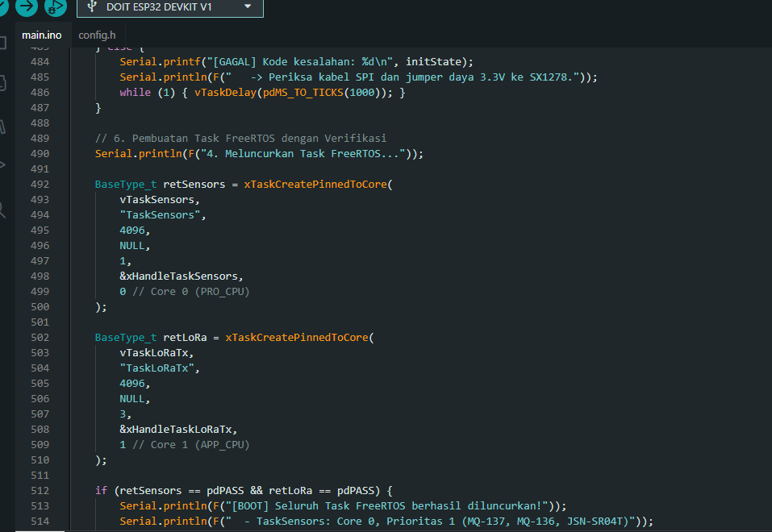
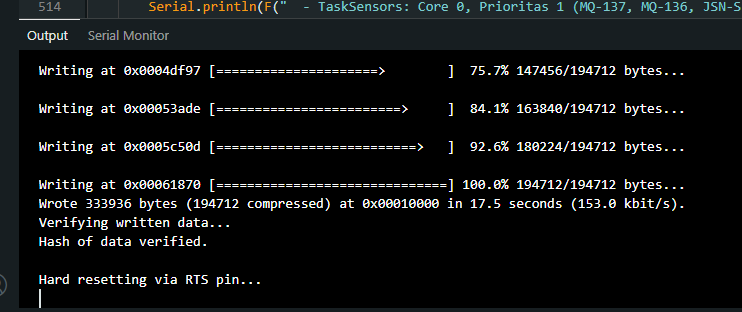
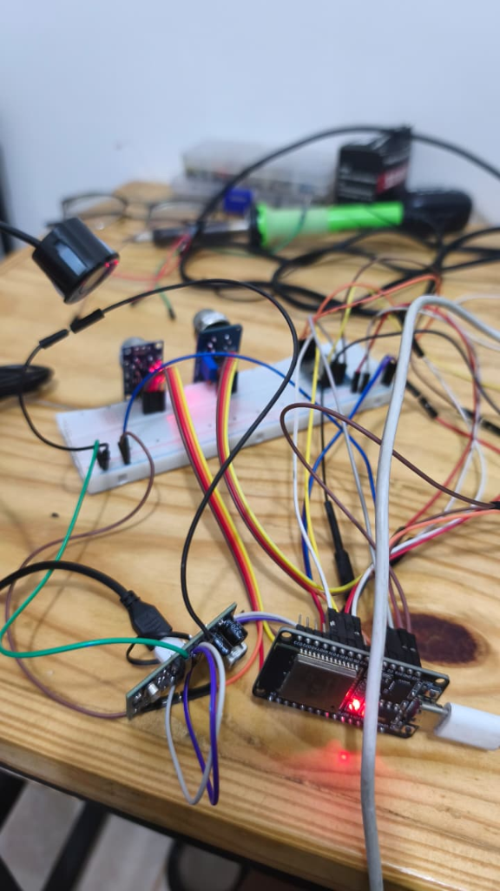
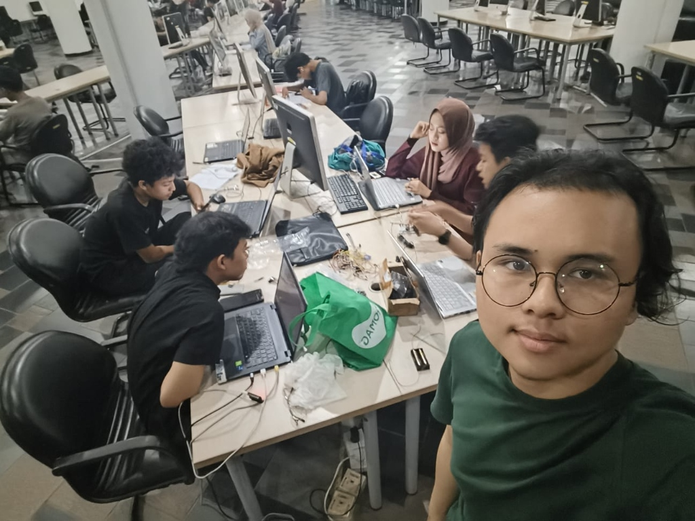
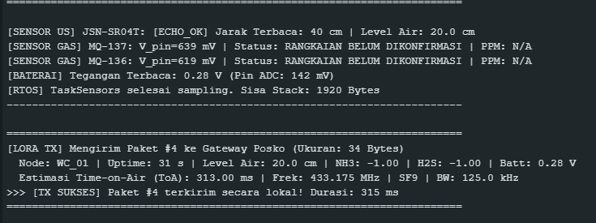

# TEMPLATE LAPORAN PEKANAN INDIVIDU
**Capstone Project Desain Proyek 2**

### A. Identitas
| Item | Keterangan |
|:---|:---|
| Nama | Daffa Hardhan |
| NPM | 2306161763 |
| Program Studi | Teknik Komputer |
| Kelompok | 4 (Empat) |
| Judul Proyek | Rancang Bangun Sistem Monitoring Smart-Sanitation eSOS Berbasis IoT untuk Wilayah Blank Spot Pasca-Bencana |
| Pekan ke- | 6 (Enam) |
| Periode | 28 September 2026 – 3 Oktober 2026 |
| Tanggal | 3 Oktober 2026 |
| Dosen Pembimbing | Prof. Dr. Muhammad Suryanegara, S.T., M.Sc. |

---

### B. Target Mingguan
Target yang direncanakan pada awal pekan berdasarkan WBS dan pembagian tugas kelompok (menindaklanjuti rencana kerja Pekan 5):

| No | Target Pekerjaan | Luaran yang Diharapkan | Status |
|:---:|:---|:---|:---:|
| 1 | Pengujian dan stabilisasi rangkaian fisik sensor gas MQ-136 dan MQ-137 dengan catu daya mandiri | Rangkaian sensor gas aktif normal di atas breadboard tanpa drop tegangan | ☑ Selesai &nbsp; ☐ Belum |
| 2 | Pemrograman komunikasi nirkabel LoRa SX1278 (konfigurasi RF 433 MHz, framing data, dan transmisi) | Driver LoRa terintegrasi pada firmware dan mampu memancarkan/menerima paket | ☑ Selesai &nbsp; ☐ Belum |
| 3 | Koding integrasi menyeluruh (*Master Firmware Integration*) multi-sensor dan aktuator berbasis FreeRTOS | Satu kesatuan kode firmware ESP32 yang menggabungkan sensor gas, ultrasonik, dan LoRa | ☑ Selesai &nbsp; ☐ Belum |
| 4 | Pengujian integrasi sistem end-to-end luring di lab dan kompilasi laporan progres kelompok Pekan 6 | Data telemetri sensor terbaca dan terkirim via LoRa; laporan kelompok selesai | ☑ Selesai &nbsp; ☐ Belum |

---

### C. Logbook Aktivitas Harian
| Hari/Tanggal | Uraian Aktivitas | Waktu (Jam) | Bukti/Dokumen |
|:---|:---|:---:|:---|
| Senin, 28 Sep 2026 | Menyelesaikan kendala catu daya sensor gas dari Pekan 5; merangkai ulang modul MQ-136 & MQ-137 di breadboard dengan jalur daya terisolasi. | 2 | Catatan Rangkaian Breadboard |
| Selasa, 29 Sep 2026 | Menulis program task FreeRTOS untuk pembacaan analog ADC sensor gas dan menerapkan algoritma penyaring data *moving average*. | 3 | Draf Kode Filter ADC |
| Rabu, 30 Sep 2026 | Mengoding integrasi firmware: menyatukan task pembacaan sensor gas (MQ-136/137) dan task sensor ultrasonik (JSN-SR04T) ke dalam arsitektur FreeRTOS ESP32. | 3 | Kode Integrasi Multi-Task |
| Kamis, 1 Okt 2026 | Mengembangkan modul komunikasi LoRa SX1278 (frekuensi 433.175 MHz, SF 9, BW 125 kHz, CR 4/7) serta memprogram enkapsulasi payload telemetri (34 byte). | 3 | Kode Driver LoRa & Struct Payload |
| Jumat, 2 Okt 2026 | Memimpin sesi pertemuan luring (offline) di lab bersama Amel dan Raka: menguji coba integrasi kode penuh, memverifikasi transmisi LoRa dari Node WC ke Gateway. | 3 | Foto Pengujian Lab & Log Serial |
| Sabtu, 3 Okt 2026 | Melakukan *code cleanup*, menyelesaikan error dependensi library, memverifikasi kompilasi firmware 100% pass, dan menyusun Laporan Kemajuan Kelompok Pekan 6. | 2 | Log Kompilasi & Laporan Kelompok |

**Total Jam Kerja Minggu Ini : 16 Jam**

---

### D. Realisasi Pekerjaan
**1. Aktivitas yang Berhasil Diselesaikan**
Pada pekan keenam ini, saya berfokus sebagai *Lead Programmer/Integrator* sistem dengan capaian tuntas:
- **Koding Integrasi Menyeluruh Multi-Sensor (*Lead Firmware Integrator* - Selesai 100%):**  
  Saya menjadi penanggung jawab utama yang mengoding dan menyatukan seluruh subsistem perangkat lunak ke dalam satu firmware ESP32 berbasis FreeRTOS. Program berhasil mengorkestrasi pembacaan sinyal analog sensor gas MQ-136 & MQ-137, sensor jarak ultrasonik JSN-SR04T, serta penanganan pemicu tombol darurat (*eSOS*) secara simultan tanpa *task starvation* atau *race condition*.
- **Pemrograman dan Implementasi Komunikasi LoRa (Selesai 100%):**  
  Melanjutkan target yang sempat tertunda di Pekan 5, saya memprogram driver komunikasi radio LoRa SX1278 pada frekuensi 433.175 MHz. Saya merancang struktur *payload telemetri 34-byte* yang memuat pembacaan gas, jarak ketinggian air, status SOS, dan uptime perangkat. Sistem radio berhasil memancarkan data dari node pemancar dan ditangkap secara presisi oleh gateway penerima.
- **Stabilisasi Sirkuit Fisik Sensor Gas (Selesai 100%):**  
  Masalah *overheating* dan *voltage drop* dari Pekan 5 berhasil dituntaskan dengan penataan skema catu daya terpisah, sehingga pembacaan tegangan analog sensor gas berjalan stabil.
- **Verifikasi Kompilasi & Pengujian Kolaboratif Tim (Selesai 100%):**  
  Seluruh source code firmware yang saya integrasikan berhasil terkompilasi 100% (*Pass*) pada PlatformIO dan Arduino IDE tanpa error. Pada pertemuan luring di lab, saya memverifikasi hasil transmisi data bersama Amel dan Raka yang membantu pengujian operasional pada unit Node WC.

**2. Luaran yang Dihasilkan**
- Source code firmware ESP32 terintegrasi penuh (multi-task FreeRTOS: Sensor Gas + Ultrasonik + Transmisi LoRa SX1278).
- Struktur data *payload* telemetri nirkabel 34-byte yang valid dan terverifikasi CRC radio.
- Bukti keberhasilan kompilasi firmware (100% *Build Success*).
- Dokumen Laporan Kemajuan Kelompok Pekan 6 dan pengarsipan logbook kegiatan tim.

---

### E. Capaian Teknis Mingguan
**Komponen/Subsistem yang Dikerjakan (Lingkup Daffa Hardhan)**
| Subsistem | Target | Realisasi | Persentase |
|:---|:---|:---|:---:|
| Hardware | Rangkaian fisik sensor gas MQ & modul LoRa SX1278 | Terpasang pada breadboard dan terhubung ke ESP32 | 100% |
| Software (FW) | Koding integrasi seluruh sensor & transmisi LoRa | Seluruh task FreeRTOS dan driver LoRa terintegrasi penuh | 100% |
| Software (Web) | Penyelarasan format telemetri ke backend | Payload terstruktur siap diteruskan gateway ke server | 100% |
| Mekanik | Evaluasi penempatan antena LoRa dan modul sensor | Koordinasi lubang port antena pada casing 3D Darrell | 80% |
| Pengujian | Uji coba transmisi nirkabel LoRa & integrasi multi-sensor | Pengujian luring di lab sukses menangkap paket telemetri | 100% |
| Dokumentasi | Kompilasi laporan kelompok & logbook Pekan 6 | Laporan kelompok & logbook terarsip lengkap | 100% |

**Ringkasan Kemajuan**
Pada Pekan 6, lonjakan kemajuan terbesar terjadi pada integrasi sistem tingkat firmware. Setelah kendala catu daya Pekan 5 teratasi, saya berhasil memprogram dan mengintegrasikan seluruh fungsi sensor (gas dan ultrasonik) bersama modul komunikasi nirkabel LoRa SX1278. Keberhasilan kompilasi dan uji coba penerimaan paket data secara nirkabel membuktikan bahwa sistem eSOS kini telah memiliki fondasi perangkat lunak yang utuh, menghubungkan sensor fisik di lapangan hingga siap diteruskan menuju server pemantauan.

---

### F. Permasalahan dan Kendala
| No | Kendala | Dampak | Tingkat Risiko |
|:---:|:---|:---|:---:|
| 1 | **Manajemen Resource SPI LoRa & Mutex FreeRTOS:** Penggunaan bus SPI oleh radio LoRa saat ada beberapa task sensor yang berjalan berpotensi memicu tabrakan akses memori (*concurrent access*). | Transmisi paket LoRa bisa gagal atau memicu *kernel panic* jika bus SPI diakses bersamaan. | **Sedang** |
| 2 | **Waktu Pemanasan Awal (*Pre-heating*) Sensor MQ:** Karakteristik sensor gas memerlukan waktu 1–3 menit untuk mencapai kestabilan suhu kerja sebelum data analog valid dibaca. | Data gas pada menit awal *booting* mengalami fluktuasi (*drift*). | **Rendah** |

**Analisis Penyebab**
Komunikasi SPI ke modul radio LoRa SX1278 bersifat sekuensial dan membutuhkan kepemilikan bus yang aman. Jika pembacaan sensor dan transmisi radio berjalan di task FreeRTOS terpisah tanpa sinkronisasi, akan terjadi konflik bus SPI. Untuk sensor gas, fluktuasi merupakan sifat bawaan semikonduktor pemanas (*heater coil*).

---

### G. Tindakan Korektif dan Solusi
| Kendala | Solusi/Tindak Lanjut | PIC | Target Penyelesaian |
|:---|:---|:---|:---|
| Potensi Tabrakan Bus SPI LoRa | Menerapkan mekanisme antrean data (*FreeRTOS Queue*) di mana task sensor hanya mengirim data ke antrean, dan satu *task dedicated* bertugas memancarkan data melalui LoRa secara teratur. | Daffa Hardhan | Selesai (Pekan 6) |
| Fluktuasi Awal Sensor Gas | Menambahkan *stabilization delay* dan filter rata-rata bergerak (*moving average filter* 10 sampel) pada kode pembacaan ADC. | Daffa Hardhan | Selesai (Pekan 6) |

---

### H. Dokumentasi Kemajuan
Berikut adalah bukti autentik realisasi pekerjaan pekan keenam yang mencakup integrasi perangkat lunak FreeRTOS, verifikasi kompilasi, perakitan sirkuit fisik, kegiatan luring laboratorium bersama tim, dan pengujian transmisi data LoRa riil:

**1. Bukti Kode Integrasi Multi-Task FreeRTOS (Sensors & LoRa Tx)**
*Tangkapan layar potongan source code `main.ino` yang memperlihatkan peluncuran task FreeRTOS secara modular: `vTaskSensors` (Core 0, Prioritas 1 untuk sensor MQ-137, MQ-136, JSN-SR04T) dan `vTaskLoRaTx` (Core 1, Prioritas 3 untuk pengiriman data radio LoRa SX1278).*

---

**2. Bukti Kompilasi & Upload Firmware Berhasil (100% Pass / Verified)**
*Tangkapan layar konsol output Arduino IDE / esptool yang membuktikan proses kompilasi dan flashing firmware ke ESP32 berjalan 100% sukses (`Writing at 0x... 100.0%`, `Hash of data verified`, dan hard reset otomatis) tanpa error dependensi library.*

---

**3. Bukti Perakitan Rangkaian Fisik Perangkat Keras di Breadboard**
*Foto sirkuit fisik aktif yang terpasang di atas breadboard: mikrokontroler ESP32 menyala, modul sensor gas amonia MQ-137 dan gas H2S MQ-136 dengan elemen pemanas aktif (indikator LED merah menyala), modul transmisi LoRa SX1278, serta tranduser ultrasonik tahan air JSN-SR04T.*

---

**4. Bukti Kegiatan Pengujian Luring (Offline) Bersama Tim di Laboratorium**
*Dokumentasi sesi kerja dan pengujian integrasi bersama seluruh anggota Kelompok 4 (Daffa, Amel, Raka, Darrell, Ilman) di meja laboratorium kampus, memverifikasi keterhubungan data antar-perangkat dan kesiapan maket fisik.*

---

**5. Bukti Serial Monitor: Pembacaan Multi-Sensor & Transmisi LoRa TX 34-Byte**
*Tangkapan layar Serial Monitor (115200 baud) yang membuktikan eksekusi real-time: `TaskSensors` berhasil mengonversi ADC gas MQ-136/137 dan jarak JSN-SR04T (40 cm), dilanjutkan oleh `vTaskLoRaTx` yang sukses memancarkan Paket #4 telemetri 34 Byte pada frekuensi 433.175 MHz SF9 ke Gateway dengan durasi transmisi 315 ms.*

---

### I. Kontribusi Terhadap Tim
**Koordinasi yang Dilakukan**
- **Arsitek Kode & Integrator Utama:** Memimpin penyatuan kode dari seluruh anggota kelompok, memastikan logika pembacaan sensor dari Amel dan Raka masuk ke dalam kerangka firmware utama secara rapi.
- **Penyelarasan Jalur Transmisi LoRa:** Menentukan parameter RF bersama (frekuensi 433.175 MHz, spreading factor 9) agar Node WC dan Gateway saling terhubung secara mulus.
- **Kepemimpinan Kelompok:** Membagi tugas teknis anggota, memantau kemajuan skematik Ilman dan desain casing Darrell, serta merangkum dokumen Laporan Kemajuan Kelompok Pekan 6.

**Kontribusi Pribadi**
Menulis seluruh arsitektur kode integrasi multi-sensor, memprogram komunikasi nirkabel LoRa SX1278, menyelesaikan kendala *dependency library*, dan memastikan firmware siap dioperasikan di lapangan.

---

### J. Evaluasi Diri
**Yang Berjalan Baik**
- Seluruh tugas integrasi firmware dan koding LoRa yang sebelumnya tertunda di Pekan 5 berhasil dituntaskan 100% dengan status *compile pass*.
- Integrasi antar-sensor berjalan stabil dengan pemanfaatan FreeRTOS Queue sehingga sistem tidak mengalami *freeze* atau *crash*.
- Kolaborasi tim di lab berjalan sangat solid dan efektif saat menguji coba transmisi nirkabel langsung.

**Yang Perlu Diperbaiki**
- Perlu merumuskan kurva dan rumus kalibrasi matematis lanjutan untuk mengonversi tegangan analog sensor gas secara langsung ke satuan $PPM$ (*Parts Per Million*) yang akurat; agenda ini akan dikerjakan berkolaborasi bersama Amel pada pekan berikutnya.

**Pelajaran yang Didapat Minggu Ini**
- Mengintegrasikan banyak subsistem membutuhkan perencanaan arsitektur perangkat lunak yang matang; penggunaan task terpisah dan queue di FreeRTOS terbukti sangat ampuh mencegah tabrakan data.

---

### K. Rencana Pekan Berikutnya
| No | Rencana Kegiatan | Target Luaran | Estimasi Jam |
|:---:|:---|:---|:---:|
| 1 | Melakukan pengujian jangkauan jarak dan ketahanan transmisi LoRa (uji propagasi NLOS antar-ruang dan lantai gedung) | Data jangkauan transmisi LoRa (RSSI & Packet Loss) | 5 Jam |
| 2 | Merumuskan kurva konversi matematis dan implementasi fungsi kalibrasi nilai PPM sensor gas pada firmware (berkolaborasi bersama Amel) serta pengujian downlink servo via LoRa | Konversi PPM presisi terverifikasi & servo dapat dikontrol via radio | 5 Jam |
| 3 | Mengoordinasikan integrasi hardware final ke prototipe PCB bersama Ilman serta instalasi ke casing 3D bersama Darrell | Purwarupa fisik node tertata rapi dalam kompartemen | 5 Jam |

---

### L. Persetujuan
**Mahasiswa**  
Nama: Daffa Hardhan  
Tanda tangan: *(Digital)*  
Tanggal: 3 Oktober 2026  

**Ketua Kelompok**  
Nama: Daffa Hardhan  
Tanda tangan: *(Digital)*  
Tanggal: 3 Oktober 2026  

**Catatan Pembimbing**  
- "Sangat bagus. Integrasi firmware multi-sensor dan keberhasilan transmisi LoRa merupakan pencapaian penting. Lanjutkan pengujian propagasi jangkauan LoRa dan validasi ketahanan sistem di Pekan 7."
