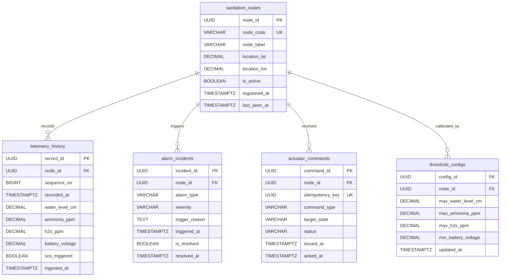

# Skema Basis Data & Model Relasional: Smart-Sanitation eSOS 🗄️

Direktori ini berisi skrip DDL (*Data Definition Language*) PostgreSQL untuk sistem Smart-Sanitation eSOS, yang dirancang sesuai standar kepatuhan **ADR-01, ADR-05, ADR-06, dan ADR-07**.

---

## 🏛️ Desain Arsitektur Data

1. **UUIDv7 (RFC 9562) Monotonically Increasing Primary Key:**
   Menggunakan fungsi kustom `uuid_generate_v7()` yang menyematkan Unix timestamp (milidetik) pada 48-bit pertama. Ini memberikan keunggulan performa indeks B-Tree yang setara dengan `BIGSERIAL`, namun tetap mempertahankan keunikan global tanpa risiko tabrakan kunci ID terdistribusi.
2. **ACID Compliance & Integritas Referensial Penuh:**
   Semua relasi antar node bilik sanitasi, histori telemetri, log insiden alarm, dan audit jejak perintah aktuasi dijaga ketat menggunakan batasan *foreign key* dan *check constraints*.
3. **Mekanisme Real-Time Sinkronisasi (LISTEN / NOTIFY):**
   Pembaruan batas ambang batas (*threshold*) pada tabel `threshold_configs` memicu fungsi pemicu PostgreSQL `NOTIFY threshold_updated`, yang seketika ditangkap oleh cache in-memory Go Server tanpa perlunya *polling* berulang.

---

## 📊 Entity-Relationship Diagram (ERD)



---

## 🚀 Panduan Eksekusi Skema

Untuk menginisialisasi basis data PostgreSQL lokal:

```powershell
# Buat database jika belum ada
psql -U postgres -c "CREATE DATABASE esos_db;"

# Eksekusi DDL schema
psql -U postgres -d esos_db -f src/data/postgres_schema.sql
```
