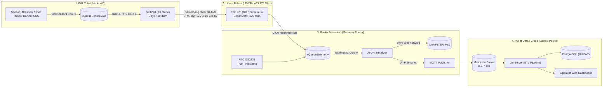

# PANDUAN INDUK FIRMWARE EMBEDDED (ESP32 FreeRTOS)
## Proyek Capstone: Smart-Sanitation eSOS (Kelompok 4 - Desain Proyek 2 FTUI)

Direktori ini memuat seluruh kode sumber perangkat lunak tertanam (*embedded firmware*) untuk mikrokontroler **DOIT ESP32 DevKit V1** yang menjalankan sistem operasi waktu nyata **FreeRTOS**.

---

## 1. Struktur Organisasi Repositori Firmware

Kode sumber telah dipisahkan secara modular menjadi dua subsistem independen sesuai peran fisiknya di lapangan:

```
src/firmware/
├── docs/
│   └── README.md                   <-- (File ini: Panduan Induk & Arsitektur End-to-End)
├── node_wc/                        <-- [SUBSISTEM 1: NODE SENSOR BILIK SANITASI]
│   ├── include/
│   │   └── config.h                <-- Pinout hardware, parameter LoRa 433MHz, struct biner 34B
│   ├── src/
│   │   └── main.cpp                <-- Firmware lengkap: Sensor, LoRa TX, Servo MG996R, PM Locks
│   ├── standalone_test/
│   │   └── test_lora_node_tx.ino   <-- Skrip uji mandiri pengirim LoRa (Arduino IDE ready)
│   ├── platformio.ini              <-- Konfigurasi build toolchain PlatformIO (env: node_wc)
│   └── docs/
│       └── README.md               <-- Dokumentasi teknis lengkap Node WC + Diagram Mermaid
└── gateway/                        <-- [SUBSISTEM 2: GATEWAY ROUTER POSKO]
    ├── include/
    │   └── config.h                <-- Pinout SPI LoRa, bus I2C RTC DS3231, kredensial MQTT
    ├── src/
    │   └── main.cpp                <-- Firmware lengkap: LoRa RX, LittleFS Ring Buffer, MQTT Client
    ├── standalone_test/
    │   └── test_lora_gateway_rx.ino<-- Skrip uji mandiri penerima LoRa (Arduino IDE ready)
    ├── platformio.ini              <-- Konfigurasi build toolchain PlatformIO (env: gateway_router)
    └── docs/
        └── README.md               <-- Dokumentasi teknis lengkap Gateway + Diagram Mermaid
```

---

## 2. Diagram Pipeline Data End-to-End (Hilir ke Hulu)



---

## 3. Matriks Kompatibilitas Pinout Hardware (ESP32 DevKit V1 30-Pin)

Kedua varian firmware berbagi konfigurasi bus SPI radio yang identik, sehingga modul radio dan kabel *jumper harness* dapat dipertukarkan tanpa mengubah perkabelan fisik:

| Sinyal Perangkat Keras | Pin ESP32 (Node WC) | Pin ESP32 (Gateway) | Tipe Jalur | Keterangan Fungsional |
| :--- | :---: | :---: | :---: | :--- |
| **LoRa SCK** | **GPIO 21** | **GPIO 21** | Output SPI | Clock sinkronisasi bus SPI (1 MHz - 2 MHz). |
| **LoRa MISO** | **GPIO 19** | **GPIO 19** | Input SPI | Master-In Slave-Out (Data dari SX1278 ke ESP32). |
| **LoRa MOSI** | **GPIO 18** | **GPIO 18** | Output SPI | Master-Out Slave-In (Data dari ESP32 ke SX1278). |
| **LoRa NSS (CS)** | **GPIO 5** | **GPIO 5** | Output GPIO | Chip Select aktif LOW (Di-pull HIGH saat boot). |
| **LoRa RESET** | **GPIO 15** | **GPIO 15** | Output GPIO | Reset perangkat keras SX1278. |
| **LoRa DIO0** | **GPIO 2** | **GPIO 2** | Input EXTI | Sinyal interupsi (TX_DONE pada Node, RX_DONE pada Gateway). |
| **Ultrasonik TRIG** | **GPIO 13** | — | Output GPIO | Pulsa trigger sensor level air tangki. |
| **Ultrasonik ECHO** | **GPIO 12** | — | Input GPIO | Input durasi pantulan gelombang suara ultrasonik. |
| **Gas Amonia MQ-137** | **GPIO 32** | — | Input ADC1 | Pembacaan analog konsentrasi amonia bilik. |
| **Gas H2S MQ-136** | **GPIO 33** | — | Input ADC1 | Pembacaan analog konsentrasi gas hidrogen sulfida. |
| **Baterai Divider** | **GPIO 34** | — | Input ADC1 | Input tegangan aki/baterai Li-ion (Input-Only). |
| **Tombol SOS** | **GPIO 27** | — | Input EXTI | Sakelar darurat fisik dengan interrupt debouncing. |
| **Motor Servo MG996R**| **GPIO 26** | — | Output PWM | Sinyal kendali penguncian pintu bilik sanitasi. |
| **RTC DS3231 SDA** | — | **GPIO 4** | I2C Data | Jalur data I2C modul waktu nyata posko. |
| **RTC DS3231 SCL** | — | **GPIO 22** | I2C Clock | Jalur clock I2C modul waktu nyata posko. |

---

## 4. Kaidah Emas Pemrograman FreeRTOS pada ESP32

Seluruh pengembang firmware pada proyek ini terikat oleh standar implementasi berikut:
1. **Dilarang Menggunakan `delay()` Blocking:**
   Semua penundaan waktu wajib menggunakan `vTaskDelay(pdMS_TO_TICKS(...))` agar CPU core dapat beralih mengerjakan task lain.
2. **Komunikasi Antar-Task Wajib via FreeRTOS Queues:**
   Dilarang keras memakai variabel global tanpa perlindungan mutex/antrean untuk bertukar data sensor atau perintah radio.
3. **Interrupt Service Routine (ISR) Wajib Ringan:**
   ISR hanya bertugas mencatat timestamp dan membangunkan task terkait (`vTaskNotifyGiveFromISR`). Tidak boleh ada transaksi SPI, I2C, Serial print, atau alokasi memori dinamis di dalam ISR.
4. **Alokasi Core Eksplisit (`xTaskCreatePinnedToCore`):**
   * **Core 0 (PRO_CPU):** Khusus pemrosesan sensor, aktuator servo, stack Wi-Fi, dan protokol MQTT.
   * **Core 1 (APP_CPU):** Khusus transaksi bus SPI radio LoRa frekuensi tinggi untuk menjamin latensi deterministik.
5. **Pemantauan Kapasitas Stack:**
   Gunakan fungsi `uxTaskGetStackHighWaterMark(NULL)` saat fase debug untuk memastikan tidak terjadi *Stack Overflow*.

---

## 5. Tautan Dokumen Detail Setiap Subsistem

* 📖 **[Dokumentasi Lengkap Node WC Sanitasi](../node_wc/docs/README.md)**: Analisis task sensor, kontrol servo, algoritma debouncing SOS, dan siklus LoRaWAN Class A.
* 📖 **[Dokumentasi Lengkap Gateway Posko](../gateway/docs/README.md)**: Mekanisme Store-and-Forward LittleFS, sinkronisasi waktu RTC DS3231, supervisor Wi-Fi, dan downlink komando.
