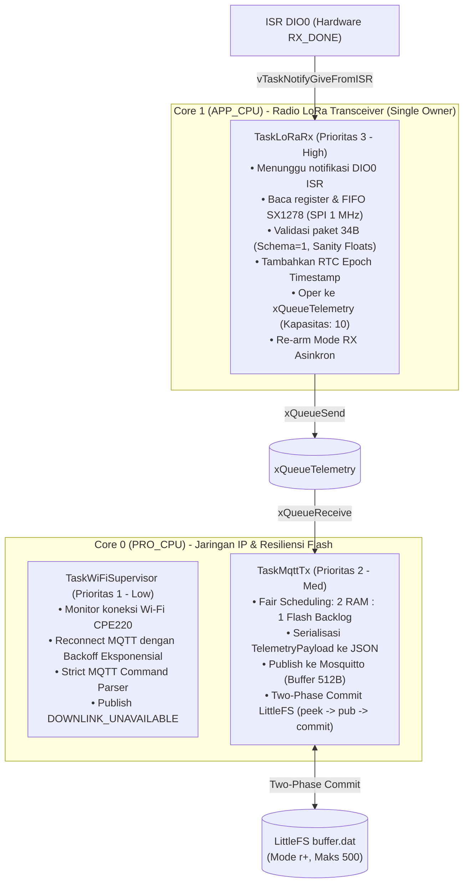
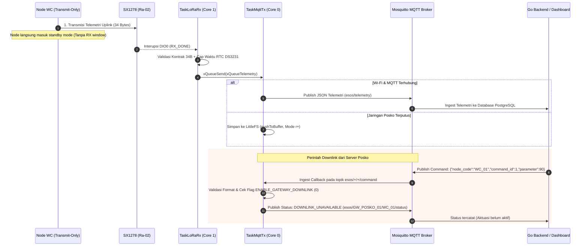
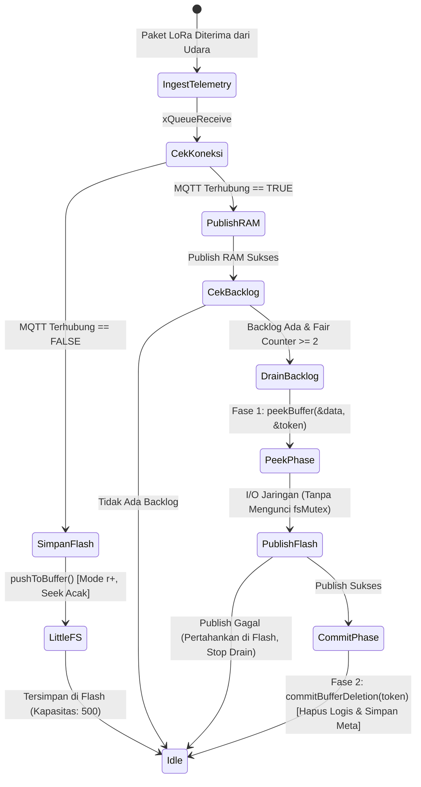

# DOKUMENTASI ARSITEKTUR FIRMWARE GATEWAY ROUTER (ESP32 FreeRTOS)
## Proyek Capstone: Smart-Sanitation eSOS (Kelompok 4 - Desain Proyek 2 FTUI)

Dokumen ini adalah **sumber kebenaran tunggal (Single Source of Truth)** untuk arsitektur perangkat lunak, konfigurasi jaringan Wi-Fi/MQTT, dan alur kerja (*workflow*) firmware mikrokontroler **ESP32 Gateway Router Posko**.

---

## 1. Identifikasi Sistem & Peran Arsitektur

Gateway bertindak sebagai jembatan cerdas (*intelligent bridge*) antara jaringan sensor nirkabel berdaya rendah (**LoRa 433.175 MHz**) di area bilik toilet dan jaringan server posko (**Wi-Fi / MQTT Mosquitto**). Sesuai **ADR-01** dan **ADR-03**, Gateway bertugas:
1. Menangkap paket biner 34-byte dari udara 24/7 secara asinkron (*interrupt-driven*).
2. Memberikan cap waktu nyata (*True Timestamping*) menggunakan **RTC DS3231** (dengan deteksi `lostPower()` fail-safe).
3. Melakukan validasi ketat (*strict sanity check*) terhadap skema, tipe, dan rentang fisis data telemetri.
4. Mengonversi data biner ke format JSON Envelope terstandarisasi.
5. Menerbitkan data ke Broker MQTT dengan perlindungan mutex dan kapasitas buffer 512-byte.
6. Mengamankan data ke **LittleFS Circular Buffer** melalui mekanisme *Two-Phase Commit* (`peek` $\rightarrow$ *publish* $\rightarrow$ `commit` tanpa menahan mutex berkas selama I/O jaringan) saat koneksi terputus (*Store-and-Forward*).
7. Menerapkan penjadwalan adil (*fair scheduling*) untuk mencegah kelaparan (*starvation*) backlog flash saat antrean RAM aktif.
8. Pada tahap integrasi aktif, unit Node WC beroperasi secara *Uplink-Only*; komando downlink MQTT dibalas dengan status `DOWNLINK_UNAVAILABLE` dan transmisi balik radio dinonaktifkan (`ENABLE_GATEWAY_DOWNLINK 0`).

```mermaid
graph LR
    subgraph "Jaringan Radio Lapangan"
        Node["Node WC 01 (Bilik)"] -->|LoRa 433.175 MHz (Uplink-Only)| SX1278[Radio SX1278 Ra-02]
    end

    subgraph "ESP32 Gateway Posko"
        SX1278 -->|SPI Bus| LoRaRx["TaskLoRaRx (Core 1)<br/>(Sole Radio Owner)"]
        RTC[RTC DS3231] -->|I2C SDA:4, SCL:22| LoRaRx
        LoRaRx -->|Raw Payload 34B| QueueTel[(xQueueTelemetry)]
        QueueTel -->|xQueueReceive| TaskMqtt["TaskMqttTx (Core 0)"]
        
        TaskMqtt -.->|Wi-Fi / MQTT Offline| LFS[("LittleFS Circular Buffer<br/>(Two-Phase Commit, Maks 500)")]
        LFS -.->|Fair Drain (1 flash : 2 RAM)| TaskMqtt
        
        TaskWiFi["TaskWiFiSupervisor (Core 0)"] -->|MQTT Command Ingest| CmdParser["Strict Command Parser<br/>(No Silent Defaults)"]
        CmdParser -->|Publish Status| DownStatus[("MQTT Status Topic<br/>DOWNLINK_UNAVAILABLE")]
    end

    subgraph "Infrastruktur Posko / Cloud"
        TaskMqtt -->|Wi-Fi MQTT JSON| Broker[("Mosquitto MQTT Broker<br/>Port 1883")]
        DownStatus --> Broker
        Broker --> GoServer["Go Backend Server"]
        GoServer --> WebDash["Web Dashboard"]
    end
```

---

## 2. Kepatuhan Regulasi Frekuensi Radio Indonesia

Pengoperasian penerima dan pemancar kendali pada Gateway tunduk pada:

* **Dasar Hukum:** Permenkomdigi No. 2 Tahun 2025 (Pita LPWAN/SRD Non-Lisensi).
* **Alokasi Pita:** 433,050 MHz – 434,790 MHz.
* **Bandwidth Maksimum:** 125.0 kHz.
* **Frekuensi Tengah Operasi:** **433.175 MHz** (Kanal nominal 433,1125 – 433,2375 MHz).
* **Parameter Modulasi:** Spreading Factor SF9, Coding Rate 4/7, Sync Word `0x12` (Jaringan Privat eSOS).
* **Batas Emisi:** Maksimum 12,15 dBm EIRP (setara 10 dBm ERP / 10 mW).

---

## 3. Arsitektur FreeRTOS Dual-Core & Alokasi Task

Gateway menerapkan prinsip **Single Radio Owner**: hanya ada satu task pada Core 1 (`TaskLoRaRx`) yang berinteraksi langsung dengan radio SX1278 melalui SPI. Hal ini mencegah tabrakan bus SPI, *race conditions*, dan pemancaran ganda.



### Tabel Spesifikasi Task FreeRTOS Gateway

| Nama Task | Core Affinity | Prioritas | Ukuran Stack (Bytes) | Deskripsi Fungsional |
| :--- | :---: | :---: | :---: | :--- |
| `TaskLoRaRx` | Core 1 | 3 (Tinggi) | 4.096 Bytes | Pemilik tunggal SX1278. Menerima interupsi hardware DIO0, validasi panjang & batas numerik, inject timestamp RTC DS3231, mengoper ke antrean, dan segera me-rearm mode siaga RX. |
| `TaskMqttTx` | Core 0 | 2 (Sedang) | 4.096 Bytes | Mengubah biner menjadi JSON string, menerbitkan ke topik MQTT dengan proteksi `mqttMutex`, dan menguras antrean flash dengan skema *Two-Phase Commit* dan *fair scheduling*. |
| `TaskWiFiSupervisor` | Core 0 | 1 (Rendah) | 4.096 Bytes | Menjaga stabilitas Wi-Fi dan sesi MQTT broker dengan algoritma *exponential backoff*, pemrosesan `mqtt.loop()`, dan validasi ketat format komando masuk. |

> [!NOTE]
> Pada ESP-IDF FreeRTOS, kedalaman stack pada `xTaskCreatePinnedToCore()` dinyatakan dalam satuan **BYTES**, bukan words.

---

## 4. Alur Kerja Penerimaan Telemetri & Kebijakan Downlink (Tahap Uplink-Only)

Pada tahap implementasi saat ini, subsistem radio beroperasi dalam moda **Uplink-Only Telemetry Ingestion**:
1. Unit **Node WC** memancarkan telemetri secara periodik tanpa membuka jendela dengar (*transmit-only*), lalu kembali ke moda *standby* untuk penghematan daya baterai.
2. Gateway mendengarkan gelombang radio 24/7 di frekuensi legal **433.175 MHz**.
3. Saat paket tiba, `TaskLoRaRx` memverifikasi ukuran payload (tepat 34 byte), versi skema (`1`), kode node ASCII alfanumerik, dan batas fisis nilai sensor.
4. Nilai sensor yang tidak tersedia atau belum terkalibrasi (`-1.0f`) dipertahankan secara transparan sebagai *sentinel value*.
5. **Kebijakan Downlink (`ENABLE_GATEWAY_DOWNLINK = 0`)**:
   - Jika broker MQTT menerima pesan komando pada topik `esos/+/+/command`, fungsi `mqttCallback` melakukan validasi ketat terhadap JSON payload (memastikan kolom `node_code`, `command_id`, dan `parameter` ada dan berada dalam rentang sah).
   - Gateway **TIDAK** memancarkan sinyal ke udara (mencegah pemborosan spektrum dan tabrakan frekuensi dengan uplink yang masuk).
   - Gateway menerbitkan status konfirmasi `DOWNLINK_UNAVAILABLE` pada topik `esos/<gw_id>/<node_code>/status` agar backend dan dashboard mengetahui bahwa fungsi aktuasi jarak jauh dinonaktifkan sementara.



---

## 5. Resiliensi Jaringan: Two-Phase Commit Store-and-Forward (ADR-03)

Untuk mencegah data hilang saat jaringan posko terputus atau terjadi kegagalan transmisi:



### Prinsip Desain Two-Phase Commit & Penanganan Starvation:
1. **Fase 1 (`peekBuffer`)**: Record pada posisi slot `meta.head` dibaca ke dalam RAM dan diberikan `CommitToken` yang memuat nomor slot dan `sequence_no`. Record **TIDAK dihapus** pada tahap ini.
2. **Penerbitan Jaringan di Luar Mutex**: Pengiriman paket JSON via `mqtt.publish()` dilakukan di luar `fsMutex`. Jika transmisi jaringan lambat atau mengalami *timeout*, operasi penulisan paket LoRa baru ke flash tidak akan terblokir.
3. **Fase 2 (`commitBufferDeletion`)**: Hanya setelah `mqtt.publish()` mengembalikan nilai `true`, fungsi commit dipanggil untuk memajukan `meta.head = (meta.head + 1) % MAX_BUFFER_RECORDS` dan memperbarui `BufferMeta` (dengan `metaFile.flush()`).
4. **Perlindungan Terhadap Wrap-Around**: Jika selama proses publish terjadi wrap-around (karena flash penuh dan slot head ditimpa oleh data baru), `commitBufferDeletion` mendeteksi ketidakcocokan token (`meta.head != token.slot` atau `meta.head_seq != token.sequence_no`), sehingga penghapusan slot yang salah dicegah.
5. **Pencegahan Kelaparan (*Starvation Prevention / Fair Scheduling*)**:
   Jika paket telemetri LoRa masuk secara kontinu dari banyak node saat koneksi Wi-Fi kembali pulih, menguras antrean RAM secara eksklusif akan membuat data flash tertahan selamanya (*starvation*). Gateway menerapkan rasio **2 RAM : 1 Flash**: setiap kali memproses 2 paket dari antrean RAM, Gateway menyelingi dengan menguras 1 paket backlog dari LittleFS.
6. **Batas Pengiriman At-Least-Once (*At-Least-Once Delivery Boundaries*)**:
   - Jika transmisi MQTT gagal di tengah proses pengurasan, record tetap tersimpan di LittleFS dan proses pengurasan dihentikan sementara sampai koneksi pulih kembali.
   - Paket yang gagal dipublish **TIDAK di-enqueue ulang ke antrean RAM** untuk mencegah *queue bloat* dan kebocoran memori heap.
   - Jika router posko mati dalam durasi sangat lama (> 500 paket $\approx 1.5$ jam pada interval 10 detik), slot tertua akan ditimpa (*OVERWRITE_OLDEST*) dan pencacah `meta.dropped_count` bertambah secara transparan.

---

## 6. Tabel Pengkabelan Fisik Lengkap (Gateway Wiring Harness)

| Nama Perangkat | Pin Modul | Pin ESP32 DevKit V1 | Fungsi Sinyal | Catatan Kelistrikan |
| :--- | :--- | :--- | :--- | :--- |
| **LoRa Ra-02** | 3.3V | **3V3** | Catu Daya Positif | **WAJIB 3.3V stabil** (Dilarang ke VIN 5V!). |
| **LoRa Ra-02** | GND | **GND** | Ground Bersama | Terhubung ke ground referensi ESP32. |
| **LoRa Ra-02** | RST | **D15 (GPIO 15)** | Hardware Reset | Pulsa reset 20ms aktif LOW. |
| **LoRa Ra-02** | DIO0 | **D2 (GPIO 2)** | Interupsi RX_DONE | Strapping pin: pastikan modul idle saat ESP32 boot. |
| **LoRa Ra-02** | NSS | **D5 (GPIO 5)** | SPI Chip Select | Di-pull HIGH saat idle bus SPI. |
| **LoRa Ra-02** | MOSI | **D18 (GPIO 18)** | SPI Master Out | Bus SPI RadioLib. |
| **LoRa Ra-02** | MISO | **D19 (GPIO 19)** | SPI Master In | Bus SPI RadioLib. |
| **LoRa Ra-02** | SCK | **D21 (GPIO 21)** | SPI Clock | Bus SPI RadioLib. |
| **RTC DS3231** | VCC | **3V3** | Catu Daya Positif | 3.3V dari ESP32. |
| **RTC DS3231** | GND | **GND** | Ground Bersama | Terhubung ke ground ESP32. |
| **RTC DS3231** | SDA | **D4 (GPIO 4)** | I2C Data Bus | Dipetakan ke GPIO 4 agar tidak bentrok dengan SCK (GPIO 21). |
| **RTC DS3231** | SCL | **D22 (GPIO 22)** | I2C Clock Bus | Dipetakan ke GPIO 22. |

---

## 7. Panduan Pengujian & Validasi Mandiri

### A. Uji Penerima Mandiri (Standalone Test)
Tersedia skrip mandiri untuk memvalidasi penerimaan sinyal radio tanpa modul Wi-Fi/MQTT aktif:
* Path: `standalone_test/test_lora_gateway_rx/test_lora_gateway_rx.ino`
* Kompilasi via PlatformIO:
  ```powershell
  pio run -d src/firmware/gateway -e test_lora_gateway_rx
  ```

### B. Kompilasi Firmware Integrasi Penuh
* Path: `src/main.cpp`
* Kompilasi via PlatformIO:
  ```powershell
  pio run -d src/firmware/gateway -e gateway_router
  ```
