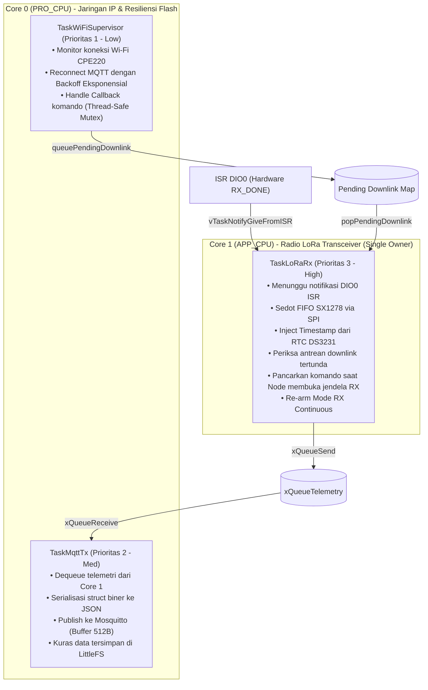
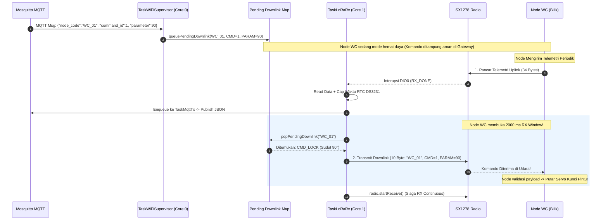
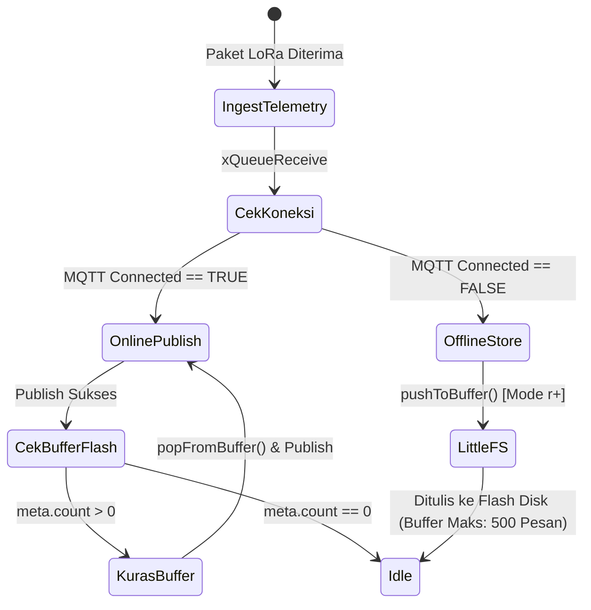

# DOKUMENTASI ARSITEKTUR FIRMWARE GATEWAY ROUTER (ESP32 FreeRTOS)
## Proyek Capstone: Smart-Sanitation eSOS (Kelompok 4 - Desain Proyek 2 FTUI)

Dokumen ini adalah **sumber kebenaran tunggal (Single Source of Truth)** untuk arsitektur perangkat lunak, konfigurasi jaringan Wi-Fi/MQTT, dan alur kerja (*workflow*) firmware mikrokontroler **ESP32 Gateway Router Posko**.

---

## 1. Identifikasi Sistem & Peran Arsitektur

Gateway bertindak sebagai jembatan cerdas (*intelligent bridge*) antara jaringan sensor nirkabel berdaya rendah (**LoRa 433.175 MHz**) di area bilik toilet dan jaringan server posko (**Wi-Fi / MQTT Mosquitto**). Sesuai **ADR-01** dan **ADR-03**, Gateway bertugas:
1. Menangkap paket biner 34-byte dari udara 24/7 secara asinkron (*interrupt-driven*).
2. Memberikan cap waktu nyata (*True Timestamping*) menggunakan **RTC DS3231** (dengan deteksi `lostPower()` fail-safe).
3. Mengonversi data biner ke format JSON Envelope terstandarisasi.
4. Menerbitkan data ke Broker MQTT dengan perlindungan mutex dan kapasitas buffer 512-byte.
5. Mengamankan data ke **LittleFS Circular Buffer** (mode `"r+"` tanpa pemotongan file) jika Wi-Fi/MQTT terputus (*Store-and-Forward*).
6. Meneruskan komando dari server posko kembali ke Node WC saat jendela dengar terbuka (*Downlink Window Control*).

```mermaid
graph LR
    subgraph "Jaringan Radio Lapangan"
        Node["Node WC 01 (Bilik)"] -->|LoRa 433.175 MHz| SX1278[Radio SX1278 Ra-02]
    end

    subgraph "ESP32 Gateway Posko"
        SX1278 -->|SPI Bus| LoRaRx["TaskLoRaRx (Core 1)<br/>(Sole Radio Owner)"]
        RTC[RTC DS3231] -->|I2C SDA:4, SCL:22| LoRaRx
        LoRaRx -->|Raw Payload| QueueTel[(xQueueTelemetry)]
        QueueTel -->|xQueueReceive| TaskMqtt["TaskMqttTx (Core 0)"]
        
        TaskMqtt -.->|Wi-Fi Offline| LFS[("LittleFS Circular Buffer<br/>(Kapasitas: 500 Rekaman)")]
        LFS -.->|Wi-Fi Reconnect (Flush)| TaskMqtt
        
        TaskWiFi["TaskWiFiSupervisor (Core 0)"] -->|MQTT Callback| MapDown[("Pending Downlink Map<br/>(Thread-Safe)")]
        MapDown -->|popPendingDownlink| LoRaRx
        LoRaRx -->|TX Downlink di Jendela RX| SX1278
    end

    subgraph "Infrastruktur Posko / Cloud"
        TaskMqtt -->|Wi-Fi MQTT JSON| Broker[("Mosquitto MQTT Broker<br/>Port 1883")]
        Broker --> GoServer["Go Backend Server"]
        GoServer --> WebDash["Web Dashboard"]
    end
```

---

## 2. Kepatuhan Regulasi Frekuensi Radio Indonesia

Pengoperasian penerima dan pemancar kendali pada Gateway tunduk pada:

* **Dasar Hukum:** Permenkomdigi No. 2 Tahun 2025 (Pita LPWAN/SRD Non-Lisensi).
* **Alokasi Pita:** 433,050 MHz – 434,790 MHz.
* **Bandwidth Maksimum:** 125.0 kHz.
* **Frekuensi Tengah Operasi:** **433.175 MHz** (Kanal nominal 433,1125 – 433,2375 MHz).
* **Parameter Modulasi:** Spreading Factor SF9, Coding Rate 4/7, Sync Word `0x12` (Jaringan Privat eSOS).
* **Batas Emisi:** Maksimum 12,15 dBm EIRP (setara 10 dBm ERP / 10 mW).

---

## 3. Arsitektur FreeRTOS Dual-Core & Alokasi Task

Gateway menerapkan prinsip **Single Radio Owner**: hanya ada satu task pada Core 1 (`TaskLoRaRx`) yang berinteraksi langsung dengan radio SX1278 melalui SPI. Hal ini mencegah tabrakan bus SPI, *race conditions*, dan pemancaran ganda.



### Tabel Spesifikasi Task FreeRTOS Gateway

| Nama Task | Core Affinity | Prioritas | Ukuran Stack (Bytes) | Deskripsi Fungsional |
| :--- | :---: | :---: | :---: | :--- |
| `TaskLoRaRx` | Core 1 | 3 (Tinggi) | 4.096 Bytes | Pemilik tunggal SX1278. Menerima interupsi hardware DIO0, membaca waktu RTC, mengoper ke antrean, dan memancarkan downlink saat jendela RX Node terbuka. |
| `TaskMqttTx` | Core 0 | 2 (Sedang) | 4.096 Bytes | Mengubah biner menjadi JSON string, menerbitkan ke topik MQTT dengan proteksi `mqttMutex`, dan menguras antrean flash. |
| `TaskWiFiSupervisor` | Core 0 | 1 (Rendah) | 4.096 Bytes | Menjaga stabilitas Wi-Fi dan sesi MQTT broker dengan algoritma *exponential backoff* dan pemrosesan `mqtt.loop()`. |

> [!NOTE]
> Pada ESP-IDF FreeRTOS, kedalaman stack pada `xTaskCreatePinnedToCore()` dinyatakan dalam satuan **BYTES**, bukan words.

---

## 4. Alur Kerja Penerimaan Telemetri & Jendela Dengar Downlink

Gateway menggunakan mekanisme **Half-Duplex Post-Uplink RX Window** (terinspirasi oleh konsep LoRaWAN Class A, diimplementasikan secara terstruktur untuk topologi star eSOS):

1. Server posko mengirimkan perintah kendali pintu via MQTT (`esos/+/+/command`).
2. `mqttCallback` menyimpan komando ke dalam `pendingDownlinks` per `node_code` dan **TIDAK langsung memancar** ke udara (karena radio Node WC sedang nonaktif/sleep).
3. Saat Node WC bangun dan mengirim telemetri uplink, Node WC seketika membuka **jendela dengar 2000 ms (RX Window)**.
4. `TaskLoRaRx` pada Gateway selesai menerima payload uplink, memeriksa apakah ada perintah tertunda untuk node tersebut via `popPendingDownlink()`.
5. Jika ada, setelah jeda peralihan (*turnaround time*) 60 ms, `TaskLoRaRx` memancarkan `ActuatorCommand` ke udara tepat di dalam jendela dengar Node.
6. Radio seketika dikembalikan ke mode siaga terima (`radio.startReceive()`).



---

## 5. Resiliensi Jaringan: LittleFS Circular Buffer (ADR-03)

Untuk mencegah hilangnya data telemetri saat router posko terputus atau MQTT broker mati:



* **Integritas File Mode `"r+"`:**
  Berbeda dari mode `FILE_WRITE` (yang setara dengan `"w"` dan memotong/menghapus file menjadi 0 byte pada setiap penulisan), implementasi menggunakan mode `"r+"` dengan *seek* acak berbasis slot sirkular. Data lama tidak terhapus.
* **Metadata & Checksum CRC32 (`/meta.dat`):**
  Struktur `BufferMeta` dilindungi oleh header *magic* (`0x47574231`), nomor versi, dan *checksum* 32-bit CRC. Jika terjadi kerusakan memori akibat pemadaman listrik tiba-tiba, metadata dipulihkan dengan aman tanpa menyebabkan *crash*.
* **Penanganan Buffer Penuh:**
  Jika kapasitas 500 rekaman tercapai, slot tertua ditimpa secara sirkular dan pencacah `dropped_count` bertambah secara transparan tanpa menghentikan eksekusi task.

---

## 6. Tabel Pengkabelan Fisik Lengkap (Gateway Wiring Harness)

| Nama Perangkat | Pin Modul | Pin ESP32 DevKit V1 | Fungsi Sinyal | Catatan Kelistrikan |
| :--- | :--- | :--- | :--- | :--- |
| **LoRa Ra-02** | 3.3V | **3V3** | Catu Daya Positif | **WAJIB 3.3V stabil** (Dilarang ke VIN 5V!). |
| **LoRa Ra-02** | GND | **GND** | Ground Bersama | Terhubung ke ground referensi ESP32. |
| **LoRa Ra-02** | RST | **D15 (GPIO 15)** | Hardware Reset | Pulsa reset 20ms aktif LOW. |
| **LoRa Ra-02** | DIO0 | **D2 (GPIO 2)** | Interupsi RX_DONE | Strapping pin: pastikan modul idle saat ESP32 boot. |
| **LoRa Ra-02** | NSS | **D5 (GPIO 5)** | SPI Chip Select | Di-pull HIGH saat idle bus SPI. |
| **LoRa Ra-02** | MOSI | **D18 (GPIO 18)** | SPI Master Out | Bus SPI RadioLib. |
| **LoRa Ra-02** | MISO | **D19 (GPIO 19)** | SPI Master In | Bus SPI RadioLib. |
| **LoRa Ra-02** | SCK | **D21 (GPIO 21)** | SPI Clock | Bus SPI RadioLib. |
| **RTC DS3231** | VCC | **3V3** | Catu Daya Positif | 3.3V dari ESP32. |
| **RTC DS3231** | GND | **GND** | Ground Bersama | Terhubung ke ground ESP32. |
| **RTC DS3231** | SDA | **D4 (GPIO 4)** | I2C Data Bus | Dipetakan ke GPIO 4 agar tidak bentrok dengan SCK (GPIO 21). |
| **RTC DS3231** | SCL | **D22 (GPIO 22)** | I2C Clock Bus | Dipetakan ke GPIO 22. |

---

## 7. Panduan Pengujian & Validasi Mandiri

### A. Uji Penerima Mandiri (Standalone Test)
Tersedia skrip mandiri untuk memvalidasi penerimaan sinyal radio tanpa modul Wi-Fi/MQTT aktif:
* Path: `standalone_test/test_lora_gateway_rx/test_lora_gateway_rx.ino`
* Kompilasi via PlatformIO:
  ```powershell
  pio run -d src/firmware/gateway -e test_lora_gateway_rx
  ```

### B. Kompilasi Firmware Integrasi Penuh
* Path: `src/main.cpp`
* Kompilasi via PlatformIO:
  ```powershell
  pio run -d src/firmware/gateway -e gateway_router
  ```
