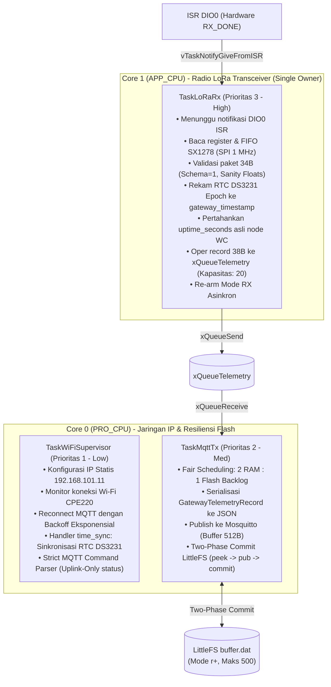
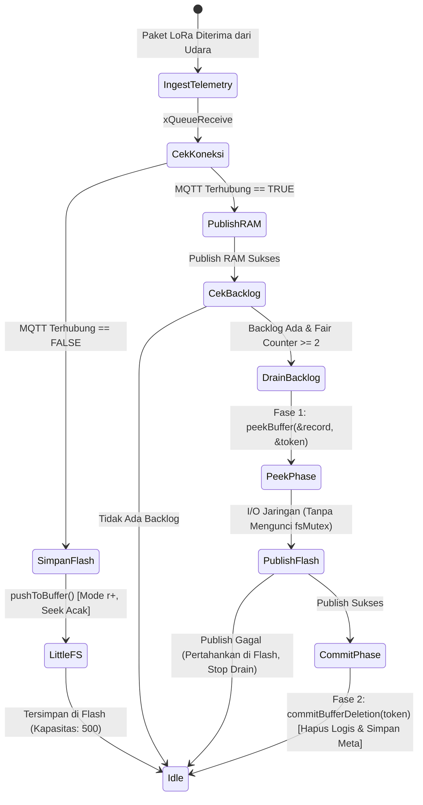

# DOKUMENTASI ARSITEKTUR FIRMWARE GATEWAY ROUTER (ESP32 FreeRTOS)
## Proyek Capstone: Smart-Sanitation eSOS (Kelompok 4 - Desain Proyek 2 FTUI)

Dokumen ini adalah **sumber kebenaran tunggal (Single Source of Truth)** untuk arsitektur perangkat lunak, konfigurasi jaringan Wi-Fi/MQTT, skema Store-and-Forward LittleFS, dan alur kerja (*workflow*) firmware mikrokontroler **ESP32 Gateway Router Posko**.

---

## 1. Identifikasi Sistem & Peran Arsitektur

Gateway bertindak sebagai jembatan cerdas (*intelligent bridge*) antara jaringan sensor nirkabel berdaya rendah (**LoRa 433.175 MHz**) di area bilik toilet dan jaringan server posko (**Wi-Fi / MQTT Mosquitto**). Sesuai **ADR-01** dan **ADR-03**, Gateway bertugas:
1. Menangkap paket biner 34-byte dari udara 24/7 secara asinkron (*interrupt-driven*).
2. Memberikan cap waktu penerimaan (*Gateway Timestamping*) menggunakan **RTC DS3231** tanpa merusak data durasi aktif (*uptime_seconds*) asli milik Node WC.
3. Melakukan validasi ketat (*strict sanity check*) terhadap skema, tipe, dan rentang fisis data telemetri.
4. Mengonversi data biner ke format JSON Envelope terstandarisasi.
5. Menerbitkan data ke Broker MQTT dengan perlindungan mutex dan kapasitas buffer 512-byte.
6. Mengamankan data ke **LittleFS Circular Buffer** melalui mekanisme *Two-Phase Commit* (`peek` $\rightarrow$ *publish* $\rightarrow$ `commit` tanpa menahan mutex berkas selama I/O jaringan) saat koneksi terputus (*Store-and-Forward*).
7. Menerapkan penjadwalan adil (*fair scheduling* rasio 2 RAM : 1 Flash) untuk mencegah kelaparan (*starvation*) backlog flash saat antrean RAM aktif.
8. Menyediakan penanganan terpisah untuk sinkronisasi waktu RTC dari backend (`time_sync`) dan parsing komando downlink ketat.
9. Pada tahap integrasi aktif, unit Node WC beroperasi secara *Uplink-Only*; komando downlink MQTT dibalas dengan status `DOWNLINK_UNAVAILABLE` dan transmisi balik radio dinonaktifkan (`ENABLE_GATEWAY_DOWNLINK 0`).

```mermaid
graph LR
    subgraph "Jaringan Radio Lapangan"
        Node["Node WC 01 (Bilik)"] -->|LoRa 433.175 MHz (Uplink-Only)| SX1278[Radio SX1278 Ra-02]
    end

    subgraph "ESP32 Gateway Posko"
        SX1278 -->|SPI Bus| LoRaRx["TaskLoRaRx (Core 1)<br/>(Sole Radio Owner)"]
        RTC[RTC DS3231] -->|I2C SDA:4, SCL:22| LoRaRx
        LoRaRx -->|Record 38B (34B LoRa + 4B RTC)| QueueTel[(xQueueTelemetry)]
        QueueTel -->|xQueueReceive| TaskMqtt["TaskMqttTx (Core 0)"]
        
        TaskMqtt -.->|Wi-Fi / MQTT Offline| LFS[("LittleFS Circular Buffer<br/>(Two-Phase Commit, Maks 500)")]
        LFS -.->|Fair Drain (1 flash : 2 RAM)| TaskMqtt
        
        TaskWiFi["TaskWiFiSupervisor (Core 0)"] -->|MQTT Command Ingest| CmdParser["Strict Command Parser<br/>(No Silent Defaults)"]
        TaskWiFi -->|Time Sync Ingest| TimeSync["RTC Synchronizer<br/>(Epoch Validasi)"]
        CmdParser -->|Publish Status| DownStatus[("MQTT Status Topic<br/>DOWNLINK_UNAVAILABLE")]
        TimeSync --> RTC
    end

    subgraph "Infrastruktur Posko / Cloud"
        TaskMqtt -->|Wi-Fi MQTT JSON| Broker[("Mosquitto MQTT Broker<br/>Port 1883")]
        DownStatus --> Broker
        Broker --> GoServer["Go Backend Server"]
        GoServer --> WebDash["Web Dashboard"]
    end
```

---

## 2. Konfigurasi Jaringan & Alamat IP Lapangan

Jaringan nirkabel posko menggunakan titik akses nirkabel **TP-Link CPE220**. Gateway ESP32 dikonfigurasi dengan **IP Statis** sebelum inisiasi Wi-Fi untuk memastikan koneksi deterministik dan ketiadaan latensi DHCP.

### A. Tabel Parameter Jaringan Target

| Parameter | Nilai Konfigurasi | Deskripsi / Catatan Operasional |
| :--- | :--- | :--- |
| **SSID Wi-Fi** | `CompEngQuiz-Server-Live` | Titik akses CPE220 Posko. |
| **Password Wi-Fi** | `compengquiz` | Kredensial WPA2-PSK (Disimpan di `config_local.h`). |
| **IP Statis ESP32 Gateway** | `192.168.101.11` | Dikonfigurasi via `WiFi.config()` sebelum `WiFi.begin()`. |
| **Subnet Mask** | `255.255.255.0` | Subnet `/24` (Rentang host: 192.168.101.1 – 192.168.101.254). |
| **Default Gateway / Router** | `192.168.101.1` | Alamat router gateway CPE220. |
| **DNS Server Utama** | `152.118.24.4` | Resolver DNS kampus UI. |
| **IP Laptop / Broker MQTT** | `192.168.101.10` | Alamat host server database & Mosquitto. |
| **Port Broker MQTT** | `1883` | Port TCP MQTT non-TLS lokal. |

> [!IMPORTANT]
> **Petunjuk Konfigurasi Laptop Server:**
> - Alamat `192.168.101.10` adalah konfigurasi target. Laptop server **WAJIB** dikonfigurasi secara manual (*static IP*) pada adapter jaringan dengan IP `192.168.101.10`, subnet `255.255.255.0`, dan gateway `192.168.101.1`.
> - Pastikan tidak ada konflik alamat IP antara laptop (`.10`), gateway (`.11`), dan router (`.1`).
> - Node WC berkomunikasi secara eksklusif melalui gelombang radio LoRa dan **tidak membutuhkan alamat IP**.
> - Akses lokal CPE220 tidak memerlukan autentikasi SSO UI. Komunikasi MQTT lokal antara Gateway dan Laptop berjalan penuh secara intranet mandiri tanpa ketergantungan internet upstream.

### B. Manajemen Kredensial Aman (`config_local.h`)

Untuk mencegah kebocoran password Wi-Fi dan token broker ke repositori Git:
1. Template konfigurasi publik disediakan pada [`include/config_local.template.h`](file:///src/firmware/gateway/include/config_local.template.h) yang berisi nilai placeholder.
2. Pengembang menyalin berkas tersebut menjadi `include/config_local.h`.
3. Berkas `config_local.h` telah didaftarkan dalam [`.gitignore`](file:///../../.gitignore) sehingga tidak akan ter-commit.
4. Firmware secara otomatis mendeteksi keberadaan berkas lokal via `#if __has_include("config_local.h")`. Jika tidak ditemukan, firmware menggunakan fallback aman dan memberikan peringatan serial tanpa pernah mencetak password ke log/konsol.

---

## 3. Kepatuhan Regulasi Frekuensi Radio Indonesia

Pengoperasian penerima dan pemancar kendali pada Gateway tunduk pada:

* **Dasar Hukum:** Permenkomdigi No. 2 Tahun 2025 (Pita LPWAN/SRD Non-Lisensi).
* **Alokasi Pita:** 433,050 MHz – 434,790 MHz.
* **Bandwidth Maksimum:** 125.0 kHz.
* **Frekuensi Tengah Operasi:** **433.175 MHz** (Kanal nominal 433,1125 – 433,2375 MHz).
* **Parameter Modulasi:** Spreading Factor SF9, Coding Rate 4/7, Sync Word `0x12` (Jaringan Privat eSOS).
* **Batas Emisi:** Maksimum 12,15 dBm EIRP (setara 10 dBm ERP / 10 mW).

---

## 4. Arsitektur FreeRTOS Dual-Core & Alokasi Task

Gateway menerapkan prinsip **Single Radio Owner**: hanya ada satu task pada Core 1 (`TaskLoRaRx`) yang berinteraksi langsung dengan radio SX1278 melalui SPI. Hal ini mencegah tabrakan bus SPI, *race conditions*, dan pemancaran ganda.



### Tabel Spesifikasi Task FreeRTOS Gateway

| Nama Task | Core Affinity | Prioritas | Ukuran Stack (Bytes) | Deskripsi Fungsional |
| :--- | :---: | :---: | :---: | :--- |
| `TaskLoRaRx` | Core 1 | 3 (Tinggi) | 4.096 Bytes | Pemilik tunggal SX1278. Menerima interupsi hardware DIO0, validasi panjang & batas numerik, inject timestamp RTC DS3231 ke pembungkus record terpisah, mempertahankan `uptime_seconds` asli node, dan me-rearm mode siaga RX pada setiap jalur. |
| `TaskMqttTx` | Core 0 | 2 (Sedang) | 4.096 Bytes | Mengubah biner menjadi JSON string, menerbitkan ke topik MQTT dengan proteksi `mqttMutex`, dan menguras antrean flash dengan skema *Two-Phase Commit* dan *fair scheduling*. |
| `TaskWiFiSupervisor` | Core 0 | 1 (Rendah) | 4.096 Bytes | Menjaga stabilitas Wi-Fi dengan IP statis, mengelola sesi MQTT broker dengan *exponential backoff*, memproses `mqtt.loop()`, menyinkronkan waktu RTC dari topik `time_sync`, dan validasi ketat format komando masuk. |

> [!NOTE]
> Pada ESP-IDF FreeRTOS, kedalaman stack pada `xTaskCreatePinnedToCore()` dinyatakan dalam satuan **BYTES**, bukan words.

---

## 5. Kontrak Data LoRa & JSON Envelope

### A. Kontrak Biner LoRa 34-Byte (Node WC ke Gateway)

Format Little-Endian Xtensa 32-bit, ukuran tepat 34 Bytes tanpa padding compiler ([ADR-01]):

| Offset | Panjang | Tipe Data | Nama Field | Deskripsi Semantik |
| :---: | :---: | :---: | :--- | :--- |
| `0` | 1 Byte | `uint8_t` | `schema_version` | Versi protokol biner (Wajib `1`). |
| `1` | 8 Bytes | `char[8]` | `node_code` | Identitas node C-String ("WC_01\0\0\0"). |
| `9` | 4 Bytes | `uint32_t` | `sequence_no` | Nomor urut paket per node. |
| `13` | 4 Bytes | `uint32_t` | `uptime_seconds` | **Durasi operasional node sejak boot (Detik)**. |
| `17` | 4 Bytes | `float` | `water_level_cm` | Level air tangki sanitasi (cm). Sentinel: `-1.0f`. |
| `21` | 4 Bytes | `float` | `ammonia_ppm` | Konsentrasi gas amonia NH3 (ppm). Sentinel: `-1.0f`. |
| `25` | 4 Bytes | `float` | `h2s_ppm` | Konsentrasi gas hidrogen sulfida H2S (ppm). Sentinel: `-1.0f`. |
| `29` | 4 Bytes | `float` | `battery_voltage` | Tegangan baterai Li-ion (V). Sentinel: `-1.0f`. |
| `33` | 1 Byte | `uint8_t` | `sos_triggered` | Flag darurat bilik (0 = Normal, 1 = SOS). |

### B. Struktur Internal Gateway (`GatewayTelemetryRecord` 38-Byte)

Gateway membungkus paket LoRa 34B bersama cap waktu RTC Gateway tanpa memodifikasi `uptime_seconds`:
```cpp
struct __attribute__((packed)) GatewayTelemetryRecord {
    TelemetryPayload payload;           // Offset  0 | 34 Bytes: Paket asli Node WC
    uint32_t         gateway_timestamp; // Offset 34 |  4 Bytes: Unix Epoch RTC DS3231 saat diterima
};
```

### C. Kontrak JSON Envelope MQTT (`esos/gateway_01/nodes/telemetry`)

JSON yang diterbitkan Gateway ke broker MQTT memenuhi kebutuhan backend Go dan dashboard web:
```json
{
  "schema_version": 1,
  "node_code": "WC_01",
  "sequence_no": 42,
  "timestamp": 1727879999,
  "uptime_seconds": 1250,
  "water_level_cm": 25.4,
  "ammonia_ppm": 0.85,
  "h2s_ppm": 0.12,
  "battery_voltage": 3.92,
  "sos_triggered": 0
}
```
* **Kesesuaian Backend Go:** Backend Go memetakan field `"timestamp"` ke `time.Unix(payload.Timestamp, 0)` untuk pencatatan di PostgreSQL. Field `"uptime_seconds"` mewakili durasi aktif perangkat keras bilik toilet.

---

## 6. Sinkronisasi Waktu Server & Penanganan Komando MQTT

### A. Sinkronisasi Waktu Server Backend (`esos/gateway_01/time_sync`)
Saat Gateway berhasil terhubung ke broker MQTT dan menerbitkan status `"ONLINE"` pada `esos/gateway_01/status`, server backend Go secara otomatis membalas dengan mempublikasikan Unix Timestamp ke topik `esos/gateway_01/time_sync` (format teks desimal polos, misal: `"1727876543"`).
* Gateway memvalidasi bahwa payload hanya terdiri atas karakter angka desimal dan berada dalam rentang masuk akal (antara 1.700.000.000 hingga 2.500.000.000).
* Modul RTC DS3231 disinkronkan via `rtc.adjust(DateTime(epoch))`.

### B. Validasi Ketat Komando MQTT (`esos/+/+/command`)
* Wajib menyertakan seluruh field tanpa nilai default otomatis: `node_code` (string, $\le 7$ karakter, alfanumerik/tanda hubung), `command_id` (integer, rentang 1..4), dan `parameter` (integer, rentang 0..255; untuk servo maks 180).
* Pemisahan validasi format dari status eksekusi: Karena subsistem berada pada tahap **Uplink-Only**, komando valid yang diterima tetap ditolak dengan menerbitkan status `DOWNLINK_UNAVAILABLE`. Tidak ada sinyal RF downlink yang dipancarkan ke udara.

---

## 7. Resiliensi Jaringan: Two-Phase Commit Store-and-Forward (ADR-03)

Untuk mencegah data hilang saat jaringan posko terputus atau terjadi kegagalan transmisi:



### Prinsip Desain Two-Phase Commit & Penanganan Kegagalan:
1. **Fase 1 (`peekBuffer`)**: Record pada posisi slot `meta.head` dibaca ke dalam RAM dan diberikan `CommitToken` yang memuat nomor slot dan `sequence_no`. Record **TIDAK dihapus** pada tahap ini.
2. **Penerbitan Jaringan di Luar Mutex**: Pengiriman paket JSON via `mqtt.publish()` dilakukan di luar `fsMutex`. Jika transmisi jaringan lambat atau mengalami *timeout*, operasi penulisan paket LoRa baru ke flash tidak akan terblokir.
3. **Fase 2 (`commitBufferDeletion`)**: Hanya setelah `mqtt.publish()` mengembalikan nilai `true`, fungsi commit dipanggil untuk memajukan `meta.head = (meta.head + 1) % MAX_BUFFER_RECORDS` dan memperbarui `BufferMeta` (dengan `metaFile.flush()`).
4. **Perlindungan Terhadap Wrap-Around**: Jika selama proses publish terjadi wrap-around (karena flash penuh dan slot head ditimpa oleh data baru), `commitBufferDeletion` mendeteksi ketidakcocokan token (`meta.head != token.slot` atau `meta.head_seq != token.sequence_no`), sehingga penghapusan slot yang salah dicegah.
5. **Pencegahan Kelaparan (*Starvation Prevention / Fair Scheduling*)**:
   Jika paket telemetri LoRa masuk secara kontinu dari banyak node saat koneksi Wi-Fi kembali pulih, menguras antrean RAM secara eksklusif akan membuat data flash tertahan selamanya (*starvation*). Gateway menerapkan rasio **2 RAM : 1 Flash**: setiap kali memproses 2 paket dari antrean RAM, Gateway menyelingi dengan menguras 1 paket backlog dari LittleFS.
6. **Inisialisasi Mount LittleFS yang Aman**:
   Menggunakan `LittleFS.begin(false)`. Jika terjadi kegagalan mount, flash **TIDAK diformat secara otomatis** agar tidak memusnahkan backlog yang ada. Gateway beralih ke mode *degraded* (antrean RAM tetap berfungsi).
7. **Pencegahan Truncation Tidak Sengaja**:
   Pembukaan berkas data `buffer.dat` menggunakan mode `"r+"`. Berkas baru hanya dibuat jika `LittleFS.exists(FILE_DATA)` bernilai `false`. Mode `"w+"` dihindari agar kegagalan pembukaan temporer tidak menghapus isi berkas lama.

### Batasan Jaminan Pengiriman (*Delivery Boundaries*):
* **At-Least-Once Delivery**: Keberhasilan `PubSubClient::publish()` membuktikan bahwa paket telah terkirim ke broker MQTT, namun tidak membuktikan bahwa data telah ditulis ke PostgreSQL oleh backend.
* **Duplikasi vs Kehilangan**: Jika terjadi kegagalan sistem tepat setelah publish berhasil namun sebelum commit metadata tersimpan ke LittleFS, paket yang sama dapat terkirim kembali setelah reboot. Hal ini sengaja dipilih karena *at-least-once* jauh lebih baik daripada kehilangan data. Backend Go telah dilengkapi dengan mekanisme deduplikasi LRU cache (`payload.SequenceNo <= lastSeq`) untuk membuang paket duplikat.
* **Ketahanan Power-Loss**: Meskipun metadata dilindungi CRC32 dan penulisan dilakukan secara deterministik, pemadaman listrik mendadak di tengah siklus tulis fisik flash NOR ESP32 tetap berpotensi menyebabkan ketidaksesuaian level sektor perangkat keras.

---

## 8. Tabel Pengkabelan Fisik Lengkap (Gateway Wiring Harness)

| Nama Perangkat | Pin Modul | Pin ESP32 DevKit V1 | Fungsi Sinyal | Catatan Kelistrikan |
| :--- | :--- | :--- | :--- | :--- |
| **LoRa Ra-02** | 3.3V | **3V3** | Catu Daya Positif | **WAJIB 3.3V stabil** (Dilarang ke VIN 5V!). |
| **LoRa Ra-02** | GND | **GND** | Ground Bersama | Terhubung ke ground referensi ESP32. |
| **LoRa Ra-02** | RST | **D15 (GPIO 15)** | Hardware Reset | Pulsa reset 20ms aktif LOW. |
| **LoRa Ra-02** | DIO0 | **D2 (GPIO 2)** | Interupsi RX_DONE | Strapping pin: pastikan modul idle saat ESP32 boot. |
| **LoRa Ra-02** | NSS | **D5 (GPIO 5)** | SPI Chip Select | Di-pull HIGH saat idle bus SPI. |
| **LoRa Ra-02** | MOSI | **D18 (GPIO 18)** | SPI Master Out | Bus SPI RadioLib. |
| **LoRa Ra-02** | MISO | **D19 (GPIO 19)** | SPI Master In | Bus SPI RadioLib. |
| **LoRa Ra-02** | SCK | **D21 (GPIO 21)** | SPI Clock | Bus SPI RadioLib. |
| **RTC DS3231** | VCC | **3V3** | Catu Daya Positif | 3.3V dari ESP32. |
| **RTC DS3231** | GND | **GND** | Ground Bersama | Terhubung ke ground ESP32. |
| **RTC DS3231** | SDA | **D4 (GPIO 4)** | I2C Data Bus | Dipetakan ke GPIO 4 agar tidak bentrok dengan SCK (GPIO 21). |
| **RTC DS3231** | SCL | **D22 (GPIO 22)** | I2C Clock Bus | Dipetakan ke GPIO 22. |

---

## 9. Panduan Verifikasi & Pengujian Mandiri

### A. Uji Logika Firmware Standalone (Unit Test Python)
Seluruh logika validasi telemetri, Store-and-Forward Two-Phase Commit, Fair Scheduling, validasi komando, dan parsing sinkronisasi waktu diverifikasi melalui unit test otomatis:
```powershell
python tests/test_gateway_logic.py
```

### B. Kompilasi Pengujian LoRa RX Mandiri (PlatformIO)
Menguji penerimaan paket radio tanpa modul Wi-Fi/MQTT aktif:
```powershell
pio run -d src/firmware/gateway -e test_lora_gateway_rx
```

### C. Kompilasi Firmware Integrasi Penuh Gateway Router
```powershell
pio run -d src/firmware/gateway -e gateway_router
```
