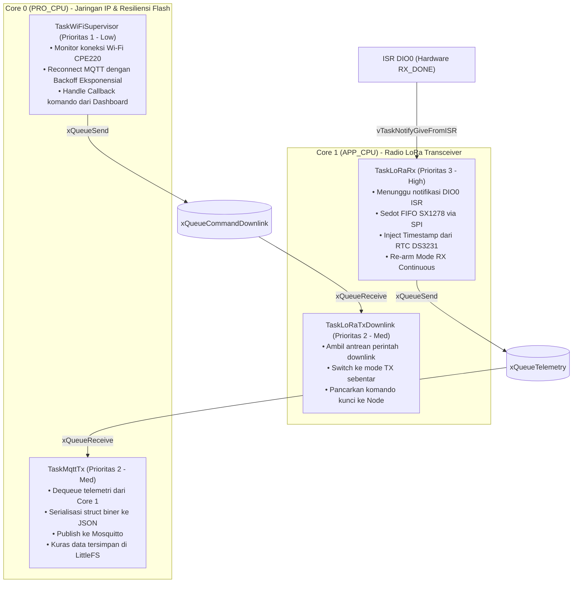
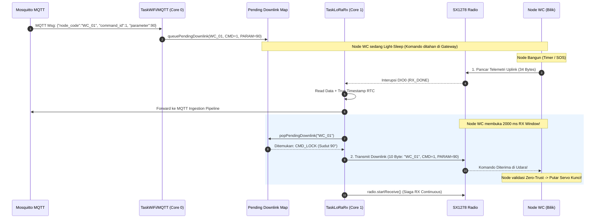
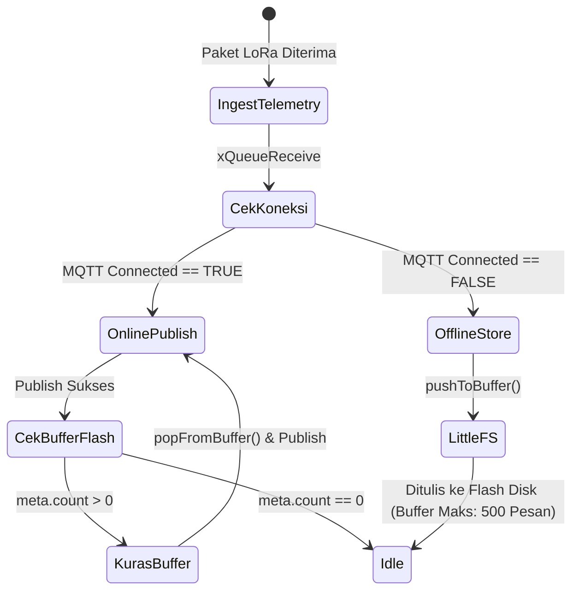

# DOKUMENTASI ARSITEKTUR FIRMWARE GATEWAY ROUTER (ESP32 FreeRTOS)
## Proyek Capstone: Smart-Sanitation eSOS (Kelompok 4 - Desain Proyek 2 FTUI)

Dokumen ini adalah **sumber kebenaran tunggal (Single Source of Truth)** untuk arsitektur perangkat lunak, konfigurasi jaringan Wi-Fi/MQTT, dan alur kerja (*workflow*) firmware mikrokontroler **ESP32 Gateway Router Posko**.

---

## 1. Identifikasi Sistem & Peran Arsitektur

Gateway bertindak sebagai jembatan cerdas (*intelligent bridge*) antara jaringan sensor nirkabel berdaya rendah (**LoRa 433.175 MHz**) di area bilik toilet dan jaringan server posko (**Wi-Fi / MQTT Mosquitto**). Sesuai **ADR-01** dan **ADR-03**, Gateway bertugas:
1. Menangkap paket biner 34-byte dari udara 24/7.
2. Memberikan cap waktu nyata (*True Timestamping*) menggunakan **RTC DS3231**.
3. Mengonversi data biner ke format JSON Envelope.
4. Menerbitkan data ke Broker MQTT jika online.
5. Mengamankan data ke **LittleFS Circular Buffer** jika Wi-Fi terputus (*Store-and-Forward*).
6. Meneruskan komando dari server posko kembali ke Node WC (*Downlink Control*).

```mermaid
graph LR
    subgraph "Jaringan Radio Lapangan"
        Node["Node WC 01 (Bilik)"] -->|LoRa 433.175 MHz| SX1278[Radio SX1278 Ra-02]
    end

    subgraph "ESP32 Gateway Posko"
        SX1278 -->|SPI Bus| LoRaRx["TaskLoRaRx (Core 1)"]
        RTC[RTC DS3231] -->|I2C SDA:4, SCL:22| LoRaRx
        LoRaRx -->|Raw Payload| QueueTel[(xQueueTelemetry)]
        QueueTel -->|xQueueReceive| TaskMqtt["TaskMqttTx (Core 0)"]
        
        TaskMqtt -.->|Wi-Fi Offline| LFS[("LittleFS Circular Buffer<br/>(Kapasitas: 500 Pesan)")]
        LFS -.->|Wi-Fi Reconnect (Flush)| TaskMqtt
        
        TaskWiFi["TaskWiFiSupervisor (Core 0)"] -->|MQTT Callback| QueueDown[(xQueueCommandDownlink)]
        QueueDown -->|xQueueReceive| LoRaDown["TaskLoRaTxDownlink (Core 1)"]
        LoRaDown -->|TX Komando| SX1278
    end

    subgraph "Infrastruktur Posko / Cloud"
        TaskMqtt -->|Wi-Fi MQTT JSON| Broker[("Mosquitto MQTT Broker<br/>Port 1883")]
        Broker --> GoServer["Go Backend Server"]
        GoServer --> WebDash["Web Dashboard"]
    end
```

---

## 2. Kepatuhan Regulasi Frekuensi Radio Indonesia

Pengoperasian penerima dan pemancar kendali pada Gateway tunduk pada:

* **Dasar Hukum:** Permenkomdigi No. 2 Tahun 2025 (Pita LPWAN/SRD Non-Lisensi).
* **Alokasi Pita:** 433,050 MHz – 434,790 MHz.
* **Bandwidth Maksimum:** 125.0 kHz.
* **Frekuensi Tengah Operasi:** **433.175 MHz**.
* **Parameter Modulasi:** Spreading Factor SF9, Coding Rate 4/7, Sync Word `0x12` (Jaringan Privat eSOS).

---

## 3. Arsitektur FreeRTOS Dual-Core & Alokasi Task

Gateway memisahkan urusan radio frekuensi tinggi (Core 1) dari urusan jaringan IP / Wi-Fi / Flash I/O (Core 0):



### Tabel Spesifikasi Task FreeRTOS Gateway

| Nama Task | Core Affinity | Prioritas | Ukuran Stack | Deskripsi Fungsional |
| :--- | :---: | :---: | :---: | :--- |
| `TaskLoRaRx` | Core 1 | 3 (Tinggi) | 4.096 Words | Menerima interupsi hardware DIO0, menyedot FIFO radio, membaca waktu RTC, dan mengoper ke antrean. |
| `TaskLoRaTxDownlink` | Core 1 | 2 (Sedang) | 4.096 Words | Memancarkan paket komando kendali (kunci/buka pintu) kembali ke Node WC saat jendela RX Node terbuka. |
| `TaskMqttTx` | Core 0 | 2 (Sedang) | 4.096 Words | Mengubah biner menjadi JSON string, menerbitkan ke topik MQTT, dan mengelola buffer flash. |
| `TaskWiFiSupervisor` | Core 0 | 1 (Rendah) | 4.096 Words | Menjaga stabilitas koneksi TCP/IP Wi-Fi dan sesi MQTT dengan algoritma *exponential backoff*. |

---

## 4. Alur Kerja Penerimaan Telemetri & Transmisi Downlink (LoRaWAN Class A)

Gateway mengadopsi pola **LoRaWAN Class A Downlink Response**:
1. Server mengirim komando aktuator via MQTT (`esos/commands/actuator`).
2. Gateway menampung komando pada antrean pending (`queuePendingDownlink`) per `node_code` dan **TIDAK langsung memancar** ke udara (karena Node WC sedang dalam mode *Light-Sleep*).
3. Saat Node WC bangun dan mengirim telemetri uplink, Node WC seketika membuka **jendela dengar 2000 ms (RX Window)**.
4. `TaskLoRaRx` Gateway mendeteksi adanya pending komando untuk node tersebut via `popPendingDownlink()`, lalu seketika menembakkan `ActuatorCommand` 10-byte ke udara tepat di dalam jendela dengar Node!



---

## 5. Resiliensi Jaringan: LittleFS Store-and-Forward (ADR-03)

Untuk mencegah hilangnya data telemetri saat router CPE220 padam atau kabel LAN posko terputus:



* **Struktur Metadata Buffer (`/meta.dat`):**
  Menyimpan pointer sirkular (*head*, *tail*, dan *count*) sehingga jika ESP32 restart tiba-tiba, antrean data lama di flash tidak hilang.
* **Kapasitas Penyimpanan:**
  Dikonfigurasi untuk menahan **500 paket** ($\approx 17\text{ KB}$). Pada interval transmisi 5 detik, Gateway sanggup menahan pemadaman jaringan selama lebih dari 40 menit tanpa kehilangan 1 byte pun.

---

## 6. Tabel Pengkabelan Fisik Lengkap (Gateway Wiring Harness)

| Nama Perangkat | Pin Modul | Pin ESP32 DevKit V1 | Fungsi Sinyal | Catatan Penting |
| :--- | :--- | :--- | :--- | :--- |
| **LoRa Ra-02** | 3.3V | **3V3** | Catu Daya Positif | **WAJIB 3.3V stabil!** |
| **LoRa Ra-02** | GND | **GND** | Ground Bersama | Ground bersama ESP32 dan RTC. |
| **LoRa Ra-02** | RST | **D15 (GPIO 15)** | Hardware Reset | Pulsa reset 20ms + settling 100ms. |
| **LoRa Ra-02** | DIO0 | **D2 (GPIO 2)** | Interupsi RX_DONE | Terhubung ke `isr_lora_rx`. |
| **LoRa Ra-02** | NSS | **D5 (GPIO 5)** | SPI Chip Select | Di-pull HIGH sebelum SPI aktif. |
| **LoRa Ra-02** | MOSI | **D18 (GPIO 18)** | SPI Master Out | Bus SPI RadioLib. |
| **LoRa Ra-02** | MISO | **D19 (GPIO 19)** | SPI Master In | Bus SPI RadioLib. |
| **LoRa Ra-02** | SCK | **D21 (GPIO 21)** | SPI Clock | Bus SPI RadioLib. |
| **RTC DS3231** | VCC | **3V3** | Catu Daya Positif | 3.3V dari ESP32. |
| **RTC DS3231** | GND | **GND** | Ground Bersama | Terhubung ke ground ESP32. |
| **RTC DS3231** | SDA | **D4 (GPIO 4)** | I2C Data Bus | Dipetakan ke GPIO 4 (bebas bentrok). |
| **RTC DS3231** | SCL | **D22 (GPIO 22)** | I2C Clock Bus | Dipetakan ke GPIO 22. |

---

## 7. Panduan Pengujian & Validasi Mandiri

1. **Uji Penerima Mandiri (Standalone Test):**
   * Buka skrip `standalone_test/test_lora_gateway_rx.ino` di Arduino IDE.
   * Unggah ke board ESP32 Gateway.
   * Buka Serial Monitor (`115200` baud).
   * Verifikasi keluaran:
     ```text
     1. Melakukan Hardware Reset SX1278 (RST:15)... [OK]
     2. Inisialisasi Hardware SPI Bus (SCK:21, MISO:19, MOSI:18, SS:Manual)... [OK]
     3. Inisialisasi Register Chip Semtech SX1278... [OK]
     4. Mengalokasikan Antrean FreeRTOS Gateway (10 Paket)... [OK]
     5. Memasang Task FreeRTOS ke Dual Core ESP32... [OK]
     6. Mendaftarkan Callback Interupsi DIO0 (GPIO 2)... [OK]
     7. Mengaktifkan Radio Mode RX Asinkron (433.175 MHz)... [OK]
     >>> MODE RX ASINKRON DIAKTIFKAN DI FREKUENSI 433.175 MHz <<<
     ```
2. **Kompilasi Penuh via PlatformIO:**
   ```powershell
   cd src/firmware/gateway
   pio run -e gateway_router -t upload
   pio device monitor
   ```
