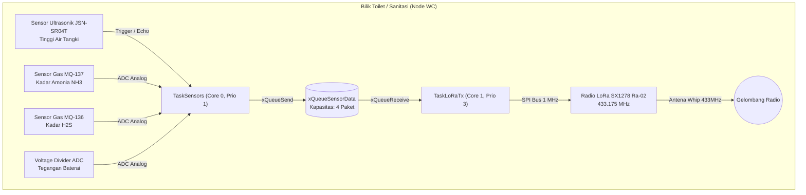
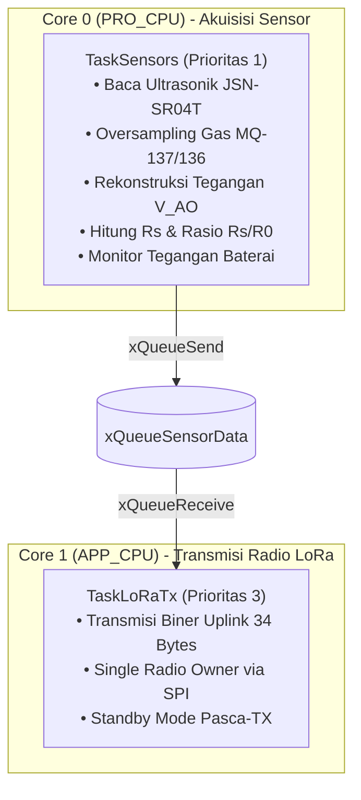
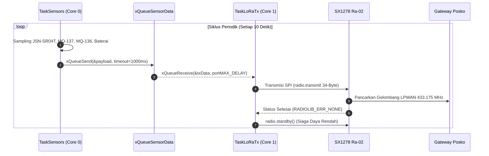

# DOKUMENTASI ARSITEKTUR FIRMWARE NODE WC (ESP32 FreeRTOS)
## Proyek Capstone: Smart-Sanitation eSOS (Kelompok 4 - Desain Proyek 2 FTUI)

Dokumen ini adalah **sumber kebenaran tunggal (Single Source of Truth)** untuk arsitektur perangkat lunak, konfigurasi perangkat keras, dan alur kerja (*workflow*) firmware mikrokontroler **Node WC (Bilik Sanitasi / Tangki)**.

---

## 1. Identifikasi Sistem & Peran Arsitektur

Node WC dirancang sebagai unit pemantau mandiri (*autonomous sensing unit*) yang beroperasi di lingkungan terisolasi (*blank spot*) pasca-bencana. Sesuai **ADR-02**, unit ini bersifat **LoRa-Only** (radio Wi-Fi dimatikan secara permanen) untuk memaksimalkan efisiensi catu daya baterai 18650 / panel surya.



> [!NOTE]
> Pada tahap integrasi aktif, aktuator servo kunci pintu/ventilasi dinonaktifkan sementara sampai tahap uji mandiri aktuator terselesaikan secara fisik. Transceiver beroperasi dalam moda **Uplink-Only Telemetry**.

---

## 2. Kepatuhan Regulasi Frekuensi Radio Indonesia

Pengoperasian radio transmisi pada Node WC tunduk pada payung hukum nasional:

* **Dasar Hukum:** Peraturan Menteri Komunikasi dan Digital (Permenkomdigi) No. 2 Tahun 2025 tentang *Spektrum Frekuensi Radio untuk Keperluan Perangkat Jarak Dekat (Short Range Device / LPWAN Non-Lisensi)*.
* **Alokasi Pita:** 433,050 MHz – 434,790 MHz.
* **Bandwidth Maksimum:** 125.0 kHz.
* **Frekuensi Tengah Operasi:** **433.175 MHz** (Kanal nominal 433,1125 – 433,2375 MHz).
* **Daya Pancar Terpancar Maksimum:** $\le$ 12,15 dBm EIRP (setara 10 dBm ERP / 10 mW).
* **Konfigurasi Chip:** Conducted Power disetel pada **+10 dBm**. Dengan penguatan antena *whip* $\approx 2\text{ dBi}$ dan rugi kabel $\approx 0\text{ dB}$, estimasi EIRP adalah $12\text{ dBm}$ (patuh regulasi).

---

## 3. Arsitektur FreeRTOS Dual-Core & Alokasi Task

Firmware memanfaatkan kedua inti komputasi prosesor Xtensa 32-bit LX6 pada ESP32 DevKit V1:



### Tabel Spesifikasi Task FreeRTOS

> [!NOTE]
> Pada ESP-IDF FreeRTOS (Arduino-ESP32), parameter `usStackDepth` pada `xTaskCreatePinnedToCore` didefinisikan dalam satuan **BYTES**, bukan words.

| Nama Task | Core Affinity | Prioritas | Ukuran Stack | Status Implementasi | Deskripsi Fungsional |
| :--- | :---: | :---: | :---: | :---: | :--- |
| `TaskSensors` | Core 0 | 1 (Low) | 4.096 Bytes | **Aktif** | Melakukan *sampling* analog sensor gas MQ-137 & MQ-136, pengukuran level air ultrasonik JSN-SR04T, tegangan baterai, dan memaketkan telemetri tiap 10.000 ms. |
| `TaskLoRaTx` | Core 1 | 3 (High) | 4.096 Bytes | **Aktif (Uplink-Only)** | Menangani transaksi SPI frekuensi tinggi ke SX1278 (pemilik tunggal radio), memancarkan paket telemetri 34 bytes, lalu mengembalikan radio ke mode *standby*. |

---

## 4. Alur Kerja Akuisisi Sensor & Transmisi Telemetri (Moda Uplink-Only)

Pada arsitektur tahap ini, Node WC beroperasi secara berkala mengirimkan telemetri uplink tanpa membuka jendela dengar (*transmit-only*):

### 4.1 Siklus Pengukuran Sensor
1. **Sensor Ultrasonik JSN-SR04T**:
   - Jika `ping_cm()` mengembalikan 0 (gema tidak diterima sebelum batas waktu 400 cm), firmware melaporkan status `NO_ECHO / OUT_OF_RANGE` dan menetapkan level air ke `-1.0f`. Manipulasi nilai menjadi 25 cm dilarang keras.
   - Jika jarak terbaca < 25 cm, firmware menandai kondisi sebagai `BLIND_ZONE` akibat fenomena *piezoelectric ringing-down* transduser tunggal dan menetapkan level air ke `-1.0f`.
   - Jika jarak valid terbaca $\ge$ 25 cm, parameter pemasangan dan geometri tangki fisik yang belum dikalibrasi dilaporkan dengan mempertahankan level air sentinel `-1.0f` berstatus `TANK_GEOMETRY_UNCONFIGURED`.
2. **Sensor Gas MQ-137 (Amonia) & MQ-136 (H2S)**:
   - Dilakukan 8 kali *oversampling* dengan jeda 5 ms untuk menekan derau frekuensi tinggi ADC1.
   - Sinyal ESP32 $V_{pin}$ direkonstruksi menjadi $V_{AO} = V_{pin} / k$ jika pembagi tegangan telah dikonfirmasi valid ($0.10 \le k \le 0.66$).
   - Jika sinyal $V_{AO} < 50\text{ mV}$ (kabel lepas/open-circuit) atau mendekati rel saturasi $\ge 4.95\text{V}$, status ditandai `CIRCUIT_SIGNAL_INVALID`.
   - Jika $R_L$ fisik belum dikonfigurasi, status ditandai `CIRCUIT_RL_UNCONFIGURED`.
   - Nilai $R_s$ dihitung memperhitungkan efek pembebanan paralel: $R_{L,\text{eff}} = (R_L \cdot (R_{\text{top}} + R_{\text{bottom}})) / (R_L + R_{\text{top}} + R_{\text{bottom}})$.
   - Kolom `ammonia_ppm` dan `h2s_ppm` dipertahankan pada nilai sentinel `-1.0f` dengan status `PPM_MODEL_UNCONFIGURED`. Konversi konsentrasi ppm dapat menerapkan fungsi sensitivitas resmi Winsen ($PPM = a \cdot (R_s/R_0)^b$) setelah koefisien regresi empiris ditetapkan melalui pengujian chamber gas terkontrol.
   - **Catatan Operasional**: `uptime_seconds` mikrokontroler adalah durasi operasional sejak *boot/reset*, bukan indikator waktu pemanasan (*preheat/burn-in*) sensor yang disyaratkan manual Winsen (24–48 jam pemanasan kontinu).
3. **Monitor Tegangan Baterai**:
   - Menghindari kesalahan interpretasi pin CMOS input-only (GPIO34) yang mengambang (*floating*). Pembacaan tegangan semu (> 100 mV) tidak dianggap sebagai sirkuit valid. Sentinel `-1.0f` dipertahankan selama rangkaian pembagi baterai fisik belum terpasang.
   - Jika sirkuit terpasang, ditegakkan validasi batas wajar sel Li-ion 1S ($2.80\text{V} \le V_{\text{batt}} \le 4.35\text{V}$).

### 4.2 Siklus Transmisi LoRa Uplink
Paket telemetri dikirim melalui antrean FreeRTOS `xQueueSensorData` menuju `TaskLoRaTx` pada Core 1:
- Transmisi biner 34 byte dilakukan via chip Semtech SX1278 (frekuensi 433.175 MHz, SF9, BW 125 kHz, CR 4/7).
- Waktu pancar nyata diukur dan dibandingkan dengan estimasi *Time-on-Air* (ToA $\approx 201\text{ ms}$).
- Pasca transmisi, radio dikembalikan ke moda *standby* berdaya rendah. Moda penerimaan downlink dan kontrol motor servo direncanakan pada tahap lanjutan setelah pengujian mandiri aktuator terselesaikan.

Kode sumber lengkap tersedia pada [`src/main.cpp`](../src/main.cpp).



---

## 5. Penanganan Interupsi Darurat (SOS Button EXTI & Event Wakeup)

Jika tombol fisik SOS di dalam bilik ditekan oleh pengungsi:
1. Terjadi interupsi *Falling Edge* pada **GPIO 27**.
2. **Sirkuit RTC IO** yang tetap bertegangan saat *Light-Sleep* langsung membangunkan inti CPU melalui konfigurasi:
   ```cpp
   esp_sleep_enable_ext0_wakeup((gpio_num_t)PIN_BTN_SOS, 0);
   ```
3. Rutin `isr_sos_button()` dijalankan di ruang RAM IRAM (`IRAM_ATTR`).
4. Dilakukan *Software Debouncing* (300 ms) untuk mencegah pantulan mekanik sakelar:
   $$\Delta t = (t_{\text{now}} - t_{\text{last}}) > 300\text{ ms}$$
5. Payload darurat (`sos_triggered = 1`) disisipkan ke **bagian terdepan antrean** menggunakan:
   ```cpp
   xQueueSendToFrontFromISR(xQueueSensorData, &alert, &xHigherPriorityTaskWoken);
   ```
6. Scheduler FreeRTOS melakukan *Context Switching* seketika (`portYIELD_FROM_ISR()`), menyela proses pembacaan sensor normal untuk langsung memancarkan alarm darurat ke posko dan membuka jendela komunikasi dua arah.

---

## 6. Kontrak Struktur Data Biner Mutlak (34 Bytes)

Untuk menghemat *airtime* dan mematuhi batas duty cycle, data dikemas dalam struct biner padat tanpa padding memori:

```cpp
struct __attribute__((packed)) TelemetryPayload {
    uint8_t  schema_version;  // Offset  0 | 1 Byte  : Versi skema biner (Selalu 1)
    char     node_code[8];    // Offset  1 | 8 Bytes : Identifier C-String ("WC_01\0\0\0")
    uint32_t sequence_no;     // Offset  9 | 4 Bytes : Nomor urut paket monotonik
    uint32_t uptime_seconds;  // Offset 13 | 4 Bytes : Waktu aktif sejak boot (Detik)
    float    water_level_cm;  // Offset 17 | 4 Bytes : Ketinggian air tangki (IEEE-754)
    float    ammonia_ppm;     // Offset 21 | 4 Bytes : Konsentrasi gas amonia (IEEE-754)
    float    h2s_ppm;         // Offset 25 | 4 Bytes : Konsentrasi gas H2S (IEEE-754)
    float    battery_voltage; // Offset 29 | 4 Bytes : Tegangan baterai Li-ion (IEEE-754)
    uint8_t  sos_triggered;   // Offset 33 | 1 Byte  : Flag darurat (0 = Normal, 1 = SOS)
};
```
$$\text{Total Ukuran} = 1 + 8 + 4 + 4 + 4 + 4 + 4 + 4 + 1 = 34\text{ Bytes}$$

---

## 7. Tabel Pengkabelan Fisik Lengkap (Hardware Wiring Harness)

| Nama Perangkat | Pin Modul | Pin ESP32 DevKit V1 | Fungsi Sinyal | Catatan Penting |
| :--- | :--- | :--- | :--- | :--- |
| **LoRa Ra-02** | 3.3V | **3V3** | Catu Daya Positif | **WAJIB 3.3V!** Dilarang ke 5V/VIN. |
| **LoRa Ra-02** | GND | **GND** | Ground Bersama | Titik referensi sinyal SPI. |
| **LoRa Ra-02** | RST | **D15 (GPIO 15)** | Hardware Reset | Pulsa LOW 20ms + 100ms settling time. |
| **LoRa Ra-02** | DIO0 | **D2 (GPIO 2)** | Interupsi TX/RX Done | Strapping pin (jangan tahan HIGH saat boot). |
| **LoRa Ra-02** | NSS | **D5 (GPIO 5)** | SPI Chip Select | Di-pull HIGH sebelum SPI aktif. |
| **LoRa Ra-02** | MOSI | **D18 (GPIO 18)** | SPI Master Out | Jalur data ke SX1278. |
| **LoRa Ra-02** | MISO | **D19 (GPIO 19)** | SPI Master In | Jalur data dari SX1278 ke ESP32. |
| **LoRa Ra-02** | SCK | **D21 (GPIO 21)** | SPI Clock | Frekuensi bus 1 MHz - 2 MHz. |
| **Ultrasonik** | TRIG | **D13 (GPIO 13)** | Pemicu Suara Ping | Pulsa 10µs via pustaka NewPing. |
| **Ultrasonik** | ECHO | **D12 (GPIO 12)** | Pantulan Pantau | **Pin Strapping MTDI!** Wajib lewat pembagi tegangan 1k/2k ohm (5V -> 3.3V) dan di-pull LOW saat boot agar flash SPI 3.3V tidak bootloop. |
| **MQ-137** | AO | **D32 (GPIO 32)** | Analog Amonia | ADC1_CH4 (12-bit resolusi). Wajib pembagi tegangan rasio $k \le 0,66$. |
| **MQ-136** | AO | **D33 (GPIO 33)** | Analog H2S | ADC1_CH5 (12-bit resolusi). Wajib pembagi tegangan rasio $k \le 0,66$. |
| **Divider Aki**| V_OUT | **D34 (GPIO 34)** | Monitor Baterai | ADC1_CH6 (Input-only, aman dari noise). |
| **Tombol SOS** | NO | **D27 (GPIO 27)** | Input EXTI Alarm | Internal Pull-Up, pemicu FALLING. |
| **Servo MG996R**| SIG | **D26 (GPIO 26)** | PWM Kontrol Kunci | Timer hardware via ESP32Servo (dinonaktifkan sementara). |

---

## 8. Panduan Pengujian Mandiri (*Standalone Test Harness*) & Build PlatformIO

Semua pengujian mandiri (*standalone test*) pada `node_wc` telah distandarisasi ke dalam subfolder terisolasi dengan sepasang berkas `.ino` (Arduino IDE) dan `.cpp` (PlatformIO Bridge).

### 8.1 Matriks Uji Mandiri & Dokumen Panduan Resmi

| Uji Mandiri | Subdirektori Sumber | Environment PlatformIO | Dokumen Panduan Teknis | Fokus & Validasi Rekayasa |
| :--- | :--- | :--- | :--- | :--- |
| **Sensor Gas MQ** | `standalone_test/test_mq_sensors/` | `test_mq_sensors` | [`STANDALONE_MQ_TEST_GUIDE.md`](STANDALONE_MQ_TEST_GUIDE.md) | Proteksi overvoltage ADC, pembagi tegangan ($k \le 0,66$), sampling periodik, kalibrasi baseline $R_0$, flash NVS (schema v2 CRC32), Zero-Trust (ppm dinonaktifkan). |
| **Sensor Ultrasonik** | `standalone_test/test_jsn_sr04t/` | `test_jsn_sr04t` | [`STANDALONE_JSN_TEST_GUIDE.md`](STANDALONE_JSN_TEST_GUIDE.md) | Time-of-flight gema akustik JSN-SR04T, eliminasi pemalsuan data (`NO_ECHO` $\ne$ 25cm), penanganan zona buta transduser tunggal (< 25 cm), proteksi pin strapping MTDI GPIO12. |
| **LoRa Transmitter** | `standalone_test/test_lora_node_tx/` | `test_lora_node_tx` | [`STANDALONE_LORA_TEST_GUIDE.md`](STANDALONE_LORA_TEST_GUIDE.md) | Transmisi telemetri uplink 34 bytes (`TelemetryPayload`), kepatuhan Permenkomdigi No. 2/2025 (433.175 MHz SF9 BW 125kHz CR 4/7), pengukuran Time-on-Air (ToA) riil. |
| **LoRa Receiver** | `standalone_test/test_lora_node_rx/` | `test_lora_node_rx` | [`STANDALONE_LORA_TEST_GUIDE.md`](STANDALONE_LORA_TEST_GUIDE.md) | Penerimaan asinkron DIO0 interrupt Core 1, antrean paket, *sole-writer* logger Core 0, dekoder biner downlink 10 bytes (`ActuatorCommand`) dengan filter node `WC_01` & uplink 34 bytes. |

---

### 8.2 Perintah Kompilasi PlatformIO Core CLI

```powershell
# 1. Kompilasi & Upload Firmware Utama Terintegrasi (Node WC)
pio run -d src/firmware/node_wc -e node_wc -t upload
pio device monitor -d src/firmware/node_wc -b 115200

# 2. Kompilasi & Upload Uji Mandiri Sensor Gas MQ-137 / MQ-136
pio run -d src/firmware/node_wc -e test_mq_sensors -t upload
pio device monitor -d src/firmware/node_wc -b 115200

# 3. Kompilasi & Upload Uji Mandiri Sensor Ultrasonik JSN-SR04T
pio run -d src/firmware/node_wc -e test_jsn_sr04t -t upload
pio device monitor -d src/firmware/node_wc -b 115200

# 4. Kompilasi & Upload Uji Mandiri LoRa Transmitter Uplink
pio run -d src/firmware/node_wc -e test_lora_node_tx -t upload
pio device monitor -d src/firmware/node_wc -b 115200

# 5. Kompilasi & Upload Uji Mandiri LoRa Receiver Downlink
pio run -d src/firmware/node_wc -e test_lora_node_rx -t upload
pio device monitor -d src/firmware/node_wc -b 115200
```

---

### 8.3 Sinkronisasi Arduino IDE

Bagi pengembang yang menggunakan Arduino IDE, berkas `.ino` di bawah ini dapat langsung dibuka dan di-flash (board: **DOIT ESP32 DEVKIT V1**, library: **RadioLib v6.6.0**, **NewPing v1.9.7**):
- `src/firmware/node_wc/standalone_test/test_mq_sensors/test_mq_sensors.ino`
- `src/firmware/node_wc/standalone_test/test_jsn_sr04t/test_jsn_sr04t.ino`
- `src/firmware/node_wc/standalone_test/test_lora_node_tx/test_lora_node_tx.ino`
- `src/firmware/node_wc/standalone_test/test_lora_node_rx/test_lora_node_rx.ino`

*(Berkas juga dapat disinkronkan langsung ke direktori Arduino sketchbook lokal).*


