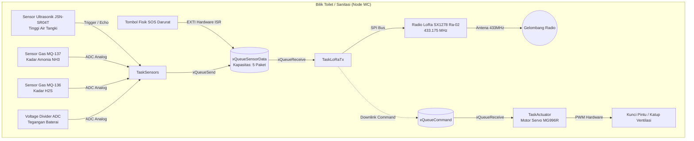
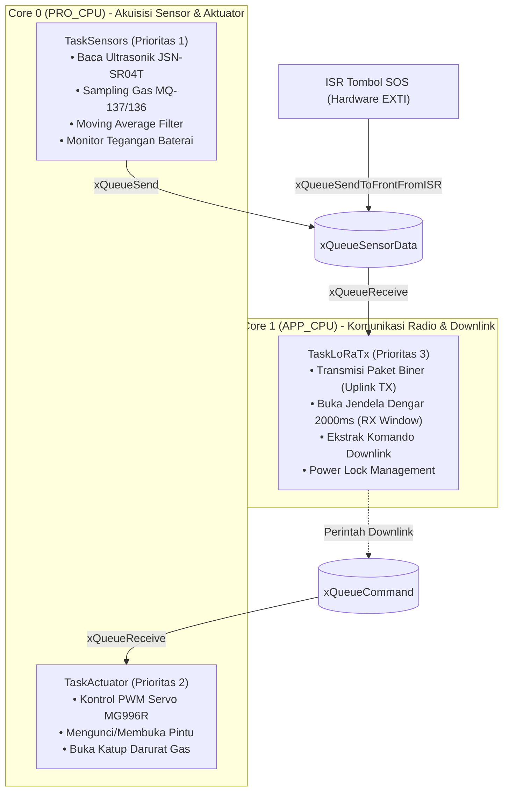
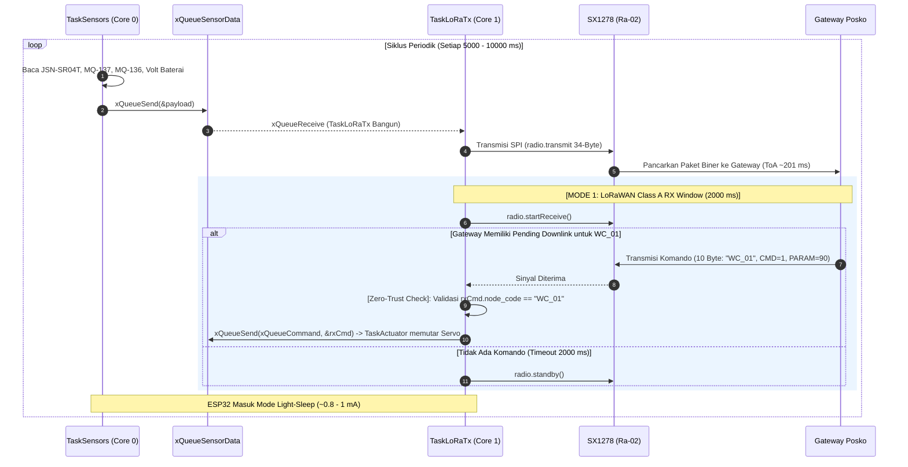

# DOKUMENTASI ARSITEKTUR FIRMWARE NODE WC (ESP32 FreeRTOS)
## Proyek Capstone: Smart-Sanitation eSOS (Kelompok 4 - Desain Proyek 2 FTUI)

Dokumen ini adalah **sumber kebenaran tunggal (Single Source of Truth)** untuk arsitektur perangkat lunak, konfigurasi perangkat keras, dan alur kerja (*workflow*) firmware mikrokontroler **Node WC (Bilik Sanitasi / Tangki)**.

---

## 1. Identifikasi Sistem & Peran Arsitektur

Node WC dirancang sebagai unit pemantau mandiri (*autonomous sensing unit*) yang beroperasi di lingkungan terisolasi (*blank spot*) pasca-bencana. Sesuai **ADR-02**, unit ini bersifat **LoRa-Only** (radio Wi-Fi dimatikan secara permanen) untuk memaksimalkan efisiensi catu daya baterai 18650 / panel surya.



---

## 2. Kepatuhan Regulasi Frekuensi Radio Indonesia

Pengoperasian radio transmisi pada Node WC tunduk pada payung hukum nasional:

* **Dasar Hukum:** Peraturan Menteri Komunikasi dan Digital (Permenkomdigi) No. 2 Tahun 2025 tentang *Spektrum Frekuensi Radio untuk Keperluan Perangkat Jarak Dekat (Short Range Device / LPWAN Non-Lisensi)*.
* **Alokasi Pita:** 433,050 MHz – 434,790 MHz.
* **Bandwidth Maksimum:** 125.0 kHz.
* **Frekuensi Tengah Operasi:** **433.175 MHz** (Kanal nominal 433,1125 – 433,2375 MHz).
* **Daya Pancar Terpancar Maksimum:** $\le$ 12,15 dBm EIRP (setara 10 dBm ERP / 10 mW).
* **Konfigurasi Chip:** Conducted Power disetel pada **+10 dBm**. Dengan penguatan antena *whip* $\approx 2\text{ dBi}$ dan rugi kabel $\approx 0\text{ dB}$, estimasi EIRP adalah $12\text{ dBm}$ (patuh regulasi).

---

## 3. Arsitektur FreeRTOS Dual-Core & Alokasi Task

Firmware memanfaatkan kedua inti komputasi prosesor Xtensa 32-bit LX6 pada ESP32 DevKit V1:



### Tabel Spesifikasi Task FreeRTOS

| Nama Task | Core Affinity | Prioritas | Ukuran Stack | Deskripsi Fungsional |
| :--- | :---: | :---: | :---: | :--- |
| `TaskSensors` | Core 0 | 1 (Low) | 3.072 Words | Melakukan *sampling* analog sensor gas, pengukuran *ping* ultrasonik, dan memaketkan data telemetri tiap 5000 ms. |
| `TaskActuator` | Core 0 | 2 (Medium) | 2.048 Words | Menggerakkan motor servo MG996R via PWM (GPIO 26) saat menerima perintah darurat atau komando posko. |
| `TaskLoRaTx` | Core 1 | 3 (High) | 4.096 Words | Menangani transaksi SPI frekuensi tinggi ke SX1278, memancarkan paket, dan membuka jendela dengar (*RX Window*). |

---

## 4. Alur Kerja Komunikasi & 3 Strategi Mitigasi Penerimaan Downlink Saat Tidur

Saat Node WC berada dalam mode hemat daya (*Light-Sleep* / *Radio Standby*), sistem menerapkan mitigasi rekayasa agar tidak kehilangan perintah penguncian/aktuasi dari Gateway:

### 🌟 4.1 Ringkasan 3 Strategi Mitigasi & Lokasi Kode Sumber

| Strategi Mitigasi | Prinsip Kerja | Status & Lokasi Kode Sumber | Konsumsi Daya | Latensi Eksekusi |
| :--- | :--- | :--- | :---: | :---: |
| **Mode 1: LoRaWAN Class A (Pending Downlink Queue)** | Gateway menahan komando di RAM buffer. Tepat setelah Node mengirim uplink, Node membuka jendela dengar 2000 ms (`RX Window`). Gateway langsung menembakkan komando di jendela ini. | **AKTIF (Default)**<br/>• Node: [`node_wc/src/main.cpp#L110-L130`](file:///c:/Users/dapah/Documents/DESPRO/DESPRO2_SMART_SANITATION_MODULAR/src/firmware/node_wc/src/main.cpp)<br/>• Gateway: [`gateway/src/main.cpp#L195-L215`](file:///c:/Users/dapah/Documents/DESPRO/DESPRO2_SMART_SANITATION_MODULAR/src/firmware/gateway/src/main.cpp) | Sangat Hemat (~1 mA saat tidur) | Sesuai interval sensor (5–10 detik) |
| **Mode 2: Event-Driven RTC Wakeup (SOS Interupsi Fisik)** | Interupsi hardware pin tombol SOS (`GPIO 27`) membangunkan ESP32 seketika (< 1 ms) dari *Light-Sleep* via modul RTC IO, mengirim uplink darurat, dan langsung membuka RX Window. | **AKTIF (Kedaruratan)**<br/>• Node: [`node_wc/src/main.cpp#L32-L49`](file:///c:/Users/dapah/Documents/DESPRO/DESPRO2_SMART_SANITATION_MODULAR/src/firmware/node_wc/src/main.cpp) & [`#L174`](file:///c:/Users/dapah/Documents/DESPRO/DESPRO2_SMART_SANITATION_MODULAR/src/firmware/node_wc/src/main.cpp) | Sangat Hemat (Nol daya tambahan) | Instan (< 10 ms) |
| **Mode 3: Wake-on-Radio via CAD (Channel Activity Detection)** | Chip SX1278 bangun berkala tiap 500 ms untuk memindai gelombang pembawa (*Preamble Carrier*). Jika ada sinyal, pin DIO0 memicu bangun ESP32 dari tidur. | **Tersedia (Opsional)**<br/>• Memerlukan preamble panjang dari Gateway. Mode 1 + Mode 2 dipilih sebagai standar operasional utama karena jauh lebih stabil pada suplai solar 10-20Wp. | Sedang (Radio siklis bangun) | Cepat (< 1 detik) |

---

### 🛡️ 4.2 Verifikasi Zero-Trust Multi-Node pada Downlink Aktuator
Setiap paket downlink penguncian pintu bilik menggunakan struktur 10-byte:
$$\text{ActuatorCommand} = \text{node\_code}[8] + \text{command\_id}[1] + \text{parameter}[1]$$
Pada `TaskLoRaTx`, Node WC menjalankan **Zero-Trust Filter**:
```cpp
if (strncmp(rxCmd.node_code, NODE_CODE, sizeof(rxCmd.node_code)) == 0) {
    // Valid untuk WC_01 -> Teruskan ke TaskActuator
    xQueueSend(xQueueCommand, &rxCmd, portMAX_DELAY);
} else {
    // Drop paket milik bilik WC lain tanpa mengeksekusi servo
}
```



---

## 5. Penanganan Interupsi Darurat (SOS Button EXTI & Event Wakeup)

Jika tombol fisik SOS di dalam bilik ditekan oleh pengungsi:
1. Terjadi interupsi *Falling Edge* pada **GPIO 27**.
2. **Sirkuit RTC IO** yang tetap bertegangan saat *Light-Sleep* langsung membangunkan inti CPU melalui konfigurasi:
   ```cpp
   esp_sleep_enable_ext0_wakeup((gpio_num_t)PIN_BTN_SOS, 0);
   ```
3. Rutin `isr_sos_button()` dijalankan di ruang RAM IRAM (`IRAM_ATTR`).
4. Dilakukan *Software Debouncing* (300 ms) untuk mencegah pantulan mekanik sakelar:
   $$\Delta t = (t_{\text{now}} - t_{\text{last}}) > 300\text{ ms}$$
5. Payload darurat (`sos_triggered = 1`) disisipkan ke **bagian terdepan antrean** menggunakan:
   ```cpp
   xQueueSendToFrontFromISR(xQueueSensorData, &alert, &xHigherPriorityTaskWoken);
   ```
6. Scheduler FreeRTOS melakukan *Context Switching* seketika (`portYIELD_FROM_ISR()`), menyela proses pembacaan sensor normal untuk langsung memancarkan alarm darurat ke posko dan membuka jendela komunikasi dua arah.

---

## 6. Kontrak Struktur Data Biner Mutlak (34 Bytes)

Untuk menghemat *airtime* dan mematuhi batas duty cycle, data dikemas dalam struct biner padat tanpa padding memori:

```cpp
struct __attribute__((packed)) TelemetryPayload {
    uint8_t  schema_version;  // Offset  0 | 1 Byte  : Versi skema biner (Selalu 1)
    char     node_code[8];    // Offset  1 | 8 Bytes : Identifier C-String ("WC_01\0\0\0")
    uint32_t sequence_no;     // Offset  9 | 4 Bytes : Nomor urut paket monotonik
    uint32_t uptime_seconds;  // Offset 13 | 4 Bytes : Waktu aktif sejak boot (Detik)
    float    water_level_cm;  // Offset 17 | 4 Bytes : Ketinggian air tangki (IEEE-754)
    float    ammonia_ppm;     // Offset 21 | 4 Bytes : Konsentrasi gas amonia (IEEE-754)
    float    h2s_ppm;         // Offset 25 | 4 Bytes : Konsentrasi gas H2S (IEEE-754)
    float    battery_voltage; // Offset 29 | 4 Bytes : Tegangan baterai Li-ion (IEEE-754)
    uint8_t  sos_triggered;   // Offset 33 | 1 Byte  : Flag darurat (0 = Normal, 1 = SOS)
};
```
$$\text{Total Ukuran} = 1 + 8 + 4 + 4 + 4 + 4 + 4 + 4 + 1 = 34\text{ Bytes}$$

---

## 7. Tabel Pengkabelan Fisik Lengkap (Hardware Wiring Harness)

| Nama Perangkat | Pin Modul | Pin ESP32 DevKit V1 | Fungsi Sinyal | Catatan Penting |
| :--- | :--- | :--- | :--- | :--- |
| **LoRa Ra-02** | 3.3V | **3V3** | Catu Daya Positif | **WAJIB 3.3V!** Dilarang ke 5V/VIN. |
| **LoRa Ra-02** | GND | **GND** | Ground Bersama | Titik referensi sinyal SPI. |
| **LoRa Ra-02** | RST | **D15 (GPIO 15)** | Hardware Reset | Pulsa LOW 20ms + 100ms settling time. |
| **LoRa Ra-02** | DIO0 | **D2 (GPIO 2)** | Interupsi TX/RX Done | Strapping pin (jangan tahan HIGH saat boot). |
| **LoRa Ra-02** | NSS | **D5 (GPIO 5)** | SPI Chip Select | Di-pull HIGH sebelum SPI aktif. |
| **LoRa Ra-02** | MOSI | **D18 (GPIO 18)** | SPI Master Out | Jalur data ke SX1278. |
| **LoRa Ra-02** | MISO | **D19 (GPIO 19)** | SPI Master In | Jalur data dari SX1278 ke ESP32. |
| **LoRa Ra-02** | SCK | **D21 (GPIO 21)** | SPI Clock | Frekuensi bus 1 MHz - 2 MHz. |
| **Ultrasonik** | TRIG | **D13 (GPIO 13)** | Pemicu Suara Ping | Pulsa 10µs via pustaka NewPing. |
| **Ultrasonik** | ECHO | **D12 (GPIO 12)** | Pantulan Pantau | Mengukur durasi pantulan suara. |
| **MQ-137** | AO | **D32 (GPIO 32)** | Analog Amonia | ADC1_CH4 (12-bit resolusi). |
| **MQ-136** | AO | **D33 (GPIO 33)** | Analog H2S | ADC1_CH5 (12-bit resolusi). |
| **Divider Aki**| V_OUT | **D34 (GPIO 34)** | Monitor Baterai | ADC1_CH6 (Input-only, aman dari noise). |
| **Tombol SOS** | NO | **D27 (GPIO 27)** | Input EXTI Alarm | Internal Pull-Up, pemicu FALLING. |
| **Servo MG996R**| SIG | **D26 (GPIO 26)** | PWM Kontrol Kunci | Timer hardware via ESP32Servo. |

---

## 8. Panduan Pengujian & Validasi Mandiri

1. **Uji Transmisi Mandiri (Standalone Test):**
   * Buka skrip `standalone_test/test_lora_node_tx.ino` di Arduino IDE atau VS Code.
   * Unggah ke board ESP32 Node.
   * Buka Serial Monitor pada baud rate `115200`.
   * Verifikasi bahwa keluaran menampilkan:
     ```text
     1. Melakukan Hardware Reset SX1278 (RST:15)... [OK]
     2. Inisialisasi Hardware SPI Bus (SCK:21, MISO:19, MOSI:18, SS:Manual)... [OK]
     3. Menghubungi Register Chip Semtech SX1278... [OK]
     ...
     >>> [TX SUKSES LOKAL] Sinyal TX_DONE diterima dari pin DIO0 (GPIO 2)!
     >>> Durasi Pemanggilan Fungsi (SPI + ToA): 315 ms
     ```
2. **Kompilasi Penuh via PlatformIO:**
   ```powershell
   cd src/firmware/node_wc
   pio run -e node_wc -t upload
   pio device monitor
   ```

3. **Uji Mandiri Sensor Gas MQ-137 ($NH_3$) & MQ-136 ($H_2S$):**
   * Buka skrip `standalone_test/test_mq_sensors/test_mq_sensors.ino` di Arduino IDE atau jalankan via PlatformIO:
     ```powershell
     pio run -d src/firmware/node_wc -e test_mq_sensors -t upload
     ```
   * Panduan lengkap pengkondisian sinyal ADC, pembagi tegangan, proteksi kelistrikan, dan kalibrasi tertuang pada:
     [`STANDALONE_MQ_TEST_GUIDE.md`](STANDALONE_MQ_TEST_GUIDE.md).

