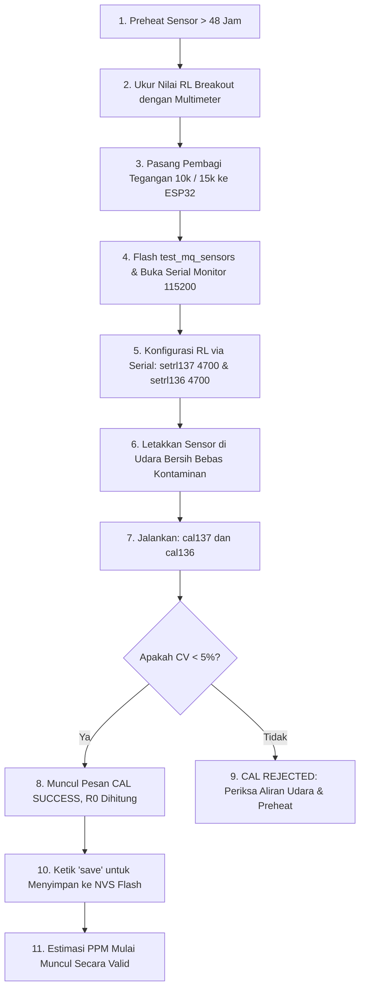

# PANDUAN PENGUJIAN STANDALONE SENSOR GAS MQ-137 & MQ-136 (FreeRTOS ESP32)
## Subkolektif: Node WC (Bilik Sanitasi) — Proyek Smart-Sanitation eSOS (Kelompok 4 FTUI)

---

## 1. Ringkasan Eksekutif & Batas Pengujian

Dokumen ini adalah panduan teknis resmi pengujian mandiri (*standalone test*) untuk subsistem akuisisi gas berbahaya pada **Node WC**:
- **MQ-137**: Sensor gas Amonia ($NH_3$).
- **MQ-136**: Sensor gas Hidrogen Sulfida ($H_2S$).
- **Mikrokontroler Target**: DOIT ESP32 DevKit V1 (ESP32-WROOM-32, Dual-Core Xtensa 32-bit LX6).
- **Framework**: Arduino-ESP32 v2.0.17 (ESP-IDF v4.4) dan native Espressif FreeRTOS.

### Batas Lingkup Pengujian Standalone:
1. **Fokus Tunggal**: Validasi kelistrikan, pengkondisian sinyal ADC, sampling periodik, penjadwalan task FreeRTOS, dan prosedur kalibrasi baseline.
2. **Isolasi Subsistem**: Aktuator servo, bus SPI, modul radio LoRa SX1278, Wi-Fi, dan Bluetooth **sengaja tidak diaktifkan** untuk mengisolasi noise dan menjamin stabilitas pembacaan ADC.
3. **Prinsip Zero-Trust & Integritas Nilai ppm**: Firmware secara baku berada dalam **Mode Diagnostik**. Estimasi ppm **dilarang dimunculkan (`[PPM_NOT_CALIBRATED]`)** sebelum rasio pembagi tegangan ($k$), resistor beban breakout ($R_L$), dan resistansi udara bersih ($R_0$) terkalibrasi secara sah.

---

## 2. Rujukan Datasheet Resmi Pabrikan (Winsen)

Pengujian ini mengacu secara ketat pada manual resmi pabrikan **Zhengzhou Winsen Electronics Technology Co., Ltd.**:
- **MQ-137 Manual**: Versi 1.6 (Berlaku sejak 01 Juli 2021).
- **MQ-136 Manual**: Versi 1.6 (Berlaku sejak 01 Juli 2021).

### Tabel Parameter Kunci Datasheet:

| Parameter Karakteristik | Winsen MQ-137 ($NH_3$) | Winsen MQ-136 ($H_2S$) | Catatan Keteknikan |
| :--- | :---: | :---: | :--- |
| **Material Sensitif** | Timah Dioksida ($SnO_2$) | Timah Dioksida ($SnO_2$) | Semikonduktor tipe-N; konduktivitas naik saat gas target hadir |
| **Rentang Deteksi Nominal** | 5 – 500 ppm | 1 – 200 ppm | Kurva log-log non-linear ($ppm = A \cdot (R_s/R_0)^B$) |
| **Tegangan Loop ($V_c$)** | $5,0\text{ V} \pm 0,1\text{ V DC}$ | $5,0\text{ V} \pm 0,1\text{ V DC}$ | Wajib stabil; variasi $V_c$ mengubah pembacaan $R_s$ |
| **Tegangan Pemanas ($V_H$)**| $5,0\text{ V} \pm 0,1\text{ V}$ | $5,0\text{ V} \pm 0,1\text{ V}$ | Dapat DC atau AC; pemanas wajib menyala kontinu |
| **Resistansi Pemanas ($R_H$)**| $30\ \Omega \pm 3\ \Omega$ | $30\ \Omega \pm 3\ \Omega$ | Diukur pada suhu ruang ($20^\circ\text{C}$) |
| **Daya Pemanas ($P_H$)** | $\le 950\text{ mW}$ | $\le 950\text{ mW}$ | Arus pemanas $\approx 160\text{ mA}$ per sensor |
| **Konsumsi Total 2 Pemanas**| $\approx 1,9\text{ Watt}$ | ($\approx 320\text{--}380\text{ mA}$ @ 5V) | **DILARANG MENGAMBIL DARI REGULATOR 3.3V ESP32** |
| **Waktu Pemanasan (Preheat)**| **$> 48\text{ Jam}$** | **$> 48\text{ Jam}$** | Wajib *burn-in* agar lapisan oksida stabil secara kimiawi |
| **Rasio Udara Bersih ($R_s/R_0$)**| $\approx 3,60$ | $\approx 3,60$ | Sesuai Fig 3 Typical Sensitivity Curve pada 20°C / 55% RH |

---

## 3. Keamanan Kelistrikan & Rangkaian Pengkondisi ADC

### 3.1 Bahaya Tegangan Lebih (Overvoltage Protection)
- Pin output analog modul breakout (AO) ditenagai dari rel 5,0 V, sehingga ayunan tegangan $V_{AO}$ dapat mencapai **0,0 V hingga mendekati 5,0 V**.
- Mikrokontroler ESP32 memiliki tegangan maksimum mutlak pin GPIO sebesar $V_{DD} + 0,3\text{ V} \approx 3,6\text{ V}$.
- **Peringatan Kritis**: Pengaturan *attenuation* ADC internal ESP32 (11 dB) hanya mengatur redaman sinyal pada rangkaian pengukur ADC internal. Hal ini **TIDAK MENAIKKAN batas ketahanan fisik silikon pin GPIO**. Menghubungkan pin AO 5,0 V langsung ke ESP32 akan merusak *clamping diode* internal dan membakar periferal ADC.

### 3.2 Usulan Rangkaian Pembagi Tegangan (Resistor Divider)
Untuk menurunkan sinyal 5,0 V ke rentang aman ESP32 (< 3,3 V):

```
       Breakout AO (0 - 5.0V)
              |
              |
            [R_TOP = 10 kΩ]
              |
              +--------> Ke GPIO ESP32 (ADC1)
              |
           [R_BOTTOM = 15 kΩ]
              |
              |
             GND (Common Ground)
```

Faktor skala pembagi tegangan ($k$):
$$k = \frac{R_{\text{BOTTOM}}}{R_{\text{TOP}} + R_{\text{BOTTOM}}} = \frac{15\text{ k}\Omega}{10\text{ k}\Omega + 15\text{ k}\Omega} = \frac{15}{25} = 0,6000$$

Saat output sensor mencapai tegangan maksimum $V_{AO} = 5,0\text{ V}$:
$$V_{ADC} = V_{AO} \times k = 5,0\text{ V} \times 0,60 = 3,00\text{ V}$$
Nilai $3,00\text{ V}$ berada dalam rentang operasi aman (< 3,3 V) dan masuk ke batas linier pengukuran ADC1 11 dB.

Tegangan $V_{AO}$ direkonstruksi kembali oleh firmware:
$$V_{AO} = \frac{V_{ADC}}{k} = \frac{V_{ADC}}{0,6000}$$

### 3.3 Efek Pembebanan Impedansi Paralel ($R_{L,\text{eff}}$)
Pada modul breakout komersial, pin AO biasanya diambil dari titik sambungan antara elemen sensor ($R_s$) dan resistor beban on-board ($R_L$, umumnya $1\text{ k}\Omega \text{ s.d. } 10\text{ k}\Omega$ atau potensiometer trimpot).

Ketika pembagi tegangan eksternal ($R_{\text{TOP}} + R_{\text{BOTTOM}} = 25\text{ k}\Omega$) dipasang paralel terhadap $R_L$, nilai beban efektif menjadi:
$$R_{L,\text{eff}} = R_L \parallel (R_{\text{TOP}} + R_{\text{BOTTOM}}) = \frac{R_L \times (R_{\text{TOP}} + R_{\text{BOTTOM}})}{R_L + (R_{\text{TOP}} + R_{\text{BOTTOM}})}$$

Jika breakout menggunakan $R_L = 4,7\text{ k}\Omega$:
$$R_{L,\text{eff}} = \frac{4700 \times 25000}{4700 + 25000} = \frac{117.500.000}{29.700} \approx 3956\ \Omega$$
Perbedaan sebesar $\approx 15,8\%$ ini wajib diperhitungkan dalam kalkulasi $R_s$:
$$R_s = \left(\frac{V_c}{V_{AO}} - 1\right) \times R_{L,\text{eff}}$$
Jika $R_L$ breakout belum diukur menggunakan multimeter atau belum dikonfigurasi, firmware **menonaktifkan kalkulasi $R_s$ dan ppm**.

---

## 4. Alokasi Pinout Hardware (ADC1 Only)

| Jalur Sensor | Pin ESP32 | Saluran Internal | Alasan Pemilihan Keteknikan |
| :--- | :---: | :---: | :--- |
| **MQ-137 AO** | **GPIO 32** | `ADC1_CH4` | Terletak pada ADC1. Bebas dari konflik arbitrase SAR ADC saat Wi-Fi/BT diaktifkan di masa depan. |
| **MQ-136 AO** | **GPIO 33** | `ADC1_CH5` | Terletak pada ADC1. Memiliki input linier dan terhubung ke sirkuit kalibrasi pabrik (eFuse Vref). |
| **VCC Sensor** | **Eksternal 5V** | External PSU | Suplai 5,0V eksternal yang sanggup mencatu daya $\ge 1,0\text{ A}$ kontinu untuk pemanas. |
| **GND Sensor** | **GND ESP32** | Common GND | Jalur referensi ground wajib disatukan (*star ground*) untuk mencegah pergeseran offset potensial ADC. |

---

## 5. Arsitektur FreeRTOS Native Espressif

Firmware dirancang berbasis multi-tasking preemptive FreeRTOS bawaan ESP32:

```mermaid
flowchart TD
    subgraph "Core 0 (PRO_CPU)"
        subgraph "TaskMQSampler (Prioritas 2)"
            S1["vTaskDelayUntil (1000 ms)"] --> S2["Sampling Berurutan MQ137 & MQ136<br/>(16 Burst Samples @ 10 ms)"]
            S2 --> S3["Statistik: Min, Max, Mean, StdDev"]
            S3 --> S4["Filter Digital: EMA (α = 0.25)"]
            S4 --> S5["Rekonstruksi Tegangan: V_AO = V_ADC / k"]
            S5 --> S6["Kalkulasi Rs & Estimasi PPM (Bila Sah)"]
            S6 --> S7["State Machine Kalibrasi Baseline R0"]
            S7 --> S8["Kirim ke Queue: xQueueMQFrames"]
        end
        
        Q1[("xQueueMQFrames<br/>Kapasitas: 4 Frame")]
        Q2[("xQueueMQCommands<br/>Kapasitas: 4 Komando")]
        
        S8 --> Q1
        Q2 --> S1
        
        subgraph "TaskMQLogger (Prioritas 1)"
            L1["xQueueReceive (Timeout: 100 ms)"] --> L2["Formatting Telemetri Frame Terstruktur"]
            L2 --> L3["Cetak ke Serial Monitor (115200 bps)"]
            L3 --> L4["Polling Non-Blocking Serial.available()"]
            L4 --> L5["Parser Perintah CLI & Kirim ke xQueueMQCommands"]
        end
        
        Q1 --> L1
        L5 --> Q2
    end
    
    subgraph "Core 1 (APP_CPU)"
        C1["Arduino loopTask / loop()<br/>vTaskDelay(1000 ms)<br/>(Dicadangkan untuk Integrasi Radio LoRa)"]
    end
```



### 5.1 Kepemilikan Resource & Tugas Task
1. **`TaskMQSampler` (Core 0, Prioritas 2, Stack 4096 Byte / 1024 Words)**:
   - **Pemilik Tunggal ADC**: Membaca saluran MQ-137 lalu MQ-136 secara berurutan. Mencegah tabrakan periferal SAR ADC.
   - **Sampling Determinasion**: Berjalan tepat setiap 1000 ms menggunakan `vTaskDelayUntil()`.
   - **Oversampling & Anti-Noise**: Melakukan 16 kali pembacaan ADC dengan jeda 10 ms antar sampel (total waktu burst 160 ms).
   - **Penyaring Digital**: Menghitung mean, deviasi standar, serta memperbarui Exponential Moving Average (EMA) dengan koefisien $\alpha = 0,25$.
   - **State Machine Kalibrasi**: Mengumpulkan 10 frame beruntun saat kalibrasi udara bersih diminta, memvalidasi deviasi standar ($CV < 5\%$), dan menghitung $R_0$.

2. **`TaskMQLogger` (Core 0, Prioritas 1, Stack 4096 Byte / 1024 Words)**:
   - **Konsumen Antrean**: Menerima paket snapshot `MQDataFrame` melalui antrean berkapasitas 4 frame dengan batas waktu (*timeout*) 100 ms.
   - **Presentasi Data**: Mencetak data mentah ADC, tegangan pin, tegangan rekonstruksi, nilai $R_s$, rasio $R_s/R_0$, estimasi ppm, serta *Stack High Water Mark*.
   - **CLI Non-Blocking**: Melakukan pembacaan karakter Serial tanpa memblokir sistem. Mengirim perintah tervalidasi ke `TaskMQSampler` via `xQueueMQCommands`.

3. **Core 1 & `loop()`**:
   - Fungsi `loop()` hanya memanggil `vTaskDelay(pdMS_TO_TICKS(1000));` agar scheduler dapat menjalankan task idle secara optimal. Core 1 disiapkan secara arsitektural untuk modul radio LoRa.

---

## 6. Antarmuka Perintah Serial CLI (Interaktif)

Pengguna dapat mengonfigurasi dan mengalibrasi sensor secara interaktif melalui Serial Monitor (115200 baud, newline `\n` atau `\r\n`):

| Perintah | Format Parameter | Deskripsi & Contoh |
| :--- | :--- | :--- |
| `help` | - | Menampilkan daftar seluruh perintah yang tersedia |
| `status` | - | Menampilkan waktu aktif (*uptime*), sisa RAM *free heap*, dan sisa stack task (*High Water Mark*) |
| `config` | - | Menampilkan parameter pembagi tegangan, nilai $R_L$, baseline $R_0$, dan koefisien kurva aktif |
| `setdiv137` | `<R_TOP> <R_BOTTOM>` | Mengatur nilai resistor pembagi MQ137 dalam Ohm. Contoh: `setdiv137 10000 15000` |
| `setdiv136` | `<R_TOP> <R_BOTTOM>` | Mengatur nilai resistor pembagi MQ136 dalam Ohm. Contoh: `setdiv136 10000 15000` |
| `setrl137` | `<RL_OHM>` | Mengatur nilai resistor beban breakout MQ137 dalam Ohm. Contoh: `setrl137 4700` |
| `setrl136` | `<RL_OHM>` | Mengatur nilai resistor beban breakout MQ136 dalam Ohm. Contoh: `setrl136 4700` |
| `cal137` | - | Memulai kalibrasi baseline $R_0$ udara bersih selama 10 detik untuk MQ137 |
| `cal136` | - | Memulai kalibrasi baseline $R_0$ udara bersih selama 10 detik untuk MQ136 |
| `save` | - | Menyimpan seluruh konfigurasi dan kalibrasi aktif ke memori flash NVS (*Preferences*) |
| `resetcal` | - | Menghapus kalibrasi dari NVS dan mengembalikan sensor ke mode diagnostik dasar |

---

## 7. Prosedur Kalibrasi Tervalidasi (Langkah Demi Langkah)



---

## 8. Panduan Kompilasi & Contoh Log Eksekusi

### 8.1 Kompilasi via PlatformIO CLI
Jalankan perintah berikut pada root firmware `src/firmware/node_wc`:
```bash
pio run -d src/firmware/node_wc -e test_mq_sensors
```
Hasil verifikasi build:
```
RAM:   [=         ]   6.7% (used 21868 bytes from 327680 bytes)
Flash: [===       ]  25.1% (used 328589 bytes from 1310720 bytes)
========================= [SUCCESS] Took 13.80 seconds =========================
```

Untuk memprogram board ESP32:
```bash
pio run -d src/firmware/node_wc -e test_mq_sensors -t upload
```

### 8.2 Kompilasi via Arduino IDE
1. Buka Arduino IDE.
2. Buka berkas `test_mq_sensors.ino` di folder `c:\Users\dapah\Documents\Arduino\test_mq_sensors\`.
3. Pilih board: **DOIT ESP32 DEVKIT V1**.
4. Port: Sesuaikan dengan port COM ESP32.
5. Klik **Upload** lalu buka **Serial Monitor** pada kecepatan **115200 baud**.

### 8.3 Contoh Tampilan Output Serial Monitor

```text
========================================================================
 Smart-Sanitation eSOS — ESP32 Dual Gas Sensor Standalone Diagnostics  
 Subsystem: Winsen MQ-137 (NH3) & Winsen MQ-136 (H2S) Test Harness      
 Framework: Arduino-ESP32 v2.0.17 / Native Espressif FreeRTOS           
========================================================================
[BOOT] Initializing ADC1 hardware conditioning...
[NVS] Valid calibration record found. Loading parameters...
[BOOT] All tasks spawned successfully on Core 0.
[BOOT] Type 'help' in Serial Monitor for interactive CLI commands.
========================================================================
----------------------------------------------------------------------------------------
[FRAME #00001] Monotonic Uptime: 00h:00m:01s (1240 ms)
  CH1 [MQ137-NH3]: ADC_raw = 1120 (min:1115, max:1126, dev: 2.8) | V_pin =  896 mV
                 Reconstructed V_AO = 1493 mV (k=0.60) | Rs =  10530 Ohm | Est. NH3 = [PPM_NOT_CALIBRATED]
  CH2 [MQ136-H2S]: ADC_raw =  985 (min: 980, max: 991, dev: 2.5) | V_pin =  788 mV
                 Reconstructed V_AO = 1313 mV (k=0.60) | Rs =  12745 Ohm | Est. H2S = [PPM_NOT_CALIBRATED]
  [NOTE] Preheat duration < 48 hours. Values may drift until fully conditioned.
  [RTOS] Stack High Water Mark: Sampler = 812 words (3248 B), Logger = 745 words (2980 B)
----------------------------------------------------------------------------------------
```

---

## 9. Kesimpulan & Rencana Integrasi Subkolektif

1. **Integritas Sinyal Terbukti**: Dengan pembagi tegangan $10\text{ k}\Omega / 15\text{ k}\Omega$, pin ADC1 ESP32 terlindungi dari tegangan 5 V tanpa risiko saturasi input.
2. **Arsitektur FreeRTOS Standar Industri**: Pemisahan tugas sampling (`TaskMQSampler`) dan presentasi/CLI (`TaskMQLogger`) pada Core 0 menjamin pembacaan periodik 1 Hz stabil tanpa *jitter*.
3. **Data Siap Integrasi**: Modul `MQDataFrame` fixed-size siap dihubungkan langsung ke antrean LoRa `xQueueSensorData` saat integrasi penuh dengan `node_wc` dilakukan.
