# PANDUAN PENGUJIAN STANDALONE SENSOR GAS MQ-137 & MQ-136 (FreeRTOS ESP32) [v2.0]
## Subkolektif: Node WC (Bilik Sanitasi) — Proyek Smart-Sanitation eSOS (Kelompok 4 FTUI)

---

## 1. Ringkasan Eksekutif & Batas Pengujian

Dokumen ini adalah panduan teknis resmi pengujian mandiri (*standalone test*) untuk subsistem akuisisi gas berbahaya pada **Node WC**:
- **MQ-137**: Sensor gas Amonia ($NH_3$).
- **MQ-136**: Sensor gas Hidrogen Sulfida ($H_2S$).
- **Mikrokontroler Target**: DOIT ESP32 DevKit V1 (ESP32-WROOM-32, Dual-Core Xtensa 32-bit LX6).
- **Framework**: Arduino-ESP32 v2.0.17 (ESP-IDF v4.4) dan native Espressif FreeRTOS.

### Batas Lingkup Pengujian Standalone (Revisi v2.0):
1. **Fokus Tunggal**: Validasi kelistrikan, pengkondisian sinyal ADC, sampling periodik, penjadwalan task FreeRTOS, dan prosedur kalibrasi baseline.
2. **Isolasi Subsistem**: Aktuator servo, bus SPI, modul radio LoRa SX1278, Wi-Fi, dan Bluetooth **sengaja tidak diaktifkan** untuk mengisolasi noise dan menjamin stabilitas pembacaan ADC.
3. **Kebijakan Zero-Trust & PPM Dinonaktifkan**: Firmware secara tegas **mematikan konversi ppm (`[PPM_DISABLED_CALIBRATION_REQUIRED]`)**. Koefisien kurva regresi belum terbukti secara empiris di ruang uji kalibrasi gas terkontrol. Pengujian fokus pada parameter fisik riil: ADC raw (min/max/mean/stddev), tegangan pin $V_{ADC}$ (mV), tegangan sensor $V_{AO}$ (mV), resistansi sensor $R_s$ ($\Omega$), dan rasio $R_s/R_0$.
4. **Kepatuhan Satuan ESP-IDF FreeRTOS**:
   - `usStackDepth` pada `xTaskCreatePinnedToCore()` dinyatakan dalam **BYTES** (bukan words). Disediakan `4096 BYTES` untuk `TaskMQSampler` dan `TaskMQLogger`.
   - `uxTaskGetStackHighWaterMark()` pada ESP-IDF menghasilkan satuan **BYTES**. Perkalian `* 4` dihapus sepenuhnya agar pelaporan sisa memori tidak dibesar-besarkan.

---

## 2. Rujukan Datasheet Resmi Pabrikan (Winsen)

Pengujian ini mengacu secara ketat pada manual resmi pabrikan **Zhengzhou Winsen Electronics Technology Co., Ltd.**:
- **MQ-137 Manual**: Versi 1.6 (Berlaku sejak 01 Juli 2021).
- **MQ-136 Manual**: Versi 1.6 (Berlaku sejak 01 Juli 2021).

### Tabel Parameter Kunci Datasheet:

| Parameter Karakteristik | Winsen MQ-137 ($NH_3$) | Winsen MQ-136 ($H_2S$) | Catatan Keteknikan |
| :--- | :---: | :---: | :--- |
| **Material Sensitif** | Timah Dioksida ($SnO_2$) | Timah Dioksida ($SnO_2$) | Semikonduktor tipe-N; konduktivitas naik saat gas target hadir |
| **Rentang Deteksi Nominal** | 5 – 500 ppm | 1 – 200 ppm | Karakteristik non-linear log-log |
| **Tegangan Loop ($V_c$)** | $5,0\text{ V} \pm 0,1\text{ V DC}$ | $5,0\text{ V} \pm 0,1\text{ V DC}$ | Wajib stabil; variasi $V_c$ mengubah pembacaan $R_s$ |
| **Tegangan Pemanas ($V_H$)**| $5,0\text{ V} \pm 0,1\text{ V}$ | $5,0\text{ V} \pm 0,1\text{ V}$ | Pemanas harus terus aktif bahkan saat task FreeRTOS sedang *Blocked* |
| **Resistansi Pemanas ($R_H$)**| $30\ \Omega \pm 3\ \Omega$ | $30\ \Omega \pm 3\ \Omega$ | Diukur pada suhu ruang ($20^\circ\text{C}$) |
| **Daya Pemanas ($P_H$)** | $\le 950\text{ mW}$ | $\le 950\text{ mW}$ | Arus pemanas $\approx 160\text{--}190\text{ mA}$ per sensor |
| **Konsumsi Total 2 Pemanas**| $\approx 1,9\text{ Watt}$ | ($\approx 380\text{ mA}$ @ 5V) | **DILARANG MENGAMBIL DARI REGULATOR 3.3V ESP32** |
| **Waktu Pemanasan (Preheat)**| **$> 48\text{ Jam}$** | **$> 48\text{ Jam}$** | Wajib *burn-in* agar lapisan oksida stabil secara kimiawi |
| **Definisi Resmi $R_0$** | $R_0 \equiv R_{s,\text{clean\_air}}$ | $R_0 \equiv R_{s,\text{clean\_air}}$ | **Winsen v1.6 Fig 3**: $R_0$ didefinisikan sebagai resistansi sensor di udara bersih |

---

## 3. Keamanan Kelistrikan & Rangkaian Pengkondisi ADC

### 3.1 Bahaya Tegangan Lebih (Overvoltage Protection)
- Pin output analog modul breakout (AO) ditenagai dari rel 5,0 V, sehingga ayunan tegangan $V_{AO}$ dapat mencapai **0,0 V hingga mendekati 5,0 V**.
- Mikrokontroler ESP32 memiliki tegangan maksimum mutlak pin GPIO sebesar $V_{DD} + 0,3\text{ V} \approx 3,6\text{ V}$.
- **Peringatan Kritis**: Pengaturan *attenuation* ADC internal ESP32 (11 dB) hanya mengatur redaman sinyal pada rangkaian pengukur ADC internal. Hal ini **TIDAK MENAIKKAN batas ketahanan fisik silikon pin GPIO**. Menghubungkan pin AO 5,0 V langsung ke ESP32 akan merusak *clamping diode* internal dan membakar periferal ADC.

### 3.2 Usulan Rangkaian Pembagi Tegangan (Resistor Divider)
Untuk menurunkan sinyal 5,0 V ke rentang aman ESP32 (< 3,3 V):

```
       Breakout AO (0 - 5.0V)
              |
              |
            [R_TOP = 10 kΩ]
              |
              +--------> Ke GPIO ESP32 (ADC1)
              |
           [R_BOTTOM = 15 kΩ]
              |
              |
             GND (Common Ground)
```

Faktor skala pembagi tegangan ($k$):
$$k = \frac{R_{\text{BOTTOM}}}{R_{\text{TOP}} + R_{\text{BOTTOM}}} = \frac{15\text{ k}\Omega}{10\text{ k}\Omega + 15\text{ k}\Omega} = \frac{15}{25} = 0,6000$$

Saat output sensor mencapai tegangan maksimum $V_{AO} = 5,0\text{ V}$:
$$V_{ADC} = V_{AO} \times k = 5,0\text{ V} \times 0,6000 = 3,00\text{ V}$$
Nilai $3,00\text{ V}$ berada dalam rentang operasi aman (< 3,3 V) dan masuk ke batas linier pengukuran ADC1 11 dB.

Tegangan $V_{AO}$ direkonstruksi kembali oleh firmware:
$$V_{AO} = \frac{V_{ADC}}{k} = \frac{V_{ADC}}{0,6000}$$

### 3.3 Efek Pembebanan Impedansi Paralel ($R_{L,\text{eff}}$) & Invalidation
Pada modul breakout komersial, pin AO biasanya diambil dari titik sambungan antara elemen sensor ($R_s$) dan resistor beban on-board ($R_L$, umumnya $1\text{ k}\Omega \text{ s.d. } 10\text{ k}\Omega$ atau potensiometer trimpot).

Ketika pembagi tegangan eksternal ($R_{\text{TOP}} + R_{\text{BOTTOM}} = 25\text{ k}\Omega$) dipasang paralel terhadap $R_L$, nilai beban efektif menjadi:
$$R_{L,\text{eff}} = R_L \parallel (R_{\text{TOP}} + R_{\text{BOTTOM}}) = \frac{R_L \times (R_{\text{TOP}} + R_{\text{BOTTOM}})}{R_L + (R_{\text{TOP}} + R_{\text{BOTTOM}})}$$

Formula resistansi sensor:
$$R_s = \left(\frac{V_c}{V_{AO}} - 1\right) \times R_{L,\text{eff}}$$

#### Aturan Invalidation Mutlak:
1. **Perubahan Rangkaian Membatalkan Baseline**: Setiap perubahan pada resistor pembagi (`setdiv137`, `setdiv136`) atau resistor beban (`setrl137`, `setrl136`) **secara otomatis membatalkan kalibrasi baseline $R_0$** sensor terkait. Kalibrasi ulang di udara bersih wajib dilakukan setelah perubahan hardware.
2. **Penanganan Sinyal Abnormal**: Jika ADC terbaca jenuh ($raw \ge 4095$) atau $V_{AO}$ berada di luar batas operasional ($< 100\text{ mV}$ atau $\ge V_c - 50\text{ mV}$), status sinyal ditandai `MQ_FLAG_SIGNAL_INVALID`. Perhitungan $R_s$ dihentikan (`MQ_VALUE_UNCONFIGURED`), dan frame tersebut ditolak dari proses kalibrasi baseline.

---

## 4. Alokasi Pinout Hardware (ADC1 Only)

| Jalur Sensor | Pin ESP32 | Saluran Internal | Alasan Pemilihan Keteknikan |
| :--- | :---: | :---: | :--- |
| **MQ-137 AO** | **GPIO 32** | `ADC1_CH4` | Terletak pada ADC1. Bebas dari konflik arbitrase SAR ADC saat Wi-Fi/BT diaktifkan di masa depan. |
| **MQ-136 AO** | **GPIO 33** | `ADC1_CH5` | Terletak pada ADC1. Memiliki input linier dan terhubung ke sirkuit kalibrasi pabrik (eFuse Vref). |
| **VCC Sensor** | **Eksternal 5V** | External PSU | Suplai 5,0V eksternal yang sanggup mencatu daya $\ge 1,0\text{ A}$ kontinu untuk pemanas. |
| **GND Sensor** | **GND ESP32** | Common GND | Jalur referensi ground wajib disatukan (*star ground*) untuk mencegah pergeseran offset potensial ADC. |

---

## 5. Arsitektur FreeRTOS Native Espressif & Isolasi Thread

Firmware mengimplementasikan arsitektur *dual-task* deterministik pada **Core 0** dengan pemisahan tanggung jawab yang ketat:

```mermaid
flowchart TD
    subgraph "Core 0 (PRO_CPU)"
        subgraph "TaskMQSampler (Prioritas 2) - Pemilik Tunggal ADC, Config & NVS"
            S1["vTaskDelayUntil (1000 ms)"] --> S2["Sampling Berurutan GPIO32 lalu GPIO33<br/>(16 Burst Samples @ 10 ms)"]
            S2 --> S3["Statistik: Min, Max, Mean, StdDev"]
            S3 --> S4["Filter Digital: EMA (α = 0.25)"]
            S4 --> S5["Rekonstruksi Tegangan: V_AO = V_ADC / k"]
            S5 --> S6["Kalkulasi Rs & Rasio Rs/R0 (Bila Sah)"]
            S6 --> S7["State Machine Kalibrasi Baseline R0 (10 Frame, CV < 5%)"]
            S7 --> S8["Kirim ke Queue: xQueueMQFrames"]
        end
        
        Q1[("xQueueMQFrames<br/>Kapasitas: 4 Frame")]
        Q2[("xQueueMQCommands<br/>Kapasitas: 4 Komando")]
        Q3[("xQueueLogMessages<br/>Kapasitas: 8 Pesan Log")]
        
        S8 --> Q1
        S8 -.->|Pesan Log Asinkron| Q3
        Q2 --> S1
        
        subgraph "TaskMQLogger (Prioritas 1) - Pemilik Tunggal Penulisan Serial"
            L1["Kuras dan Cetak xQueueLogMessages"] --> L2["xQueueReceive (Timeout: 100 ms)"]
            L2 --> L3["Formatting Telemetri Frame Terstruktur"]
            L3 --> L4["Cetak ke Serial Monitor (115200 bps)"]
            L4 --> L5["Polling Non-Blocking Serial.available()"]
            L5 --> L6["Parser Perintah CLI & Kirim ke xQueueMQCommands"]
        end
        
        Q1 --> L2
        Q3 --> L1
        L6 --> Q2
    end
    
    subgraph "Core 1 (APP_CPU)"
        C1["Arduino loopTask / loop()<br/>vTaskDelay(1000 ms)<br/>(Dicadangkan untuk Integrasi Radio LoRa)"]
    end
```



### 5.1 Kepemilikan Resource & Alokasi Memori
1. **`TaskMQSampler` (Core 0, Prioritas 2, Stack 4096 BYTES)**:
   - **Pemilik Tunggal ADC & Filter**: Membaca saluran MQ-137 lalu MQ-136 secara berurutan. Mencegah tabrakan periferal SAR ADC.
   - **Pemilik Tunggal Konfigurasi & NVS**: Seluruh mutasi konfigurasi dan operasi baca/tulis memori flash (`Preferences`) dieksekusi secara eksklusif di dalam task ini.
   - **Penjadwalan Tanpa Drift**: Berjalan tepat setiap 1000 ms menggunakan `vTaskDelayUntil()`.
   - **Oversampling & Anti-Noise**: Melakukan 16 kali pembacaan ADC dengan jeda 10 ms antar sampel. Menghitung mean, deviasi standar, serta memperbarui EMA ($\alpha = 0,25$).
   - **Pencegahan Data Korup**: Mengirim snapshot konfigurasi yang *immutable* (`MQChannelConfigSnapshot`) di dalam frame telemetri.
   - **Penghitungan Frame Terbuang**: Melacak counter `dropped_frames_count` jika antrean penuh.

2. **`TaskMQLogger` (Core 0, Prioritas 1, Stack 4096 BYTES)**:
   - **Pemilik Tunggal Serial**: Satu-satunya task yang memiliki hak menulis ke antarmuka Serial (UART0), mencegah interferensi dan data garbled.
   - **Konsumen Antrean**: Menerima paket snapshot `MQDataFrame` melalui antrean berkapasitas 4 frame dengan batas waktu 100 ms.
   - **CLI Non-Blocking**: Melakukan pembacaan karakter Serial secara inkremental tanpa memblokir sistem. Hasil verifikasi pengiriman perintah diperiksa (`pdPASS`).

3. **Core 1 & `loop()`**:
   - Fungsi `loop()` memanggil `vTaskDelay(pdMS_TO_TICKS(1000));` agar scheduler dapat menjalankan task idle secara optimal. Core 1 disiapkan secara arsitektural untuk modul radio LoRa.

---

## 6. Antarmuka Perintah Serial CLI (Interaktif v2.0)

Pengguna dapat mengonfigurasi dan mengalibrasi sensor secara interaktif melalui Serial Monitor (115200 baud, newline `\n` atau `\r\n`):

| Perintah | Format Parameter | Deskripsi & Validasi |
| :--- | :--- | :--- |
| `help` | - | Menampilkan daftar seluruh perintah yang tersedia |
| `status` | - | Menampilkan waktu aktif (*uptime*), sisa RAM *free heap*, dan sisa stack task dalam **BYTES** |
| `config` | - | Menampilkan status konfirmasi divider, nilai $R_L$, dan baseline $R_0$ dari snapshot frame terbaru |
| `setdiv137` | `<R_TOP> <R_BOTTOM>` | Mengonfirmasi resistor pembagi MQ137 dalam Ohm ($\ge 100\ \Omega$). Membatalkan kalibrasi $R_0$ lama. |
| `setdiv136` | `<R_TOP> <R_BOTTOM>` | Mengonfirmasi resistor pembagi MQ136 dalam Ohm ($\ge 100\ \Omega$). Membatalkan kalibrasi $R_0$ lama. |
| `setrl137` | `<RL_OHM>` | Mengonfigurasi resistor beban breakout MQ137 ($100\ \Omega \le R_L \le 1\text{ M}\Omega$). Membatalkan kalibrasi $R_0$ lama. |
| `setrl136` | `<RL_OHM>` | Mengonfigurasi resistor beban breakout MQ136 ($100\ \Omega \le R_L \le 1\text{ M}\Omega$). Membatalkan kalibrasi $R_0$ lama. |
| `cal137` | - | Memulai kalibrasi baseline $R_0$ udara bersih selama 10 detik untuk MQ137 |
| `cal136` | - | Memulai kalibrasi baseline $R_0$ udara bersih selama 10 detik untuk MQ136 |
| `save` | - | Mengirim instruksi ke `TaskMQSampler` untuk menyimpan konfigurasi terverifikasi ke NVS flash |
| `resetcal` | - | Menghapus NVS flash dan mengembalikan konfigurasi ke status diagnostik awal |

---

## 7. Prosedur Kalibrasi Baseline ($R_0$) Tervalidasi

1. **Preheat Sensor $> 48\text{ Jam}$**: Pasang sensor pada catu daya 5V selama minimal 48 jam hingga lapisan semikonduktor $SnO_2$ stabil secara termal dan kimiawi.
2. **Ukur Nilai $R_L$ Breakout**: Gunakan multimeter untuk mengukur resistor beban pada modul breakout.
3. **Hubungkan Pembagi Tegangan**: Pasang resistor $10\text{ k}\Omega$ dan $15\text{ k}\Omega$ antara AO breakout, pin ADC ESP32, dan GND.
4. **Flash Firmware & Buka Serial Monitor (115200 baud)**:
   ```powershell
   pio run -d src/firmware/node_wc -e test_mq_sensors -t upload
   ```
5. **Konfirmasi Rangkaian Fisik via Serial**:
   ```text
   setdiv137 10000 15000
   setdiv136 10000 15000
   setrl137 4700
   setrl136 4700
   ```
6. **Kalibrasi di Udara Bersih**:
   Tempatkan sensor di lingkungan udara bersih tak bergerak bebas asap atau uap solvent. Ketik:
   ```text
   cal137
   ```
   Tunggu 10 detik. State machine FreeRTOS akan mengambil 10 sampel $R_s$. Jika koefisien variasi deviasi standar ($CV < 5\%$), baseline dinyatakan sah:
   $$R_0 = R_{s,\text{clean\_air\_mean}}$$
   Lakukan hal yang sama untuk MQ-136:
   ```text
   cal136
   ```
7. **Simpan ke Flash NVS**:
   Ketik `save` untuk menyimpan parameter ke memori flash ESP32 secara persisten.

---

## 8. Contoh Output Serial Monitor (Refactored v2.0)

```text
========================================================================
 Smart-Sanitation eSOS — ESP32 Dual Gas Sensor Diagnostics [v2.0]       
 Subsystem: Winsen MQ-137 (NH3) & Winsen MQ-136 (H2S) Test Harness      
 Framework: Arduino-ESP32 v2.0.17 / Native Espressif FreeRTOS           
========================================================================
[BOOT] Initializing ADC1 conditioning...
>>> [NVS] Valid calibration record found (v1). Validating entries...
>>> [NVS] Parameters validated and loaded successfully.
[BOOT] System initialized. TaskMQSampler & TaskMQLogger active on Core 0.
[BOOT] Type 'help' for interactive serial commands.
========================================================================
----------------------------------------------------------------------------------------
[FRAME #00001] Monotonic Uptime: 00h:00m:01s (1240 ms) | Dropped: 0
  CH1 [MQ137-NH3]: ADC_raw = 1120 (min:1115, max:1126, dev: 2.8) | V_pin =  896 mV
                 Reconstructed V_AO = 1493 mV (k=0.6000) | Rs =  10530 Ohm | Rs/R0 = 1.00 (R0=10530)
  CH2 [MQ136-H2S]: ADC_raw =  985 (min: 980, max: 991, dev: 2.5) | V_pin =  788 mV
                 Reconstructed V_AO = 1313 mV (k=0.6000) | Rs =  12745 Ohm | Rs/R0 = 1.00 (R0=12745)
  [NOTE] Preheat duration < 48 hours. Layer chemistry stabilizing.
  [RTOS] Stack High Water Mark: Sampler = 2840 B remaining, Logger = 2960 B remaining
----------------------------------------------------------------------------------------
```
