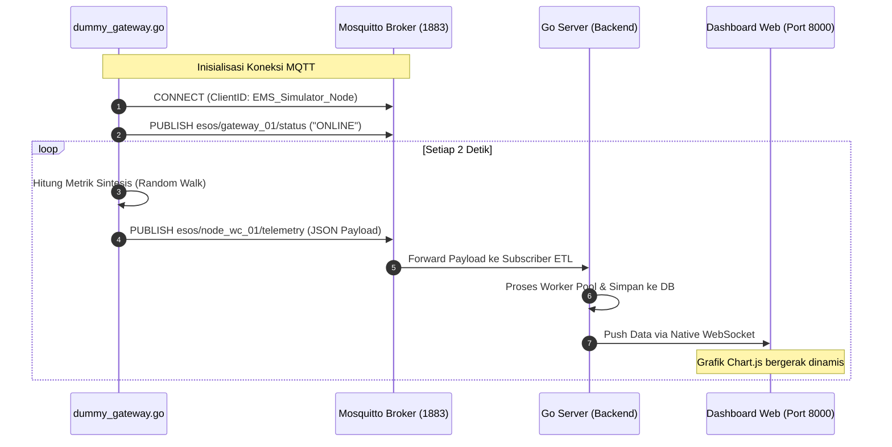

# Skrip Utilitas & Simulator: Smart-Sanitation eSOS 🛠️

Direktori ini berisi skrip pengujian beban, simulator telemetri perangkat keras (*dummy hardware*), dan perkakas otomasi pengembangan untuk sistem Smart-Sanitation eSOS.

---

## 📋 Daftar Utilitas

| Berkas | Bahasa | Deskripsi & Fungsi |
| :--- | :--- | :--- |
| [`dummy_gateway.go`](file:///c:/Users/dapah/Documents/DESPRO/DESPRO2_SMART_SANITATION_MODULAR/src/scripts/dummy_gateway.go) | Go | Simulator Gateway LoRa-to-MQTT untuk menginjeksi data telemetri sintesis (level air, amonia, H2S, baterai, status SOS) secara berkala (2 detik) langsung ke broker Mosquitto. |

---

## 🧪 Alur Kerja Simulator Dummy Gateway



---

## 🚀 Cara Menjalankan Simulator

1. Pastikan Mosquitto broker dan Go Server backend sudah aktif.
2. Jalankan simulator langsung menggunakan runtime Go:
   ```powershell
   cd src/scripts
   go run dummy_gateway.go
   ```
3. Buka browser ke `http://localhost:8000` untuk memverifikasi penerimaan data dan pergerakan grafik sensor secara interaktif tanpa memerlukan perangkat keras fisik ESP32.
